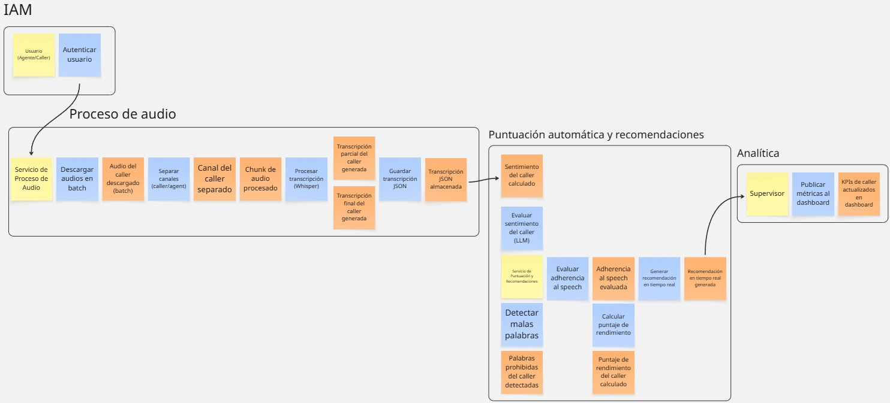
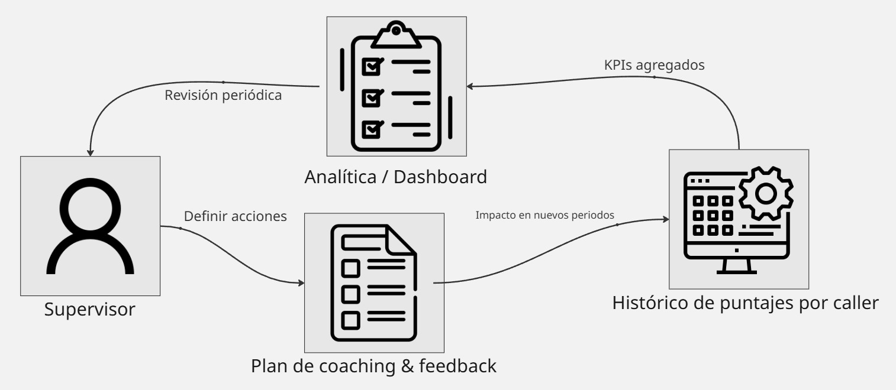
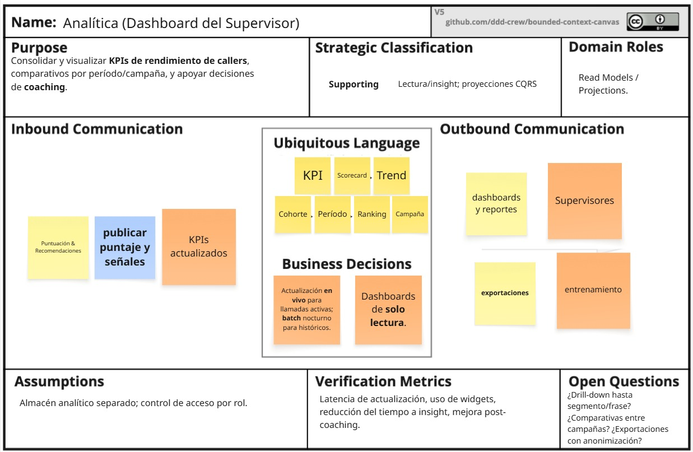

<h1 style="text-align: center;"> Informe del Trabajo Final </h1>
<h3 style="text-align: center;"> Universidad Peruana de Ciencias Aplicadas </h3>

<h5 style="text-align: center"> Área: Ingeniería de Software </h5>

<h5 style="text-align: center"> Arquitecturas de Software Emergentes </h5>
<h5 style="text-align: center"> NRC: 14802 </h5>

<h5 style="text-align: center"> Docente: Royer Edelwer Rojas Malásquez </h5>

<h5 style="text-align: center"> Startup: ??? </h5>

<h5 style="text-align: center"> Producto: ??? </h5>

## Team members:

  
|                Nombre                 |   Código   |
| :-----------------------------------: | :--------: |
|                                       |            |
|                                       |            |
|                                       |            |
|                                       |            |
|                                       |            |

<h5 style="text-align: center"> Ciclo 2025-02 </h5>

# Registro de Versiones del Informe

El objetivo de esta sección es resumir las modificaciones relevantes que se realizan al informe durante el ciclo de vida del proyecto. Esta sección inicia en una página nueva y se incluye un cuadro con la siguiente estructura:

| Versión |   Fecha    |             Autor             | Descripción de modificación                                                                                                                                                                       |
| :-----: | :--------: | :---------------------------: | ------------------------------------------------------------------------------------------------------------------------------------------------------------------------------------------------- |
|a|a|a|a|

# Project Report Collaboration Insights

URL del repositorio para el reporte del proyecto:

**TB1**

  

  

Para el desarrollo del informe perteneciente a la entrega TF, se dividió la implementación de secciones de la siguiente forma para cada integrante del equipo:

| Integrante                        | Tareas Asignadas                                                                                                                                                              |
| --------------------------------- | ----------------------------------------------------------------------------------------------------------------------------------------------------------------------------- |
|a|a|

**Github Collaboration Insights**

Github también presenta un timeline de las ramas principales y los procesos de merge a los que se han sometido. Todas las ramas se crearon tomando en cuenta el diseño de GitFlow para una buena organización cuando se usa un software de control de versiones.

Los integrantes son:

- XXX (XXX)
- XXX (XXX)
- XXX (XXX)
- Silva Tirado, Sebastián Valentino (SebasSilvaT)
- XXX (XXX)

# Contenido

1. [**Capítulo I: Introducción.**](#1.)  
   1.1. [Startup Profile.](#1.1.)  
   1.1.1. [Descripción del startup.](#1.1.1.) 
   1.1.2.[Perfiles de los integrantes del equipo.](#1.1.2.) 
   1.2. [Solution Profile.](#1.2.) 
   1.2.1. [Antecedentes y Problemática.](#1.2.1.) 
   1.2.2. [Lean UX Process.](#1.2.2.) 
   1.2.2.1 [Lean UX Problem Statements.](#1.2.2.1.) 
   1.2.2.2. [Lean UX Assumptions.](#1.2.2.2.) 
   1.2.2.3 [Lean UX Hypothesis Statements.](#1.2.2.3.) 
   1.2.2.4 [Lean UX Canvas.](#1.2.2.4.) 
   1.3. [Segmentos objetivo.](#1.3.) 
2. [**Capítulo II: Requirements Elicitation & Analysis.**](#2.) 
   2.1. [Competidores.](#2.1.) 
   2.1.1. [Análisis competitivo.](#2.1.1.) 
   2.1.2. [Estrategias y tácticas frente a competidores.](#2.1.2.) 
   2.2. [Entrevistas.](#2.2.) 
   2.2.1. [Diseño de entrevistas.](#2.2.1.) 
   2.2.2. [Registro de entrevistas.](#2.2.2.) 
   2.2.3. [Análisis de entrevistas.](#2.2.3.) 
   2.3. [Needfinding.](#2.3.) 
   2.3.1. [User Personas.](#2.3.1.) 
   2.3.2. [User Task Matrix.](#2.3.2.) 
   2.3.3. [Empathy Mapping.](#2.3.3.) 
   2.3.4. [As-is Scenario Mapping.](#2.3.4.) 
   2.4. [Ubiquitous Language](#2.4.) 
3. [**Capítulo III: Requirements Specification.**](#3.) 
   3.1. [To-Be Scenario Mapping.](#3.1.) 
   3.2. [User Stories.](#3.2.) 
   3.3. [Impact Mapping.](#3.3.) 
   3.4. [Product Backlog.](#3.4.) 
4. [**Capítulo IV: Solution Software Design.**](#4.) 
  4.1. [Strategic-Level Attribute-Driven Design.](#4.1.) 
  4.1.1. [Design Purpose.](#4.1.1.) 
  4.1.2. [Attribute-Driven Design Inputs.](#4.1.2.) 
  4.1.2.1. [Primary Functionality (Primary User Stories).](#4.1.2.1.) 
  4.1.2.2. [Quality Attribute Scenarios.](#4.1.2.2.) 
  4.1.2.3. [Constraints.](#4.1.2.3.) 
  4.1.3. [Architectural Drivers Backlog.](#4.1.3.) 
  4.1.4. [Architectural Design Decisions.](#4.1.4.) 
  4.1.5. [Quality Attribute Scenario Refinements.](#4.1.5.) 
  4.2. [Strategic-Level Domain-Driven Design.](#4.2.) 
  4.2.1. [EventStorming.](#4.2.1.) 
  4.2.2. [Candidate Context Discovery.](#4.2.2.) 
  4.2.3. [Domain Message Flows Modeling.](#4.2.3.) 
  4.2.4. [Bounded Context Canvases.](#4.2.4.) 
  4.2.5. [Context Mapping.](#4.2.5.) 
  4.3. [Software Architecture.](#4.3.) 
  4.3.1. [Software Architecture System Landscape Diagram.](#4.3.1.) 
  4.3.2. [Software Architecture Context Level Diagrams.](#4.3.2.) 
  4.3.3. [Software Architecture Container Level Diagrams.](#4.3.3.) 
  4.3.4. [Software Architecture Deployment Diagrams.](#4.3.4.) 

5. [Conclusiones](#5.) 
6. [Bibliografía](#6.) 
7. [Anexo](#7.) 

# STUDENT OUTCOME

**ABET – EAC - Student Outcome 5**
 La capacidad de funcionar efectivamente en un equipo cuyos miembros juntos proporcionan liderazgo, crean un entorno de colaboración e inclusivo, establecen objetivos, planifican tareas y cumplen objetivos.

<table>
  <thead>
    <tr>
      <th>Criterio específico</th>
      <th>Acciones realizadas</th>
      <th>Conclusiones</th>
    </tr>
  </thead>
  <tbody>
    <tr>
      <td style="font-weight:bold">Trabaja en equipo para
proporcionar liderazgo en
forma conjunta</td>
      <td>
      </td>
      <td>
        <!--conclusion -->
      </td>
    </tr>
    <tr>
      <td style="font-weight:bold">Crea un entorno colaborativo e inclusivo, establece metas, planifica tareas y cumple objetivos.</td>
      <td>
      </td>
      <td>
        <!-- conclusion -->
      </td>
    </tr>
  </tbody>
</table>

<h2>1. Capítulo I: Introducción</h2>

<h3>1.1. Startup Profile</h3>

<h4>1.1.1. Descripción del startup</h4>

<h4>1.1.2. Perfiles de los integrantes del equipo</h4>

<h3>1.2. Solution Profile</h3>

<h4>1.2.1. Antecedentes y Problemática</h4>

<h4>1.2.2. Lean UX Process</h4>

<h5>1.2.2.1. Lean UX Problem Statements</h5>

<h5>1.2.2.2. Lean UX Assumptions</h5>

<h5>1.2.2.3. Lean UX Hypothesis Statements</h5>

<h5>1.2.2.4. Lean UX Canvas</h5>

<h3>1.3. Segmentos objetivo</h3>

<h2>2. Capítulo II: Requirements Elicitation & Analysis</h2>

<h3>2.1. Competidores</h3>

<h4>2.1.1. Análisis competitivo</h4>

<h4>2.1.2. Estrategias y tácticas frente a competidores</h4>

<h3>2.2. Entrevistas</h3>

<h4>2.2.1. Diseño de entrevistas</h4>

<h4>2.2.2. Registro de entrevistas</h4>

<h4>2.2.3. Análisis de entrevistas</h4>

<h3>2.3. Needfinding</h3>

<h4>2.3.1. User Personas</h4>

<h4>2.3.2. User Task Matrix</h4>

<h4>2.3.3. Empathy Mapping</h4>

<h4>2.3.4. As-is Scenario Mapping</h4>

<h3>2.4. Ubiquitous Language</h3>

<h2>3. Capítulo III: Requirements Specification</h2>

<h3>3.1. To-Be Scenario Mapping</h3>

<h3>3.2. User Stories</h3>

<h3>3.3. Impact Mapping</h3>

<h3>3.4. Product Backlog</h3>

<h2>4. Capítulo IV: Solution Software Design</h2>

<h3>4.1. Strategic-Level Attribute-Driven Design</h3>

<h4>4.1.1. Design Purpose</h4>

<h4>4.1.2. Attribute-Driven Design Inputs</h4>

<h5>4.1.2.1. Primary Functionality (Primary User Stories)</h5>

<h5>4.1.2.2. Quality Attribute Scenarios</h5>

<h5>4.1.2.3. Constraints</h5>

<h4>4.1.3. Architectural Drivers Backlog</h4>

<h4>4.1.4. Architectural Design Decisions</h4>

<h4>4.1.5. Quality Attribute Scenario Refinements</h4>

<h3>4.2. Strategic-Level Domain-Driven Design</h3>

<h4>4.2.1. EventStorming</h4>

A través de la plataforma Miro hemos realizado el proceso de EventStorming, lo que nos permitió identificar los eventos, usuarios o agentes, comandos que desencadenan dichos eventos, así como los aggregates y bounded contexts propios de nuestro dominio.

Para facilitar la comprensión, la información se seccionará y presentará mediante distintos “post-its”, siguiendo la convención:

* Post It Anaranjado: Evento que representa un hecho ocurrido en el dominio.
* Post It Azul: Comando que desata el evento de su derecha.
* Post It Amarillo: Usuario, sistema o agente que genera el comando de su derecha.
* Delimitaciones amarillas: Agrupan eventos y comandos relacionados a un aggregate.
* Delimitaciones de color negro: Agrupan uno o más aggregates relacionados a un bounded context.
* Flechas punteadas: Señalan la comunicación de comandos que generan eventos en distintos aggregates o bounded contexts.

</img>

#### Proceso

Primer paso: se identificaron los eventos principales del dominio y se trazaron en una línea de tiempo imaginaria de izquierda a derecha. Entre los más relevantes se encuentran: Llamada iniciada, Consentimiento de grabación registrado, Transcripción parcial generada, Transcripción final generada, Análisis de sentimiento calculado, Disposición de pago inferida (score), Caso de cobranza actualizado, Señales de riesgo/compliance detectadas y Notificación enviada al dashboard.
Algunos eventos se dispusieron en la misma columna, dado que su ocurrencia no necesariamente sigue un orden consecutivo.

</img>

Segundo paso: se identificaron los comandos que disparan dichos eventos, representados con post-its azules. Ejemplos: Iniciar llamada, Registrar consentimiento, Procesar transcripción, Calcular sentimiento, Calcular disposición de pago, Actualizar caso de cobranza o Evaluar reglas de compliance.

</img>

Tercer paso: se definieron los agentes o usuarios que ejecutan cada comando, los cuales se representaron con post-its amarillos. Aquí destacan: Agente de cobranza, Deudor/Cliente, Motor de telefonía (SIP/CCaaS), Servicio de Transcripción (LLM/ASR), Motor de Sentimiento/NN, Servicio de Scoring, Módulo de Compliance y Dashboard/Analytics.

</img>

Último paso: se agruparon los eventos relacionados dentro de sus respectivos aggregates, delimitados con marcos amarillos, y posteriormente se organizaron en bounded contexts, delimitados con marcos negros. Entre ellos se encuentran: Telephony Ingestion, Transcription, Sentiment & Emotion, Propensity Scoring, Collections Operations, Compliance & Audit y Analytics & Dashboard.

Finalmente, se trazaron flechas punteadas para representar la interacción entre contextos. Por ejemplo: desde Transcripción final generada hacia Calcular sentimiento, desde Sentimiento calculado hacia Calcular disposición de pago, o desde Score de disposición de pago hacia Actualizar caso de cobranza y Enviar notificación al dashboard.

<h4>4.2.2. Candidate Context Discovery</h4>

La técnica Start-With-Value es un enfoque dentro del diseño centrado en el usuario y Domain-Driven Design (DDD) que propone iniciar el modelado del dominio a partir de los valores que el sistema debe entregar al usuario final o al negocio.

En este sentido, utilizamos dicha técnica para determinar los eventos clave en nuestros bounded contexts, alineados con el valor esperado por los distintos usuarios del sistema.

| **Bounded Context**        | **Valor esperado por el usuario**                                                                 | **Eventos clave**                                                                 |
|-----------------------------|---------------------------------------------------------------------------------------------------|-----------------------------------------------------------------------------------|
| **Telephony Ingestion**     | Establecer la comunicación con el cliente, registrar consentimiento y capturar el audio en tiempo real. | *Llamada iniciada*, *Consentimiento de grabación registrado*, *Audio capturado*.  |
| **Transcription**           | Obtener transcripciones parciales y finales de la conversación, incluyendo separación por hablantes. | *Transcripción parcial generada*, *Transcripción final generada*.                 |
| **Sentiment & Emotion**     | Analizar el tono emocional de la llamada y detectar emociones críticas (enojo, empatía, frustración). | *Análisis de sentimiento calculado*, *Emociones detectadas*.                      |
| **Propensity Scoring**      | Conocer la probabilidad de disposición de pago del cliente durante o después de la llamada.         | *Disposición de pago inferida (score)*.                                           |
| **Collections Operations**  | Gestionar los casos de cobranza y registrar promesas de pago realizadas por los clientes.            | *Promesa de pago registrada*, *Caso de cobranza actualizado*.                      |
| **Compliance & Audit**      | Asegurar el cumplimiento normativo, registrar evidencias y alertar sobre prácticas indebidas.        | *Señales de riesgo/compliance detectadas*, *Artefactos de auditoría consolidados*. |
| **Analytics & Dashboard**   | Visualizar métricas de desempeño de agentes, reportes de disposición de pago y cumplimiento.         | *Notificación enviada al dashboard*, *KPIs actualizados*.                          |

<h4>4.2.3. Domain Message Flows Modeling</h4>

Escenario 1: Atención completa de una llamada de cobranza

Objetivo: Un agente quiere gestionar una interacción de cobranza completa, desde que se inicia la llamada hasta el registro del caso, analizando emociones y calculando la disposición de pago.

</img>

Escenario 2: Control de cumplimiento y alertas en vivo

Objetivo: El sistema debe monitorear la conversación para garantizar el cumplimiento normativo y alertar sobre prácticas indebidas durante la cobranza.

</img>

Escenario 3: Gestión y trazabilidad de métricas financieras y operativas

Objetivo: Relacionar los resultados de las interacciones con métricas financieras y de desempeño de agentes.

</img>

<h4>4.2.4. Bounded Context Canvases</h4>

El Bounded Context Canvas es una herramienta gráfica aplicada en los talleres de Domain-Driven Design (DDD) que permite representar y documentar de manera explícita los límites y las interacciones entre distintos contextos delimitados dentro de un sistema complejo.

Su objetivo principal es ayudar a los equipos a construir una visión compartida sobre el nombre y propósito de cada contexto, las entidades y agregados que este contiene, así como las políticas de negocio que lo rigen.

## Bounded Context Canvas — IAM (Access & Identity)
</img>

## Bounded Context Canvas — Telephony Ingestion
</img>

## Bounded Context Canvas — Transcription
</img>

## Bounded Context Canvas — Sentiment & Emotion
</img>

## Bounded Context Canvas — Propensity Scoring (Payment Intent)
</img>

## Bounded Context Canvas — Collections Operations
</img>

## Bounded Context Canvas — Compliance & Audit
</img>

## Bounded Context Canvas — Analytics & Dashboard
</img>

<h4>4.2.5. Context Mapping</h4>

Este Context Map describe cómo interactúan los Bounded Contexts del sistema. Aplicamos patrones de DDD como Upstream/Downstream, Published Language, Open-Host Service, Conformist y Anti-Corruption Layer (ACL).

</img>

## Bounded Contexts y relaciones

1. IAM / AuthN-AuthZ

* Upstream de: Telephony, Transcription, Sentiment, Propensity Scoring, Collections, Compliance, Analytics.
* Patrón: Conformist (los consumidores aceptan claims/roles tal como los expone IAM).
* Motivo: identidad y permisos consistentes en todo el ecosistema.

2. Telephony Ingestion

* Upstream de Transcription mediante Open-Host Service (expone stream de audio/metadata).
* Downstream de IAM (autorización/claims para sesiones).
* Responsabilidad: sesión de llamada, consentimiento, chunks de audio.

3. Transcription

* Upstream de Sentiment & Emotion por Published Language (transcript con timestamps/diarización).
* Downstream de Telephony e IAM.
* Responsabilidad: transcripción parcial/final, calidad (WER), idioma.

4. Sentiment & Emotion

* Upstream de Propensity Scoring (señales/ métricas conversacionales) vía Published Language; el consumidor actúa Conformist.
* Downstream de Transcription e IAM.
* Responsabilidad: sentimiento segmentado/global, emociones, métricas (talk/listen, interrupciones).

5. Propensity Scoring (Payment Intent)

* Upstream hacia Collections a través de un ACL (traduce score probabilístico a comandos seguros de negocio).
* Upstream también de Analytics (entrega KPIs/scores).
* Downstream de Sentiment, Transcription (features) e IAM.
* Motivo del ACL: evitar contaminar el modelo operativo de casos con probabilidades/terminología de ML.

6. Collections Operations

* Downstream de Propensity (vía ACL) y Compliance (alertas).
* Upstream de Analytics (cambios de caso/promesas).
* Downstream de IAM.
* Responsabilidad: ciclo de vida de casos, promesas, follow-ups.

7. Compliance & Audit

* Downstream de Transcription y Sentiment (insumos para reglas).
* Upstream de Collections (incidentes/alertas) y Analytics (estadísticas de cumplimiento).
* Downstream de IAM para trazabilidad.
* Responsabilidad: detección de infracciones, evidencias, retención.

8. Analytics & Dashboard

* Downstream de Collections, Propensity y Compliance (widgets/KPIs en vivo y batch).
* Downstream de IAM (control de acceso).
* Responsabilidad: proyecciones CQRS, scorecards, reportes.

9. ML Platform / Feature Store

* Upstream de Sentiment y Propensity (modelos y features online/offline).
* No expone directamente a negocio; service interno de ML/Ops.

## Anti-Corruption Layers (ACL)

* **Entre Propensity Scoring y Collections**: convierte score, top factors y confianza en comandos/ eventos del dominio operativo (p.ej., Sugerir guion, Priorizar caso, Registrar promesa), aislando la incertidumbre del modelo.

## Patrones de integración

* **Conformist**: todos los consumidores de IAM aceptan su modelo de identidad/roles.
* **Open-Host Service**: Telephony expone un endpoint/stream estable para Transcription.
* **Published Language**: Transcription → Sentiment y Sentiment → Propensity usan contratos bien definidos de mensajes (segments, timestamps, señales).
* **ACL**: Propensity → Collections para proteger el modelo de casos.

## Flujos U/D (resumen)

* IAM como proveedor universal (Upstream) de identidad.
* Telephony → Transcription → Sentiment → Propensity como cadena principal de valor (todos Upstream del siguiente).
* Propensity → (ACL) → Collections y Collections → Analytics para operación y visibilidad.
* Compliance consume de Transcription/Sentiment y provee a Collections/Analytics.

<h3>4.3. Software Architecture</h3>

<h4>4.3.1. Software Architecture System Landscape Diagram</h4>

<h4>4.3.2. Software Architecture Context Level Diagrams</h4>

<h4>4.3.3. Software Architecture Container Level Diagrams</h4>

<h4>4.3.4. Software Architecture Deployment Diagrams</h4>

<h2>5. Conclusiones</h2>

<h2>6. Bibliografía</h2>

<h2>7. Anexo</h2>
