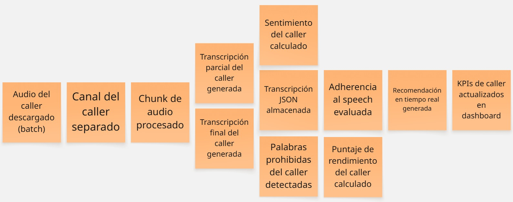
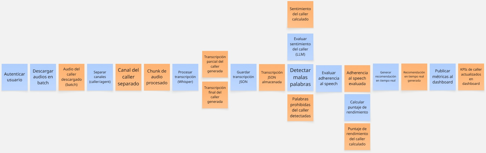
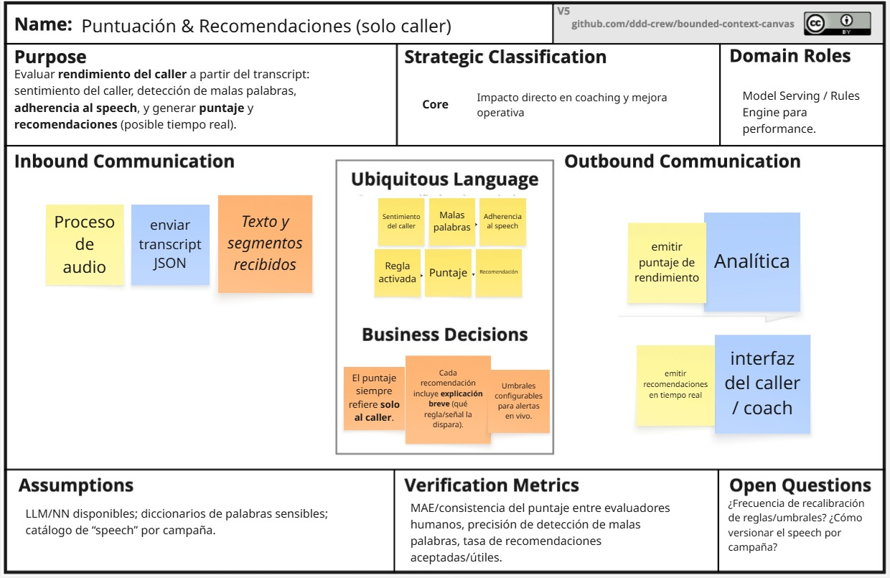
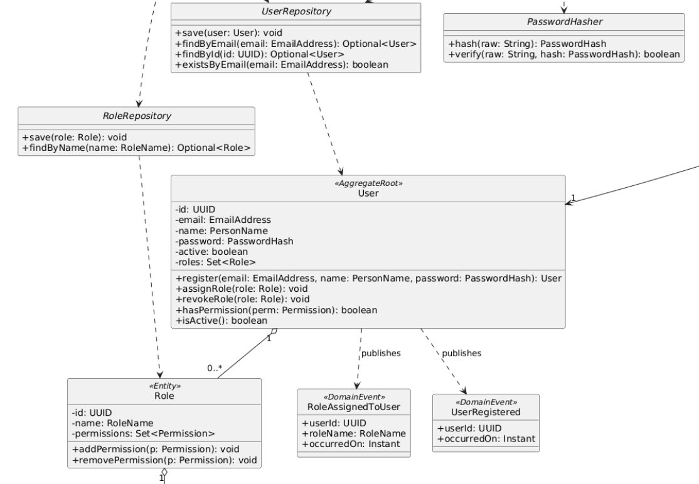

<h1 style="text-align: center;"> Informe del Trabajo Final </h1>
<h3 style="text-align: center;"> Universidad Peruana de Ciencias Aplicadas </h3>

<h5 style="text-align: center"> Área: Ingeniería de Software </h5>

<h5 style="text-align: center"> Arquitecturas de Software Emergentes </h5>
<h5 style="text-align: center"> NRC: 14802 </h5>

<h5 style="text-align: center"> Docente: Royer Edelwer Rojas Malásquez </h5>

<h5 style="text-align: center"> Startup: Los Power Ranger </h5>

<h5 style="text-align: center"> Producto: aloGPT </h5>

## Team members:

  
|                Nombre                 |   Código   |
| :-----------------------------------: | :--------: |
| Diego Martin Bastidas Bastidas        | u20221a301 |
| Diego André Cantoral Paredes          | u20201f568 |
| David Alejandro Rivas Sarango         | u20191e831 |
| Elvia Marcela Rodriguez Villa         | u20231c784 |
| Sebastian Valentino Silva Tirado      | u20211g296 |

<h5 style="text-align: center"> Ciclo 2025-02 </h5>

# Registro de Versiones del Informe

El objetivo de esta sección es resumir las modificaciones relevantes que se realizan al informe durante el ciclo de vida del proyecto. Esta sección inicia en una página nueva y se incluye un cuadro con la siguiente estructura:

| Versión |   Fecha    |             Autor             | Descripción de modificación                                                                                                                                                                       |
| :-----: | :--------: | :---------------------------: | ------------------------------------------------------------------------------------------------------------------------------------------------------------------------------------------------- |
|   TB1   | 15/09/2025 |Diego Martin Bastidas Bastidas      Diego André Cantoral Paredes       David Alejandro Rivas Sarango Elvia Marcela Rodriguez Villa     Silva Tirado, Sebastián Valentino  | Realización de:   - Capítulo I: Introducción - Capítulo II: Requirements Elicitation & Analysis - Capítulo III: Requirements Specification - Capítulo IV: Strategic-Level Software Design |

| Versión |   Fecha    |             Autor             | Descripción de modificación                                                                                                                                                                       |
| :-----: | :--------: | :---------------------------: | ------------------------------------------------------------------------------------------------------------------------------------------------------------------------------------------------- |
|   TP1   | 10/10/2025 |Diego Martin Bastidas Bastidas      Diego André Cantoral Paredes       David Alejandro Rivas Sarango Elvia Marcela Rodriguez Villa     Silva Tirado, Sebastián Valentino  | Realización de:   - Capítulo V: Tactical-Level Software Design.   - Capítulo VI: Solution UX Design |

# Project Report Collaboration Insights

URL del repositorio para el reporte del proyecto: https://github.com/TF-SoftwareEmergentes

**TB1**

  

  

**TP1**

  

  

Para el desarrollo del informe perteneciente a la entrega TP1, se dividió la implementación de secciones de la siguiente forma para cada integrante del equipo:

| Integrante                        | Tareas Asignadas                                                                                                                                                              |
| --------------------------------- | ----------------------------------------------------------------------------------------------------------------------------------------------------------------------------- |
| Diego Martin Bastidas Bastidas    | Elaboración de la Unidad 5 |
| Diego André Cantoral Paredes      | Elaboración de la Unidad 5 |
| David Alejandro Rivas Sarango     | Elaboración de la Unidad 6 |
| Elvia Marcela Rodriguez Villa     | Elaboración de la Unidad 6 |
| Silva Tirado, Sebastián Valentino | Elaboración de la Unidad 5 |

**Github Collaboration Insights**

Github también presenta un timeline de las ramas principales y los procesos de merge a los que se han sometido. Todas las ramas se crearon tomando en cuenta el diseño de GitFlow para una buena organización cuando se usa un software de control de versiones.

Los integrantes son:

- Diego Martin Bastidas Bastidas (ghostnotfound404)
- Diego André Cantoral Paredes (diegocantoralp)
- David Alejandro Rivas Sarango (dars2002)
- Elvia Marcela Rodriguez Villa (ElviaRV)
- Silva Tirado, Sebastián Valentino (SebasSilvaT)

# Contenido

1. [**Capítulo I: Introducción.**](#1.)  
   1.1. [Startup Profile.](#1.1.)  
   1.1.1. [Descripción del startup.](#1.1.1.) 
   1.1.2.[Perfiles de los integrantes del equipo.](#1.1.2.) 
   1.2. [Solution Profile.](#1.2.) 
   1.2.1. [Antecedentes y Problemática.](#1.2.1.) 
   1.2.2. [Lean UX Process.](#1.2.2.) 
   1.2.2.1 [Lean UX Problem Statements.](#1.2.2.1.) 
   1.2.2.2. [Lean UX Assumptions.](#1.2.2.2.) 
   1.2.2.3 [Lean UX Hypothesis Statements.](#1.2.2.3.) 
   1.2.2.4 [Lean UX Canvas.](#1.2.2.4.) 
   1.3. [Segmentos objetivo.](#1.3.) 
2. [**Capítulo II: Requirements Elicitation & Analysis.**](#2.) 
   2.1. [Competidores.](#2.1.) 
   2.1.1. [Análisis competitivo.](#2.1.1.) 
   2.1.2. [Estrategias y tácticas frente a competidores.](#2.1.2.) 
   2.2. [Entrevistas.](#2.2.) 
   2.2.1. [Diseño de entrevistas.](#2.2.1.) 
   2.2.2. [Registro de entrevistas.](#2.2.2.) 
   2.2.3. [Análisis de entrevistas.](#2.2.3.) 
   2.3. [Needfinding.](#2.3.) 
   2.3.1. [User Personas.](#2.3.1.) 
   2.3.2. [User Task Matrix.](#2.3.2.) 
   2.3.3. [Empathy Mapping.](#2.3.3.) 
   2.3.4. [As-is Scenario Mapping.](#2.3.4.) 
   2.4. [Ubiquitous Language](#2.4.) 
3. [**Capítulo III: Requirements Specification.**](#3.) 
   3.1. [To-Be Scenario Mapping.](#3.1.) 
   3.2. [User Stories.](#3.2.) 
   3.3. [Impact Mapping.](#3.3.) 
   3.4. [Product Backlog.](#3.4.) 
4. [**Capítulo IV: Solution Software Design.**](#4.) 
  4.1. [Strategic-Level Attribute-Driven Design.](#4.1.) 
  4.1.1. [Design Purpose.](#4.1.1.) 
  4.1.2. [Attribute-Driven Design Inputs.](#4.1.2.) 
  4.1.2.1. [Primary Functionality (Primary User Stories).](#4.1.2.1.) 
  4.1.2.2. [Quality Attribute Scenarios.](#4.1.2.2.) 
  4.1.2.3. [Constraints.](#4.1.2.3.) 
  4.1.3. [Architectural Drivers Backlog.](#4.1.3.) 
  4.1.4. [Architectural Design Decisions.](#4.1.4.) 
  4.1.5. [Quality Attribute Scenario Refinements.](#4.1.5.) 
  4.2. [Strategic-Level Domain-Driven Design.](#4.2.) 
  4.2.1. [EventStorming.](#4.2.1.) 
  4.2.2. [Candidate Context Discovery.](#4.2.2.) 
  4.2.3. [Domain Message Flows Modeling.](#4.2.3.) 
  4.2.4. [Bounded Context Canvases.](#4.2.4.) 
  4.2.5. [Context Mapping.](#4.2.5.) 
  4.3. [Software Architecture.](#4.3.) 
  4.3.1. [Software Architecture System Landscape Diagram.](#4.3.1.) 
  4.3.2. [Software Architecture Context Level Diagrams.](#4.3.2.) 
  4.3.3. [Software Architecture Container Level Diagrams.](#4.3.3.) 
  4.3.4. [Software Architecture Deployment Diagrams.](#4.3.4.) 
5. [**Capítulo V: Tactical-Level Software Design.**](#5.) 
   5.1. [Bounded Context: IAM (Access & Identity).](#5.1.) 
   5.1.1. [Domain Layer.](#5.1.1.) 
   5.1.2. [Interface Layer.](#5.1.2.) 
   5.1.3. [Application Layer.](#5.1.3.) 
   5.1.4. [Infrastructure Layer.](#5.1.4.) 
   5.1.5. [Bounded Context Software Architecture Component Level Diagrams.](#5.1.5.) 
   5.1.6. [Bounded Context Software Architecture Code Level Diagrams.](#5.1.6.) 
   5.1.6.1. [Bounded Context Domain Layer Class Diagrams.](#5.1.6.1.) 
   5.1.6.2. [Bounded Context Database Design Diagram.](#5.1.6.2.) 
   5.2. [Bounded Context: Proceso de audio.](#5.2.) 
   5.2.1. [Domain Layer.](#5.2.1.) 
   5.2.2. [Interface Layer.](#5.2.2.) 
   5.2.3. [Application Layer.](#5.2.3.) 
   5.2.4. [Infrastructure Layer.](#5.2.4.) 
   5.2.5. [Bounded Context Software Architecture Component Level Diagrams.](#5.2.5.) 
   5.2.6. [Bounded Context Software Architecture Code Level Diagrams.](#5.2.6.) 
   5.2.6.1. [Bounded Context Domain Layer Class Diagrams.](#5.2.6.1.) 
   5.2.6.2. [Bounded Context Database Design Diagram.](#5.2.6.2.) 
   5.3. [Bounded Context: Puntuación & Recomendaciones.](#5.3.) 
   5.3.1. [Domain Layer.](#5.3.1.) 
   5.3.2. [Interface Layer.](#5.3.2.) 
   5.3.3. [Application Layer.](#5.3.3.) 
   5.3.4. [Infrastructure Layer.](#5.3.4.) 
   5.3.5. [Bounded Context Software Architecture Component Level Diagrams.](#5.3.5.) 
   5.3.6. [Bounded Context Software Architecture Code Level Diagrams.](#5.3.6.) 
   5.3.6.1. [Bounded Context Domain Layer Class Diagrams.](#5.3.6.1.) 
   5.3.6.2. [Bounded Context Database Design Diagram.](#5.3.6.2.) 
   5.4. [Bounded Context: Analítica.](#5.4.) 
   5.4.1. [Domain Layer.](#5.4.1.) 
   5.4.2. [Interface Layer.](#5.4.2.) 
   5.4.3. [Application Layer.](#5.4.3.) 
   5.4.4. [Infrastructure Layer.](#5.4.4.) 
   5.4.5. [Bounded Context Software Architecture Component Level Diagrams.](#5.4.5.) 
   5.4.6. [Bounded Context Software Architecture Code Level Diagrams.](#5.4.6.) 
   5.4.6.1. [Bounded Context Domain Layer Class Diagrams.](#5.4.6.1.) 
   5.4.6.2. [Bounded Context Database Design Diagram.](#5.4.6.2.) 
6. [**Capítulo VI: Solution UX Design.**](#6.) 
    6.1. [Style Guidelines.](#6.1.) 
    6.1.1. [General Style Guidelines.](#6.1.1.) 
    6.1.2. [Web, Mobile & Devices Style Guidelines.](#6.1.2.) 
    6.2. [Information Architecture.](#6.2.) 
    6.2.1. [Site Maps.](#6.2.1.) 
    6.2.2. [Labeling Systems.](#6.2.2.) 
    6.2.3. [Searching Systems.](#6.2.3.) 
    6.2.4. [SEO Tags and Meta Tags.](#6.2.4.) 
    6.2.5. [Navigation Systems.](#6.2.5.) 
    6.3. [Landing Page UI Design.](#6.3.) 
    6.3.1. [Landing Page Wireframe.](#6.3.1.) 
    6.3.2. [Landing Page Mock-up.](#6.3.2.) 
    6.4. [Applications UX/UI Design.](#6.4.) 
    6.4.1. [Applications Wireframes.](#6.4.1.) 
    6.4.2. [Applications Wireflow Diagrams.](#6.4.2.) 
7. [Conclusiones](#5.) 
8. [Bibliografía](#6.) 
9. [Anexo](#7.) 

# STUDENT OUTCOME

El curso contribuye al cumplimiento del Student Outcome ABET:

**ABET – EAC - Student Outcome 3**

**Criterio:** Capacidad de comunicarse efectivamente con un rango de audiencias.

En el siguiente cuadro se describe las acciones realizadas y enunciados de
conclusiones por parte del grupo, que permiten sustentar el haber alcanzado el logro del ABET – EAC - Student Outcome 3.

<table>
  <thead>
    <tr>
      <th>Criterio específico</th>
      <th>Acciones realizadas</th>
      <th>Conclusiones</th>
    </tr>
  </thead>
  <tbody>
    <tr>
      <td>Comunica oralmente sus ideas y/o resultados con objetividad a público de diferentes especialidades y niveles jerárquicos, en el marco del desarrollo de un proyecto en ingeniería.</td>
      <td>
        Diego Martin Bastidas Bastidas 
        TB1: Expuso la importancia del problema y el objetivo del proyecto.  
        Diego André Cantoral Paredes 
        TB1: Presentó la metodología y explicó el uso de EventStorming.  
        David Alejandro Rivas Sarango 
        TB1: Explicó los bounded contexts y su interacción.  
        Elvia Marcela Rodriguez Villa 
        TB1: Describió los casos de uso y el valor para los usuarios finales.  
        Silva Tirado, Sebastián Valentino 
        TB1: Presentó las conclusiones parciales y los aportes estratégicos.
      </td>
      <td>
        TB1: Cada integrante logró comunicar con claridad su parte del proyecto, manteniendo un discurso técnico adaptado al nivel del público, lo que permitió una comprensión compartida del avance.
      </td>
    </tr>
    <tr>
      <td>Comunica en forma escrita ideas y/o resultados con objetividad a público de diferentes especialidades y niveles jerárquicos, en el marco del desarrollo de un proyecto en ingeniería.</td>
      <td>
        Diego Martin Bastidas Bastidas 
        TB1: Redactó la introducción y la justificación del problema.  
        Diego André Cantoral Paredes 
        TB1: Elaboró la sección de EventStorming y Candidate Context Discovery.  
        David Alejandro Rivas Sarango 
        TB1: Desarrolló los Bounded Context Canvases.  
        Elvia Marcela Rodriguez Villa 
        TB1: Redactó los Domain Message Flows Modeling.  
        Silva Tirado, Sebastián Valentino 
        TB1: Estructuró el Context Mapping y la conclusión general.
      </td>
      <td>
        TB1: Se alcanzó una redacción clara, coherente y objetiva en todas las secciones, lo que permitió consolidar un documento alineado con los criterios de un proyecto de ingeniería.
      </td>
    </tr>
  </tbody>
</table>

<h2>1. Capítulo I: Introducción</h2>

<h3>1.1. Startup Profile</h3>

Esta sección incluye la descripción del Startup y los perfiles de los integrantes del equipo.

<h4>1.1.1. Descripción del startup</h4>

aloGPT es una solución de inteligencia artificial para el sector de cobranzas. Su función principal es asistir a los agentes y supervisores en el proceso de llamadas a usuarios con deudas pendientes. La plataforma analiza la voz del deudor durante la llamada, identificando emociones, nivel de convicción y la probabilidad real de cumplir con la promesa de pago.

Análisis de promesa de pago: el sistema genera un score emocional del audio y lo interpreta con un modelo de lenguaje (LLM) para determinar la veracidad de la intención del cliente.

Gestión oportuna: en la fecha de vencimiento, aloGPT apoya en la identificación de los deudores con mayor probabilidad de pago, optimizando la eficiencia de las llamadas de cobranza.

<h4>1.1.2. Perfiles de los integrantes del equipo</h4>

|                       Photo                        | Description |
|:--------------------------------------------------:|:------------|
|  | **Nombre y Apellido:** Diego Martin Bastidas Bastidas    **Carrera:** Ingeniería de Software (8vo ciclo)   **Acerca de:** Decidí estudiar esta carrera porque desde pequeño me llamaba la atención el funcionamiento de las computadoras y los procesos que conllevan. Me apasiona practicar deportes de contacto, salir a pasear y, sobre todo, ser Groomer canino, ya que disfruto trabajar con mascotas. |
|  | **Nombre y Apellido:** Sebastián Valentino Silva Tirado   **Carrera:** Ingenieria de Software   **Acerca de:** Soy estudiante del octavo ciclo de la carrera de Ingeniería de Software en UPC. Opté por estudiar esta carrera porque me gusta la idea de programar y crear algo que pueda llegar a funcionar y ser útil en el mundo. Por lo cual, la universidad me da la posibilidad de estudiar y ser un profesional exitoso. Deseo ser buen integrante para mi equipo y me comprometo en hacer el mejor trabajo posible, y poder superarme más que el ciclo anterior. |
|  | **Nombre y Apellido:** Diego Cantoral   **Carrera:** Ingeniería de Software   **Acerca de:** Mi nombre es Diego André Cantoral Paredes y soy estudiante de la carrera de Ingeniería de Software. Desde siempre me interesaron los temas tecnológicos y sobre todo las computadoras, por lo que desarrollé una afición a los videojuegos y luego a la programación. Me considero una persona responsable, creativa y siempre dispuesto a ayudar a mis compañeros. |
|  | **Nombre y Apellido:** Elvia Rodríguez   **Carrera:** Ingeniería de Software   **Acerca de:** Soy Elvia Rodríguez, estudiante universitaria, egresada de Laboratoria y embajadora de Microsoft. He participado en voluntariados y Hackathons, aplicando mis habilidades en desarrollo de interfaces de usuario (UI) y programación web. Mi experiencia en el ámbito tecnológico y educativo puede contribuir al modelo de negocio mediante la creación de soluciones digitales innovadoras y funcionales. |
| | **Nombre y Apellido:** David Alejandro Rivas Sarango   **Carrera:** Ingeniería de Software   **Acerca de:** Mi nombre es David Alejandro Rivas Sarango, actualmente estoy cursando la carrera de Ingeniería de Software en la UPC. Soy una persona honesta y responsable. Me interesa el área de Data Science, por esto estoy siguiendo cursos de capacitacion en SQL y Python. |

<h3>1.2. Solution Profile</h3>

<h4>1.2.1. Antecedentes y Problemática</h4>

- What (¿Qué?)

  El sector de cobranzas depende en gran medida de llamadas telefónicas para recuperar deudas. Sin embargo, gran parte de estas interacciones no generan resultados efectivos, ya que los deudores suelen dar respuestas poco confiables sobre su intención de pago.

- Who (¿Quién?)

  Los principales afectados son los supervisores de cobranza y los agentes callers, quienes invierten tiempo y esfuerzo en contactar deudores sin tener herramientas objetivas para evaluar si las promesas de pago serán cumplidas.

- Where (¿Dónde?)

  Esto ocurre principalmente en call centers de cobranza y en áreas de gestión de pagos de bancos, financieras, cooperativas y empresas de servicios.

- When (¿Cuándo?)

  El problema se intensifica en las fechas de vencimiento de deudas, cuando los equipos realizan más llamadas y necesitan priorizar a los clientes con mayor probabilidad de pago.

- Why (¿Por qué?)

  Las promesas de pago incumplidas generan ineficiencia operativa, pérdida de tiempo de los agentes, y retrasos en la recuperación de dinero para las empresas. Además, la falta de análisis emocional en la comunicación provoca que los supervisores tomen decisiones con información incompleta.

- How (¿Cómo?)

  Actualmente, la evaluación de la promesa de pago depende de la percepción subjetiva del agente, sin métricas objetivas que midan la veracidad o la disposición real del deudor. Esto limita la capacidad de los supervisores para tomar decisiones basadas en datos.

- How much (¿Cuánto?)

  El impacto económico es alto: en muchos call centers de cobranzas, más del 50% de las promesas de pago no se cumplen, lo que se traduce en pérdidas millonarias y en un uso ineficiente de recursos humanos y tecnológicos.

<h4>1.2.2. Lean UX Process</h4>

<h5>1.2.2.1. Lean UX Problem Statements</h5>

Nuestro producto fue diseñado para apoyar a supervisores y agentes de cobranza mediante una plataforma que analiza la voz de los deudores de forma eficiente, confiable y fácil de usar. Hemos observado que en muchos call centers aún se enfrentan dificultades para identificar de manera objetiva qué promesas de pago son reales, lo que genera pérdida de tiempo, baja productividad y retrasos en la recuperación de la deuda.

<h5>1.2.2.2. Lean UX Assumptions</h5>

#### Features

- Análisis de voz y emociones: Los supervisores valoran poder identificar el nivel de convicción de los deudores a través de un score confiable que mide emociones e intenciones.

- Detección de promesas de pago: Los agentes necesitan un sistema que evalúe si las promesas realizadas durante la llamada son reales o poco probables.

- Alertas y reportes en tiempo real: Los usuarios valoran recibir insights inmediatos sobre la llamada, lo que les permite priorizar casos de mayor probabilidad de pago.

- Modelo freemium con opción premium: Los call centers estarían dispuestos a pagar por funciones avanzadas de predicción, reportes detallados y dashboards integrados.

#### Business Outcomes

- Aumentar la efectividad de recuperación de deuda mediante análisis predictivo de promesas de pago.

- Mejorar la productividad de los agentes y la toma de decisiones de supervisores.

- Generar ingresos sostenibles mediante licencias, comisiones por uso y planes premium.

- Posicionar a aloGPT como una solución innovadora y confiable en la industria de cobranzas.

#### Users

- Supervisores de cobranza, que necesitan medir y mejorar el desempeño de sus equipos.

- Agentes callers, que requieren apoyo en tiempo real para saber con qué deudores insistir o no.

- Call centers y áreas de cobranza de bancos, financieras, cooperativas y empresas de servicios.

#### User Outcomes & Benefits

- Identificar rápidamente deudores con mayor probabilidad de cumplir con su promesa de pago.

- Tomar decisiones basadas en datos objetivos en lugar de percepciones subjetivas.

- Reducir frustración y tiempo perdido en llamadas improductivas.

- Aumentar la tasa de éxito en la recuperación de deudas con una herramienta de fácil uso.

#### User Assumptions

- Los supervisores desean métricas claras y fáciles de interpretar para evaluar a sus equipos.

- Los agentes confían más en una herramienta que valide sus percepciones durante la llamada.

- Prefieren plataformas intuitivas que no interrumpan su flujo de trabajo.

- Los call centers están dispuestos a pagar un plan premium si obtienen análisis más profundos y predictivos.

#### Business Assumptions

- La demanda por soluciones de cobranza más efectivas seguirá creciendo en bancos y empresas de servicios.

- Los usuarios adoptarán la plataforma si esta ofrece rapidez, confiabilidad y facilidad de uso.

- Los call centers verán valor en registrar a sus equipos para aumentar el rendimiento y las recuperaciones.

<h5>1.2.2.3. Lean UX Hypothesis Statements</h5>

**Hipótesis 1**

Creemos que al ofrecer un sistema de análisis de voz que identifique emociones y el nivel de convicción en las promesas de pago, para supervisores de cobranza y agentes callers, mejoraremos la efectividad en la priorización de llamadas y aumentaremos la tasa de recuperación de deuda.
Sabremos que esta hipótesis es cierta
Cuando veamos que al menos el 60% de los supervisores reportan una mejora en la clasificación de deudores y que la tasa de cumplimiento de promesas de pago aumenta en un 20%.

**Hipótesis 2**

Creemos que al proveer reportes en tiempo real con un score de promesa de pago, los agentes de cobranza podrán tomar decisiones más rápidas y precisas durante la llamada, reduciendo el tiempo invertido en deudores con baja probabilidad de pago.
Sabremos que esta hipótesis es cierta
Cuando observemos que los agentes reducen en un 30% el tiempo promedio por llamada improductiva y aumentan en un 15% la conversión de promesas efectivas.

**Hipótesis 3**

Creemos que al implementar un sistema de alertas y dashboards fáciles de usar para supervisores, se incrementará la productividad del equipo y la satisfacción en la gestión de cobranza.
Sabremos que esta hipótesis es cierta
Cuando al menos el 70% de los supervisores reporten que la herramienta les facilita la toma de decisiones y se observe un aumento del 25% en la eficiencia operativa del call center.

**Hipótesis 4**

Creemos que al ofrecer un modelo free con funciones básicas gratuitas y análisis predictivos avanzados en un plan premium, los call centers adoptarán la plataforma y generaremos ingresos sostenibles.
Sabremos que esta hipótesis es cierta
Cuando al menos el 20% de los usuarios gratuitos migren al plan premium en los primeros 6 meses, y los ingresos por suscripciones superen las proyecciones iniciales.

<h5>1.2.2.4. Lean UX Canvas</h5>

**Enlace:** <a href="https://acortar.link/ualshH"> https://acortar.link/ualshH</a> 

<h3>1.3. Segmentos objetivo</h3>

**Segmento Objetivo 1: Supervisores de cobranza**

Son responsables de monitorear y dirigir equipos de agentes en call centers o áreas de cobranza. Su principal necesidad es contar con métricas objetivas y dashboards claros que les permitan evaluar en tiempo real la calidad de las promesas de pago, priorizar deudores y mejorar la productividad del equipo.

**Segmento Objetivo 2: Agentes callers**

Son los operadores que realizan las llamadas directamente a los deudores. Enfrentan la dificultad de distinguir entre promesas reales y falsas, lo que genera frustración y pérdida de tiempo. Con aloGPT reciben apoyo en tiempo real mediante un score de intención de pago, lo que les ayuda a decidir con qué clientes insistir y cómo enfocar la conversación.

<h2>2. Capítulo II: Requirements Elicitation & Analysis</h2>

<h3>2.1. Competidores</h3>

| Competidor          | Descripción                                                                 | Características                                                                 | Logo |
|---------------------|-----------------------------------------------------------------------------|---------------------------------------------------------------------------------|------|
| Latitude AI         | Plataforma que utiliza inteligencia artificial para analizar el comportamiento de deudores y predecir la probabilidad de pago, optimizando las estrategias de cobranza. | Canal de distribución principal: SaaS en la nube, integración con CRMs y plataformas de cobranza. |  |
| TrueAccord (EE. UU.)| Empresa especializada en cobranza digital automatizada que usa machine learning para personalizar mensajes y aumentar la tasa de recuperación de deudas. | Canal de distribución principal: Plataforma web, API de integración y comunicación omnicanal (email, SMS, chat). |  |
| CollectAI (Alemania)| Solución de gestión de cobranzas que combina IA con estrategias de comunicación digital para mejorar el flujo de caja y reducir costos operativos. | Canal de distribución principal: SaaS, integración API y comunicación omnicanal (correo, SMS, WhatsApp). |  |

<h4>2.1.1. Análisis competitivo</h4>

<table>
    <tr>
        <th colspan="2" align="center">¿Por qué llevar a cabo este análisis?</th>
        <th colspan="4" align="center">Lo realizamos para comprender mejor a la competencia en cobranza digital con IA y así ajustar la estrategia de negocio para competir con mayor efectividad.</th>
    </tr>
    <tr>
        <td colspan="2"></td>
        <td align="center">aloGPT</td>
        <td align="center">Latitude AI</td>
        <td align="center">TrueAccord</td>
        <td align="center">CollectAI</td>
    </tr>
    <tr>
        <td rowspan="2" align="center">Perfil</td>
        <td align="center"><b>Overview</b></td>
        <td align="center">Plataforma de cobranza asistida por IA enfocada en supervisores y agentes de call center. Integra generación automática de guiones, análisis en tiempo real y reportes personalizados.</td>
        <td align="center">Solución basada en IA que analiza el comportamiento de deudores y predice la probabilidad de pago, optimizando las estrategias de cobranza.</td>
        <td align="center">Empresa estadounidense que ofrece cobranza digital automatizada mediante machine learning, personalizando mensajes y procesos para cada deudor.</td>
        <td align="center">Startup alemana que combina IA y comunicación digital multicanal para mejorar el flujo de caja y reducir costos operativos.</td>
    </tr>
    <tr>
        <td align="center"><b>Ventaja competitiva ¿Qué valor ofrece a los clientes?</b></td>
        <td align="center">Optimiza la productividad de agentes y supervisores al generar guiones personalizados y análisis inmediato del desempeño.</td>
        <td align="center">Predicción avanzada de pagos y segmentación de clientes de alto valor.</td>
        <td align="center">Mensajes hiperpersonalizados y tasa alta de recuperación sin interacción humana.</td>
        <td align="center">Eficiencia en la comunicación digital y reducción significativa de los costos de cobranza.</td>
    </tr>
    <tr>
        <td rowspan="2" align="center">Perfil de Marketing</td>
        <td align="center"><b>Mercado objetivo</b></td>
        <td align="center">Empresas de cobranza y call centers que buscan mejorar la productividad de supervisores y agentes callers.</td>
        <td align="center">Bancos y grandes instituciones financieras que manejan volúmenes altos de cartera vencida.</td>
        <td align="center">Empresas financieras y fintechs en EE. UU. que buscan digitalizar su cobranza.</td>
        <td align="center">Compañías europeas de energía, telecomunicaciones y servicios financieros con altos volúmenes de clientes.</td>
    </tr>
    <tr>
        <td align="center"><b>Estrategias de marketing</b></td>
        <td align="center">Alianzas con call centers, demostraciones directas y casos de uso medibles.</td>
        <td align="center">Marketing B2B con enfoque en big data y consultoría.</td>
        <td align="center">Campañas digitales y contenido educativo sobre cobranza ética y efectiva.</td>
        <td align="center">Énfasis en eficiencia operativa y automatización en mercados europeos.</td>
    </tr>
    <tr>
        <td rowspan="3" align="center">Perfil de producto</td>
        <td align="center"><b>Productos o servicios</b></td>
        <td align="center">Generación automática de guiones, dashboards de supervisión, métricas de productividad y reportes en tiempo real.</td>
        <td align="center">Plataforma predictiva para segmentación de clientes y optimización de cobranza.</td>
        <td align="center">Automatización de cobranzas digitales con machine learning y comunicación multicanal.</td>
        <td align="center">Gestión de cobranzas digital con IA, recordatorios multicanal y pagos inteligentes.</td>
    </tr>
    <tr>
        <td align="center"><b>Precios y costos</b></td>
        <td align="center">Modelo SaaS con planes de suscripción escalables para equipos de cobranza.</td>
        <td align="center">Licenciamiento SaaS con costos elevados dirigidos a grandes corporaciones.</td>
        <td align="center">Modelo de comisiones + SaaS para fintechs y empresas medianas/grandes.</td>
        <td align="center">Licenciamiento SaaS y comisiones por recuperación de cartera.</td>
    </tr>
    <tr>
        <td align="center"><b>Canales de distribución (web y/o móvil)</b></td>
        <td align="center">Aplicación web con dashboards, API de integración y módulos de entrenamiento.</td>
        <td align="center">Plataforma SaaS en la nube e integraciones personalizadas.</td>
        <td align="center">Plataforma web, API e integración con CRMs.</td>
        <td align="center">SaaS en la nube y comunicación omnicanal (SMS, email, WhatsApp).</td>
    </tr>
    <tr>
        <td rowspan="4" align="center"><b>Análisis SWOT</b></td>
        <td align="center"><b>Fortalezas</b></td>
        <td align="center">Optimiza la eficiencia de agentes, insights inmediatos y facilidad de integración en call centers.</td>
        <td align="center">Alta capacidad predictiva en grandes volúmenes de datos.</td>
        <td align="center">Personalización avanzada y posicionamiento fuerte en EE. UU.</td>
        <td align="center">Automatización multicanal con fuerte presencia en Europa.</td>
    </tr>
    <tr>
        <td align="center"><b>Debilidades</b></td>
        <td align="center">Startup emergente con necesidad de construir reputación en el mercado.</td>
        <td align="center">Costos elevados limitan acceso a empresas medianas.</td>
        <td align="center">Enfocado principalmente en el mercado estadounidense.</td>
        <td align="center">Dependencia en conectividad digital y regulación europea estricta.</td>
    </tr>
    <tr>
        <td align="center"><b>Oportunidades</b></td>
        <td align="center">Escalar a Latinoamérica donde la industria de call centers es grande y creciente.</td>
        <td align="center">Expandirse a mercados emergentes fuera de EE. UU.</td>
        <td align="center">Ingresar a nuevos sectores como seguros y salud.</td>
        <td align="center">Crecer en mercados fuera de Europa con soluciones adaptadas.</td>
    </tr>
    <tr>
        <td align="center"><b>Amenazas</b></td>
        <td align="center">Competidores consolidados con mayor capital y presencia internacional.</td>
        <td align="center">Competencia en IA aplicada a cobranza de grandes techs.</td>
        <td align="center">Nuevas regulaciones de privacidad y datos sensibles en EE. UU.</td>
        <td align="center">Riesgo de que surjan plataformas más económicas y simples.</td>
    </tr>
</table>

<h4>2.1.2. Estrategias y tácticas frente a competidores</h4>

**Propuesta de valor diferenciada**  

Crear una plataforma que conecte de forma rápida y confiable a supervisores de cobranza y agentes callers con herramientas de inteligencia artificial, destacándose por la facilidad de uso, la reducción de tiempos en la gestión y la mejora en los indicadores de desempeño.  

---

**Estrategia digital multicanal**  
- Campañas en redes sociales profesionales (LinkedIn).  
- Webinars especializados en cobranza y call centers.  
- Publicidad segmentada en empresas de servicios financieros, telecomunicaciones y retail con alta necesidad de gestión de cartera.  

---

**Generación de confianza**  
- Incorporar testimonios y casos de éxito reales de call centers.  
- Mostrar mejoras en KPIs como:  
  - Promesas de pago cumplidas.  
  - Eficiencia por llamada.  
  - Reducción de costos operativos.  
- Difusión de resultados en la app y en campañas publicitarias.  

---

**Beneficios iniciales**  
- Promociones de lanzamiento (acceso gratuito a módulos premium durante los primeros meses).  
- Gamificación interna para agentes y supervisores con beneficios como:  
  - Dashboards más avanzados.  
  - Reportes personalizados.  
  - Soporte técnico prioritario.  

---

**Valor para supervisores y agentes**  
- Generación de insights inmediatos (guiones sugeridos en tiempo real y métricas automáticas de productividad).  
- Mejora del desempeño y reducción de la carga operativa.  
- Motivación del equipo mediante recompensas por rendimiento.  

<h3>2.2. Entrevistas</h3>

<h4>2.2.1. Diseño de entrevistas</h4>

**Preguntas para el Segmento Objetivo 1: Supervisores de cobranza**

1. ¿Cuáles son los principales retos que enfrentas al supervisar a los agentes de cobranza?

1. ¿Qué métricas utilizas actualmente para medir el desempeño de tu equipo?

1. ¿Cómo decides si un deudor realmente cumplirá con la promesa de pago?

1. ¿Qué tan confiables consideras las promesas de pago que registran los agentes?

1. ¿Qué herramientas o sistemas utilizas actualmente para gestionar las llamadas de cobranza?

1. ¿Qué problemas ves en los reportes o en la manera en que recibes la información?

1. ¿Qué mejorarías en el proceso de seguimiento a las promesas de pago?

1. ¿Te resultaría útil una plataforma que analice las emociones en la voz del deudor y prediga la probabilidad de pago? ¿Por qué?

1. ¿Cómo influiría en tu trabajo poder tener dashboards automáticos de predicción de pagos?

1. ¿Qué características te darían confianza para implementar una herramienta como aloGPT en tu equipo?

**Preguntas para el  Segmento Objetivo 2: Agentes callers**

1. ¿Qué es lo más difícil al momento de convencer a un deudor para que cumpla su promesa de pago?

1. ¿Cuánto tiempo promedio dedicas a cada llamada y cómo lo mides?

1. ¿Qué tan seguido percibes que los deudores cumplen realmente con sus promesas de pago?

1. ¿Qué técnicas o frases usas para persuadir al deudor?

1. ¿Recibes apoyo o guías en tiempo real mientras llamas, o todo depende de tu experiencia?

1. ¿Qué tan útiles consideras los guiones que te dan actualmente?

1. ¿Qué te gustaría mejorar en el proceso de llamadas para que sea más efectivo?

1. ¿Qué pensarías de una herramienta que te sugiera en tiempo real qué decir según el tono de voz del cliente?

1. ¿Qué beneficios personales esperas obtener de una plataforma como aloGPT (menos estrés, más cierres, incentivos, etc.)?

1. ¿Qué haría que realmente quieras usar este tipo de herramienta en tu día a día?

<h4>2.2.2. Registro de entrevistas</h4>

### Segmento 1: Supervisores de cobranza

<table style="width: 100%; border-collapse: collapse;">
    <tr>
        <td>Entrevistado N°1</td>
        <td>Marcelo Ávalos</td>
    </tr> 
    <tr>
        <td>Edad</td>
        <td>25</td>
    </tr> 
    <tr>
        <td>Distrito de residencia</td>
        <td>San Isidro</td>
    </tr> 
    <tr>
        <td></td>
        <td>Marcelo Ávalos es un supervisor de cobranza con 5 años de experiencia en el sector.</td>
    </tr> 
    <tr>
        <td>Timing: 0:00 - 09:04</td>
        <td>URL: <a href="https://upcedupe-my.sharepoint.com/:v:/g/personal/u20211g296_upc_edu_pe/EfR9V51IV1tGk25nxx9L2ZIBoat2qR7QvrW26D12AZZRwA?e=ebOzyE">Link del Video</a></td>
    </tr> 
    <tr>
        <td>Entrevistado N°2</td>
        <td>Amner Llamo</td>
    </tr> 
    <tr>
        <td>Edad</td>
        <td>22</td>
    </tr> 
    <tr>
        <td>Distrito de residencia</td>
        <td>San Miguel</td>
    </tr> 
    <tr>
        <td></td>
        <td>En la entrevista, el supervisor comentó que las herrmaientas actuales que utiliza para la medición de sus colaboradores son útiles pero que desaría contar con resultados relacionados a la calidad de las llamadas que recibe, y contar con un dashboard que muestre los resultados más importantes sería muy beneficioso para su trabajo </td>
    </tr> 
    <tr>
        <td>Timing: 00:00 - 04:24</td>
        <td>URL: <a href="https://upcedupe-my.sharepoint.com/:v:/g/personal/u20201f568_upc_edu_pe/EUn8MWIvHl1FtDR9EKUQr9YBdKAfrKMS8NYwGUXvDRSTkw?e=tCfled&nav=eyJyZWZlcnJhbEluZm8iOnsicmVmZXJyYWxBcHAiOiJTdHJlYW1XZWJBcHAiLCJyZWZlcnJhbFZpZXciOiJTaGFyZURpYWxvZy1MaW5rIiwicmVmZXJyYWxBcHBQbGF0Zm9ybSI6IldlYiIsInJlZmVycmFsTW9kZSI6InZpZXcifX0%3D">Link del Video</a></td>
    </tr> 
    <tr>
        <td>Entrevistado N°3</td>
        <td>Vanesa Gomez</td>
    </tr> 
    <tr>
        <td>Edad</td>
        <td>24</td>
    </tr> 
    <tr>
        <td>Distrito de residencia</td>
        <td>Lince</td>
    </tr> 
    <tr>
        <td></td>
        <td>El entrevistado resaltó que la plataforma le permite monitorear en tiempo real las llamadas y acceder a métricas históricas para evaluar a su equipo. Considera especialmente útil la detección temprana de emociones negativas, ya que facilita intervenir antes de que surjan conflictos. También valoró los reportes automáticos de cumplimiento normativo, que simplifican auditorías internas. Sin embargo, señaló que aún es necesario mejorar la precisión del análisis y aprovechar más los datos para entrenar a los agentes.</td>
    </tr> 
    <tr>
        <td>Timing: 00:00 - 6:56</td>
        <td>URL: <a href="https://n9.cl/entrevista_3">Link del Video</a></td>
    </tr> 
</table>

### Segmento 2: Agentes callers

<table style="width: 100%; border-collapse: collapse;">
    <tr>
        <td>Entrevistado N°1</td>
        <td>Marcia Rea Gamboa</td>
    </tr> 
    <tr>
        <td>Edad</td>
        <td>21</td>
    </tr> 
    <tr>
        <td>Distrito de residencia</td>
        <td>Comas</td>
    </tr> 
    <tr>
        <td></td>
        <td>Marcia Rea es una joven que trabaja como agente de cobranza y busca mejorar sus habilidades de persuasión.</td>
    </tr> 
    <tr>
        <td>Timing: 0:00 - 09:43</td>
        <td>URL: <a href="https://upcedupe-my.sharepoint.com/:v:/g/personal/u20211g296_upc_edu_pe/EavOkRlWWUFMowRkOibxKaUByF-2pkt2ZK79EkvEI7W-gg?e=jYYiLL">Link del Video</a></td>
    </tr> 
    <tr>
        <td>Entrevistado N°2</td>
        <td>Sebastián Vargas</td>
    </tr> 
    <tr>
        <td>Edad</td>
        <td>25</td>
    </tr> 
    <tr>
        <td>Distrito de residencia</td>
        <td>San Martín de Porres</td>
    </tr> 
    <tr>
        <td></td>
        <td>Sebastián Vargas es un estudiante de la UPC que ha trabajado en el área de atención al cliente de Movistar y Claro.</td>
    </tr> 
    <tr>
        <td>Timing: 00:00 - 09:05</td>
        <td>URL: <a href="https://upcedupe-my.sharepoint.com/:v:/g/personal/u20191e831_upc_edu_pe/EVi9VU-y-spAqbxAWZlRDnQBiUlZWZ5uoBrDVUJT8L41fw?e=JJmGen&nav=eyJyZWZlcnJhbEluZm8iOnsicmVmZXJyYWxBcHAiOiJTdHJlYW1XZWJBcHAiLCJyZWZlcnJhbFZpZXciOiJTaGFyZURpYWxvZy1MaW5rIiwicmVmZXJyYWxBcHBQbGF0Zm9ybSI6IldlYiIsInJlZmVycmFsTW9kZSI6InZpZXcifX0%3D">Link del Video</a></td>
    </tr> 
    <tr>
        <td>Entrevistado N°3</td>
        <td>Alejandro Álvarez </td>
    </tr> 
    <tr>
        <td>Edad</td>
        <td>29</td>
    </tr> 
    <tr>
        <td>Distrito de residencia</td>
        <td>Lince</td>
    </tr> 
    <tr>
        <td></td>
        <td>Alejandro es ex trabajador del área de cobranzas de una conocida empresa de telefonía </td>
    </tr> 
    <tr>
        <td>Timing: 00:00:00 - 05:15</td>
        <td>URL: <a href="https://upcedupe-my.sharepoint.com/:v:/g/personal/u20231c784_upc_edu_pe/EUHvlUQYGf9PgOThOUt9N-UB4D4_qLtRXgOQmHfzpYHgiQ?nav=eyJyZWZlcnJhbEluZm8iOnsicmVmZXJyYWxBcHAiOiJTdHJlYW1XZWJBcHAiLCJyZWZlcnJhbFZpZXciOiJTaGFyZURpYWxvZy1MaW5rIiwicmVmZXJyYWxBcHBQbGF0Zm9ybSI6IldlYiIsInJlZmVycmFsTW9kZSI6InZpZXcifX0%3D&e=HrEumQ" >Link del Video</a></td>
    </tr> 
</table>

<h4>2.2.3. Análisis de entrevistas</h4>

### Análisis del segmento de agentes de cobranza

Los entrevistados valoran altamente la plataforma por su capacidad de mostrar en tiempo real el sentimiento y la disposición de pago de los clientes, lo cual les permite ajustar su discurso durante la llamada. El 100% de los agentes coincidió en que el dashboard interactivo facilita la comprensión de métricas clave como tono emocional, probabilidad de pago y cumplimiento normativo. La mayoría destacó la utilidad de recibir alertas inmediatas de riesgo que les ayudan a prevenir errores de comunicación o prácticas indebidas.

En general, los agentes consideran que la plataforma es un aliado estratégico para mejorar la productividad y los resultados de cobranza, aunque sugieren refinar la usabilidad y la integración para maximizar su impacto.

### Análisis del segmento de Agentes callers

El 100% de los supervisores entrevistados valoraron la posibilidad de monitorear en vivo las conversaciones y acceder a métricas históricas que permiten evaluar el desempeño de los agentes. Un 70% destacó como principal ventaja la detección temprana de emociones negativas, ya que ayuda a anticipar conflictos y tomar decisiones de coaching oportunas. Además, un 50% subrayó la importancia de contar con reportes automatizados de cumplimiento normativo, lo que facilita auditorías internas y externas.

En general, los supervisores perciben la plataforma como una herramienta clave para optimizar la gestión de equipos de cobranza, mejorar la calidad del servicio y reducir riesgos regulatorios. Sin embargo, insisten en la necesidad de fortalecer la precisión del análisis y aprovechar los datos para la capacitación continua.

<h3>2.3. Needfinding</h3>

<h4>2.3.1. User Personas</h4>

**Segmento Objetivo 1: Supervisores de cobranza**

**Segmento Objetivo 2: Agentes callers**

<h4>2.3.2. User Task Matrix</h4>

| Tarea | Supervisores de Cobranza (Frecuencia / Importancia) | Agentes Callers (Frecuencia / Importancia) |
|-------|-----------------------------------------------------|--------------------------------------------|
| Revisar desempeño del equipo | Frecuente / Alta | - |
| Analizar promesas de pago | Frecuente / Alta | Frecuente / Alta |
| Recibir reportes automáticos | Frecuente / Alta | - |
| Monitorear llamadas en tiempo real | Media / Alta | - |
| Ajustar estrategias de cobranza | Media / Alta | - |
| Registrar promesas de pago en el sistema | - | Frecuente / Alta |
| Seguir guiones de cobranza | - | Frecuente / Media |
| Convencer al deudor para que pague | - | Frecuente / Alta |
| Validar emociones y tono de voz con IA | Media / Alta | Frecuente / Alta |
| Cumplir objetivos de cobranza (KPIs) | Frecuente / Alta | Frecuente / Alta |
| Recibir retroalimentación gamificada (niveles, puntos, incentivos) | Media / Media | Frecuente / Media |

<h4>2.3.3. Empathy Mapping</h4>

**Segmento Objetivo 1: Supervisores de cobranza**

**Segmento Objetivo 2: Agentes callers**

<h4>2.3.4. As-is Scenario Mapping</h4>

**Segmento Objetivo 1: Supervisores de cobranza**

**Segmento Objetivo 2: Agentes callers**

<h3>2.4. Ubiquitous Language</h3>

| Término en Inglés (Español) | Definición |
|-----------------------------|------------|
| **Account (Cuenta)** | Identidad digital de un usuario en aloGPT, ya sea supervisor o agente caller, con acceso al sistema y permisos asociados. |
| **User (Usuario)** | Persona registrada en la plataforma, que puede ser un **Supervisor** o un **Agente Caller**. |
| **Supervisor (Supervisor de Cobranza)** | Usuario que gestiona, supervisa y analiza el desempeño de los agentes callers y la efectividad de las llamadas de cobranza. |
| **Caller Agent (Agente Caller)** | Usuario encargado de realizar llamadas a los deudores, registrar interacciones y utilizar el análisis de voz para mejorar la gestión de cobranza. |
| **Debtor (Deudor)** | Persona que mantiene una deuda pendiente y es contactada por un agente a través de la plataforma. |
| **Call (Llamada)** | Interacción telefónica entre un agente caller y un deudor, que puede ser grabada y analizada por aloGPT. |
| **Voice Analysis (Análisis de Voz)** | Proceso automatizado de aloGPT que interpreta el tono, emociones y patrones de la voz del deudor para generar un puntaje o probabilidad de pago. |
| **Promise to Pay (Promesa de Pago)** | Compromiso verbal detectado durante una llamada en la que el deudor indica su disposición a realizar un pago. |
| **Promise Score (Score de Promesa)** | Puntuación calculada por aloGPT que estima la probabilidad de que el deudor cumpla con su promesa de pago. |
| **LLM Analysis (Análisis LLM)** | Interpretación del lenguaje y contenido de la llamada mediante un modelo de lenguaje, para identificar la intención y credibilidad del deudor. |
| **Notification (Notificación)** | Aviso que recibe un agente o supervisor sobre pagos pendientes, llamadas programadas o resultados de análisis de voz. |
| **Dashboard (Panel de Control)** | Vista centralizada para supervisores donde se muestran métricas clave como desempeño de agentes, score de promesas y cumplimiento de pagos. |
| **Report (Reporte de Gestión)** | Documento generado automáticamente con estadísticas de llamadas, tasas de promesas y efectividad de los agentes. |
| **Gamification (Gamificación)** | Sistema de incentivos para agentes basado en métricas de desempeño (ej. cumplimiento de metas, efectividad en promesas). |
| **Level (Nivel)** | Categoría alcanzada por un agente en el sistema de gamificación (ej. Bronce, Plata, Oro) que refleja su efectividad en cobranza. |
| **Reward (Recompensa)** | Beneficio otorgado a los agentes callers por su desempeño (bonificaciones, reconocimientos o acceso a más herramientas). |

<h2>3. Capítulo III: Requirements Specification</h2>

<h3>3.1. To-Be Scenario Mapping</h3>

**Segmento Objetivo 1: Supervisores de cobranza**

**Segmento Objetivo 2: Agentes callers**

<h3>3.2. User Stories</h3>

| Epic ID | Título | Descripción |
|---------|--------|-------------|
| EP001 | Gestión de Usuarios y Autenticación | Como usuario (supervisor o agente de cobranza), quiero gestionar mi acceso y perfil para mantener la seguridad y personalización del sistema. |

| Story ID | Título | Descripción | Criterios de aceptación con Escenarios |
|----------|--------|-------------|----------------------------------------|
| US001 | Registro de usuario | Como nuevo usuario del equipo de cobranza, quiero crear una cuenta para acceder a la plataforma de análisis de sentimientos. | E01: Registro exitoso Dado que un nuevo usuario necesita registrarse Cuando completa el formulario de registro con datos válidos Y confirma su registro Entonces recibe un correo de verificación y su cuenta queda pendiente de activación.  E02: Registro con datos inválidos Dado que un nuevo usuario intenta registrarse Cuando ingresa datos incompletos o inválidos Entonces el sistema muestra mensajes de error específicos. |
| US002 | Inicio de sesión | Como usuario registrado, quiero iniciar sesión para acceder al dashboard de análisis. | E01: Login exitoso Dado que un usuario tiene credenciales válidas Cuando ingresa usuario y contraseña correctos Entonces accede al dashboard principal.  E02: Credenciales incorrectas Dado que un usuario ingresa credenciales inválidas Cuando intenta iniciar sesión Entonces el sistema muestra error de autenticación. |
| US003 | Recuperación de contraseña | Como usuario, quiero recuperar mi contraseña en caso de olvido para mantener el acceso al sistema. | E01: Recuperación exitosa Dado que un usuario olvidó su contraseña Cuando solicita recuperación vía email Entonces recibe instrucciones para resetear su contraseña. |

| Epic ID | Título | Descripción |
|---------|--------|-------------|
| EP002 | Procesamiento y Análisis de Audios | Como sistema, debo procesar audios de llamadas, generar transcripciones y analizar sentimientos para proporcionar insights valiosos al equipo de cobranza. |

| Story ID | Título | Descripción | Criterios de aceptación con Escenarios |
|----------|--------|-------------|----------------------------------------|
| US004 | Carga de audios de llamadas | Como agente, quiero subir audios de llamadas para que sean procesados y analizados. | E01: Carga exitosa Dado que un agente selecciona un archivo de audio Cuando lo sube al sistema Entonces recibe confirmación y el audio entra a la cola de procesamiento.  E02: Formato inválido Dado que un agente sube un archivo no compatible Cuando intenta procesarlo Entonces el sistema rechaza el archivo y notifica el error. |
| US005 | Transcripción automática | Como sistema, debo transcribir automáticamente los audios para facilitar el análisis de contenido. | E01: Transcripción exitosa Dado que un audio es procesado Cuando el motor de transcripción funciona correctamente Entonces se genera texto con alta precisión y bajo margen de error. |
| US006 | Análisis de sentimiento | Como sistema, debo analizar el tono emocional del cliente usando LLM para clasificar el estado anímico. | E01: Análisis completo Dado que una transcripción está disponible Cuando el LLM procesa el contenido Entonces clasifica el sentimiento (positivo, neutral, negativo, estrés, disposición pago). |

| Epic ID | Título | Descripción |
|---------|--------|-------------|
| EP003 | Dashboard y Visualización de Insights | Como supervisor o agente, quiero visualizar los resultados del análisis através de un dashboard interactivo para tomar decisiones informadas. |

| Story ID | Título | Descripción | Criterios de aceptación con Escenarios |
|----------|--------|-------------|----------------------------------------|
| US007 | Dashboard principal | Como usuario, quiero acceder a un dashboard con métricas generales del desempeño del equipo. | E01: Visualización de KPIs Dado que un usuario accede al dashboard Cuando el sistema carga la información Entonces muestra métricas clave: llamadas procesadas, distribución de sentimientos, efectividad. |
| US008 | Filtros de búsqueda | Como supervisor, quiero filtrar llamadas por tipo de sentimiento para analizar patrones específicos. | E01: Filtrado por sentimiento Dado que hay múltiples llamadas analizadas Cuando selecciono filtrar por "disposición de pago" Entonces el sistema muestra solo las llamadas con esa clasificación. |
| US009 | Detalle de llamada | Como agente, quiero ver el detalle completo de una llamada específica incluyendo transcripción y análisis. | E01: Visualización completa Dado que selecciono una llamada del listado Cuando accedo a su detalle Entonces veo audio, transcripción, análisis de sentimiento y recomendaciones. |

| Epic ID | Título | Descripción |
|---------|--------|-------------|
| EP004 | Recomendaciones y Alertas en Tiempo Real | Como sistema, debo proporcionar recomendaciones prácticas basadas en el análisis para mejorar la efectividad en la cobranza. |

| Story ID | Título | Descripción | Criterios de aceptación con Escenarios |
|----------|--------|-------------|----------------------------------------|
| US010 | Recomendaciones personalizadas | Como agente, quiero recibir sugerencias específicas basadas en el análisis de cada llamada. | E01: Recomendaciones contextuales Dado que una llamada muestra cliente estresado Cuando el sistema analiza el patrón Entonces sugiere técnicas de desescalamiento y próximos pasos. |
| US011 | Alertas de oportunidades | Como supervisor, quiero recibir alertas cuando se detecte alta disposición de pago. | E01: Alerta inmediata Dado que una llamada muestra disposición de pago alta Cuando el análisis se completa Entonces el sistema notifica al supervisor para acción inmediata. |

| Epic ID | Título | Descripción |
|---------|--------|-------------|
| EP005 | Reportes y Analytics | Como supervisor, quiero generar reportes detallados del desempeño del equipo y efectividad de las estrategias de cobranza. |

| Story ID | Título | Descripción | Criterios de aceptación con Escenarios |
|----------|--------|-------------|----------------------------------------|
| US012 | Reportes periódicos | Como supervisor, quiero generar reportes semanales/mensuales de métricas clave. | E01: Generación de reportes Dado que solicito un reporte del mes actual Cuando el sistema procesa la data Entonces genera PDF/Excel con todas las métricas relevantes. |
| US013 | Tendencias temporales | Como manager, quiero visualizar tendencias de sentimientos a lo largo del tiempo. | E01: Análisis temporal Dado que accedo a la sección de analytics Cuando selecciono rango de fechas Entonces veo gráficos de evolución de sentimientos y efectividad. |

| Story ID | Título | Descripción | Criterios de aceptación con Escenarios |
|----------|--------|-------------|----------------------------------------|
| TS001 | Endpoint para procesamiento de audio | Como developer, quiero crear un endpoint para subir y procesar audios de llamadas. | E01: Procesamiento exitoso Dado el endpoint "/api/audio/process" Cuando se envía POST con audio válido Entonces responde 202 Accepted y devuelve ID de proceso. |
| TS002 | Endpoint para análisis de sentimiento | Como developer, quiero crear un endpoint para análisis de texto con LLM. | E01: Análisis exitoso Dado el endpoint "/api/analyze/sentiment" Cuando se envía texto de transcripción Entonces devuelve clasificación de sentimiento y confianza. |
| TS003 | Endpoint para dashboard data | Como developer, quiero crear endpoints para alimentar el dashboard. | E01: Data consistente Dado el endpoint "/api/dashboard/metrics" Cuando se solicita data del dashboard Entonces devuelve métricas en tiempo real. |

<h3>3.3. Impact Mapping</h3>

| Actor              | Impacto                        | Comportamiento Deseado                               | Funcionalidades (Deliverables)                                   |
|--------------------|--------------------------------|------------------------------------------------------|------------------------------------------------------------------|
| Supervisores de cobranza| Mejorar estrategias de negociación | Adaptar su enfoque según el estado emocional del cliente | - Dashboard con análisis de sentimientos   - Recomendaciones personalizadas   - Alertas de oportunidades |
| Agentes callers       | Optimizar gestión del equipo   | Identificar patrones y oportunidades de mejora        | - Reportes de desempeño   - Tendencias temporales   - Métricas de efectividad |

### User Journey Map – Supervisores de cobranza

</img>

### User Journey Map – Agentes callers

</img>

<h3>3.4. Product Backlog</h3>

| ID     | Título                              | Estimación | Estimación en Horas |
|--------|-------------------------------------|------------|---------------------|
| US001  | Registro de usuario                 | S          | 3                   |
| US002  | Inicio de sesión                    | S          | 2                   |
| US003  | Recuperación de contraseña          | S          | 3                   |
| US004  | Carga de audios de llamadas         | M          | 5                   |
| US005  | Transcripción automática            | L          | 13                  |
| US006  | Análisis de sentimiento             | L          | 21                  |
| US007  | Dashboard principal                 | M          | 8                   |
| US008  | Filtros de búsqueda                 | M          | 5                   |
| US009  | Detalle de llamada                  | M          | 8                   |
| US010  | Recomendaciones personalizadas      | M          | 8                   |
| US011  | Alertas de oportunidades            | S          | 3                   |
| US012  | Reportes periódicos                 | M          | 8                   |
| US013  | Tendencias temporales               | M          | 8                   |
| US014  | Seguridad de datos                  | M          | 8                   |
| TS001  | Endpoint para procesamiento de audio| M          | 8                   |
| TS002  | Endpoint para análisis de sentimiento| M         | 8                   |
| TS003  | Endpoint para dashboard data        | M          | 5                   |

| Tamaño | Rango de Horas | Descripción |
|--------|----------------|-------------|
| S      | 1-3            | Tareas simples, rápidas de implementar |
| M      | 5-8            | Tareas moderadas, requieren más desarrollo o integración |
| L      | 13+            | Tareas complejas, con múltiples escenarios o integraciones externas |

<h2>4. Capítulo IV: Solution Software Design</h2>

<h3>4.1. Strategic-Level Attribute-Driven Design</h3>

En este capítulo se muestran las decisiones que fundamentan la propuesta de la arquitectura; en la que el análisis permite que la solución esté planteada bajo una sólida base.

<h4>4.1.1. Design Purpose</h4>

El propósito del diseño es mejorar la eficiencia en la gestión de cobranza mediante Inteligencia Artificial.  
La plataforma busca:  
- Procesar audios de llamadas y transcribirlos automáticamente con un LLM.  
- Analizar emociones con una red neuronal de sentimiento.  
- Predecir disposición de pago y apoyar la toma de decisiones.  
- Brindar métricas en un dashboard interactivo para agentes y supervisores.  

<h4>4.1.2. Attribute-Driven Design Inputs</h4>

Se introduce los insumos principales que definen el proceso clave del diseño arquitectónico. 

<h5>4.1.2.1. Primary Functionality (Primary User Stories)</h5>

Se identificar las User Stories con mayor impacto en las funcionalidades de la solución y que coindicionen de mayor manera la arquitectura. 

| ID     | Título                              | Descripción |
|--------|-------------------------------------|-------------|
| US004  | Carga de audios de llamadas         | Como agente, quiero subir audios de llamadas para que sean procesados y analizados. |
| US005  | Transcripción automática            | Como sistema, debo transcribir automáticamente los audios para facilitar el análisis de contenido. |
| US006  | Análisis de sentimiento             | Como sistema, debo analizar el tono emocional del cliente usando LLM para clasificar el estado anímico. |
| US007  | Dashboard principal                 | Como usuario, quiero acceder a un dashboard con métricas generales del desempeño del equipo. |
| US008  | Filtros de búsqueda                 | Como supervisor, quiero filtrar llamadas por tipo de sentimiento para analizar patrones específicos. |
| US009  | Detalle de llamada                  | Como agente, quiero ver el detalle completo de una llamada específica incluyendo transcripción y análisis. |
| US010  | Recomendaciones personalizadas      | Como agente, quiero recibir sugerencias específicas basadas en el análisis de cada llamada. |

<h5>4.1.2.2. Quality Attribute Scenarios</h5>

Se especifican los escenarios sobre los que se estarían evidenciando los atributos de calidad definidos que tendrán un comportamiento ante estímulos específicos. 

| Atributo de Calidad | Fuente                    | Escenario                                | Estímulo                                   | Artefacto                          | Entorno                   | Respuesta                                                    | Medida                                |
|---------------------|---------------------------|------------------------------------------|--------------------------------------------|------------------------------------|---------------------------|--------------------------------------------------------------|---------------------------------------|
| **Rendimiento**     | Agente                    | Procesamiento de audio en tiempo casi real | Subida de archivo de audio (5-10 min)      | Módulo de transcripción + análisis | Plataforma web             | Transcripción y análisis completos en menos de 3 minutos     | 95% de procesamientos < 3 min         |
| **Disponibilidad**  | Usuario (agente/supervisor) | Acceso continuo al dashboard              | Solicitud de acceso durante horario laboral | Servidor de aplicación / Dashboard | Nube multi-región          | Sistema disponible 24/7 con máximo 1h de mantenimiento mensual | 99.5% uptime                          |
| **Seguridad**       | Atacante externo/interno  | Protección de datos sensibles             | Intento de acceso no autorizado a grabaciones | API backend / Repositorio de audios | Plataforma en producción   | Autenticación robusta y encriptación end-to-end              | 0 brechas de datos                    |
| **Usabilidad**      | Agente nuevo              | Interfaz intuitiva para agentes           | Primer uso del dashboard                   | Interfaz de usuario (UI)           | Navegador web / dispositivo estándar | Curva de aprendizaje menor a 30 minutos                      | 90% de usuarios proficientes en 1 día |
| **Precisión**       | Sistema (motor de análisis) | Análisis de sentimientos                  | Procesamiento de transcripción             | Red neuronal de sentimiento        | Servidor de análisis       | Clasificación correcta del estado emocional                  | >85% de precisión en clasificación    |

<h5>4.1.2.3. Constraints</h5>

Se lista las restricciones no negociables que limitan y orientan las decisiones de diseño. Dichas restricciones estarán limitadas tanto por el alcance del negocio como también de las tecnologías utilizadas en la solución

| Technical Story ID | Título                         | Descripción | Criterios de Aceptación | Relacionado con (Epic ID) |
|--------------------|---------------------------------|-------------|--------------------------|---------------------------|
| TS001              | Endpoint para procesamiento de audio | Subida de audios en formatos válidos .wav/.mp3 | Procesamiento exitoso con 202 Accepted | EP002 |
| TS002              | Endpoint para análisis de sentimiento | Procesar transcripciones y devolver clasificación | Respuesta con sentimiento + confianza | EP002 |
| TS003              | Endpoint para dashboard data   | Entregar métricas en tiempo real al dashboard | GET devuelve KPIs consistentes | EP003 |
| C001               | Seguridad en autenticación     | Uso de OAuth2 y cifrado robusto en endpoints | Solo accesos autenticados válidos | EP001 |
| C002               | Latencia máxima en análisis    | Procesamiento en < 3 min en 95% de casos | Validación en pruebas de carga | EP002 |
| C003               | Disponibilidad mínima          | Dashboard disponible 24/7 (≥99.5% uptime) | Máx. 1h de downtime mensual | EP003 |
| C004               | Privacidad de datos sensibles  | Grabaciones cifradas y anonimizadas | Sin filtración de datos personales | EP002 |
| C005               | Escalabilidad en lotes         | Procesar ≥10,000 audios sin degradación | Stress test exitoso < 1 hora | EP005 |

<h4>4.1.3. Architectural Drivers Backlog</h4>

En esta sección se presenta los drivers arquitectónicos acordados por el equipo según el análisis de los atributos de calidad; en el que se detallan los drivers y criterios utilizados. 

| Driver ID | Título de Driver       | Descripción | Importancia para Stakeholders (High, Medium, Low) | Impacto en Architecture Technical Complexity (High, Medium, Low) |
|-----------|------------------------|-------------|-----------------------------|--------------------------------|
| AD01      | Rendimiento            | Procesamiento de audios en tiempo real | High | High |
| AD02      | Disponibilidad         | Garantizar acceso continuo al dashboard | High | Medium |
| AD03      | Seguridad              | Protección de datos sensibles | High | Medium |
| AD04      | Usabilidad             | Dashboard intuitivo | High | Medium |
| AD05      | Precisión del análisis | Clasificación emocional ≥85% | High | High |
| AD06      | Escalabilidad          | Procesamiento masivo de llamadas | Medium | High |

<h4>4.1.4. Architectural Design Decisions</h4>

En esta sección se explican los procesos mediante el cual se tomaron las decisiones de diseño en base a los atributos de calidad definidos previamente. 

| Driver ID | Título de Driver | Pattern 1 |        | Pattern 2 |        |
|-----------|------------------|-----------|--------|-----------|--------|
|           |                  | Pro       | Con    | Pro       | Con    |
| AD01      | Rendimiento      | Procesamiento en streaming (baja latencia) | Mayor consumo de recursos | Procesamiento batch (optimizado análisis masivo) | No sirve en tiempo real |
| AD02      | Disponibilidad   | Nube multi-región (redundancia) | Costo elevado | Una sola región (bajo costo) | Riesgo mayor de downtime |
| AD03      | Seguridad        | Cifrado AES-256 + OAuth2 (robusto) | Más complejo | Cifrado básico + token (simple) | Menos seguro |
| AD04      | Usabilidad       | Framework de UI modular (consistencia) | Curva de aprendizaje | Diseño ad-hoc (flexible) | Inconsistencias UX |

<h4>4.1.5. Quality Attribute Scenario Refinements</h4>

Se presentan los escenarios refinados de atributos de calidad que fueron seleccionados en base a los atributos de calidad priorizados. Se está detallando cada escenario con las variables necesarias para tener un marco claro para validar las decisiones arquitectónicas durante la implementación y operación.

#### Ejemplo Refinamiento 1 – Rendimiento

| Campo                        | Detalle |
|------------------------------|---------|
| Scenario(s)                  | Procesamiento de audio en tiempo casi real |
| **Business Goals**           | Brindar retroalimentación rápida al agente |
| **Relevant Quality Attributes** | Rendimiento, Escalabilidad |
| Stimulus                     | Subida de audio de 5–10 min |

**Scenario Components**

| Componente        | Detalle |
|-------------------|---------|
| Stimulus Source   | Agente |
| Environment       | Plataforma web |
| Artifact (if Known) | Módulo de transcripción + red neuronal |
| Response          | Transcripción y análisis completados en menos de 3 min |
| Response Measure  | ≥95% de los casos cumplen con la latencia establecida |
| Questions:|  ¿Qué hacer si la latencia excede el límite en condiciones de stress? |  
| **Issues:**  |  Ajustar recursos de cómputo en picos de carga.  |

#### Ejemplo Refinamiento 2 – Seguridad

| Campo                        | Detalle |
|------------------------------|---------|
| Scenario(s)                  | Protección de datos sensibles |
| **Business Goals**           | Evitar accesos no autorizados y brechas |
| **Relevant Quality Attributes** | Seguridad, Disponibilidad |
| Stimulus                     | Intento de acceso no autorizado a grabación |

**Scenario Components**

| Componente        | Detalle |
|-------------------|---------|
| Stimulus Source   | Atacante externo |
| Environment       | Plataforma web |
| Artifact (if Known) | API de backend / repositorio de audios |
| Response          | Bloquear acceso, registrar en logs, notificar al admin |
| Response Measure  | 100% de accesos ilegales bloqueados en <5 seg |
| Questions  | ¿Se requiere auditoría externa anual? |
| Issues| Sobrecarga de logs en ataques masivos.  |

<h3>4.2. Strategic-Level Domain-Driven Design</h3>

<h4>4.2.1. EventStorming</h4>

A través de la plataforma **Miro** hemos realizado el proceso de **EventStorming**, lo que nos permitió identificar los **eventos**, **usuarios o agentes**, **comandos** que desencadenan dichos eventos, así como los **aggregates** y **bounded contexts** propios de nuestro dominio.

Para facilitar la comprensión, la información se seccionará y presentará mediante distintos “post-its”, siguiendo la convención:

* **Post It Anaranjado**: Evento que representa un hecho ocurrido en el dominio.
* **Post It Azul**: Comando que desata el evento de su derecha.
* **Post It Amarillo**: Usuario, sistema o agente que genera el comando de su derecha.
* **Delimitaciones amarillas**: Agrupan eventos y comandos relacionados a un *aggregate*.
* **Delimitaciones de color negro**: Agrupan uno o más *aggregates* relacionados a un *bounded context*.
* **Flechas punteadas**: Señalan la comunicación de comandos que generan eventos en distintos *aggregates* o *bounded contexts*.

</img>

---

### Proceso

#### Primer paso: eventos principales

Se trazaron los **eventos** en una línea de tiempo. Los más relevantes para este dominio son:

* **Audio del caller descargado (batch)**
* **Canal del caller separado**
* **Chunk de audio procesado**
* **Transcripción parcial del caller generada**
* **Transcripción final del caller generada**
* **Transcripción JSON almacenada**
* **Sentimiento del caller calculado (streaming o batch)**
* **Palabras prohibidas del caller detectadas**
* **Adherencia al speech evaluada**
* **Puntaje de rendimiento del caller calculado**
* **Recomendación en tiempo real generada**
* **KPIs de caller actualizados en dashboard**

Algunos eventos se ubican en la misma columna cuando su orden no es estrictamente secuencial.

</img>

#### Segundo paso: comandos

Los principales **comandos** que disparan los eventos son:

* **Autenticar usuario** (IAM)
* **Descargar audios en batch**
* **Separar canales (caller/agent)**
* **Procesar transcripción (Whisper)**
* **Guardar transcripción JSON**
* **Evaluar sentimiento del caller (LLM)**
* **Detectar malas palabras**
* **Evaluar adherencia al speech**
* **Calcular puntaje de rendimiento**
* **Generar recomendación en tiempo real**
* **Publicar métricas al dashboard**

</img>

#### Tercer paso: agentes o usuarios

Los **actores** que emiten los comandos son:

* **Usuario (Agente/Caller) autenticado vía IAM**
* **Servicio de Proceso de Audio** (ingesta, batch, separación, Whisper)
* **Servicio de Puntuación y Recomendaciones** (LLM)
* **Supervisor** (consumidor de analítica/dashboard)

</img>

#### Último paso: aggregates y bounded contexts

Los eventos y comandos se organizaron en sus respectivos **aggregates** y posteriormente en los **bounded contexts**:

#### 1. IAM

* **Aggregates**: User, Session
* **Eventos**: Usuario autenticado, Sesión expirada
* **Invariantes**: acciones sólo con token válido

#### 2. Proceso de Audio (batch → separación → transcripción Whisper)

* **Aggregates**: RecordingBatch, CallerChannel, Transcript
* **Eventos**: Audio descargado, Canal separado, Transcripción parcial/final generada, Transcripción JSON almacenada
* **Invariantes**: no transcribir sin canal caller; transcript final solo al cerrar stream

#### 3. Puntuación automática y recomendaciones (caller)

* **Aggregates**: CallerPerformanceReview, RealTimeHint
* **Eventos**: Sentimiento calculado, Palabras prohibidas detectadas, Adherencia al speech evaluada, Puntaje calculado, Recomendación en tiempo real generada
* **Invariantes**: el puntaje refiere únicamente al caller; toda recomendación debe incluir explicación breve

#### 4. Analítica (Supervisor / Dashboard)

* **Aggregates**: CallerKPIProjection, TeamTrends
* **Eventos**: KPIs de caller actualizados en dashboard
* **Invariantes**: vistas de solo lectura; actualización en vivo para llamadas activas y batch nocturno para históricos

<h4>4.2.2. Candidate Context Discovery</h4>

La técnica Start-With-Value es un enfoque dentro del diseño centrado en el usuario y Domain-Driven Design (DDD) que propone iniciar el modelado del dominio a partir de los valores que el sistema debe entregar al usuario final o al negocio.

En este sentido, utilizamos dicha técnica para determinar los eventos clave en nuestros bounded contexts, alineados con el valor esperado por los distintos usuarios del sistema.

| **Bounded Context**              | **Valor esperado por el usuario**                                                                                                        | **Eventos clave**                                                                                                                                                        |
| -------------------------------- | ---------------------------------------------------------------------------------------------------------------------------------------- | ------------------------------------------------------------------------------------------------------------------------------------------------------------------------ |
| **IAM**                          | Autenticarse en la plataforma de manera segura para poder usar las funcionalidades del sistema.                                          | *Usuario autenticado*, *Sesión iniciada*, *Sesión expirada*.                                                                                                             |
| **Proceso de Audio**             | Obtener transcripciones confiables del caller a partir de audios procesados en batch o en tiempo real (Whisper).                         | *Audio del caller descargado*, *Canal separado*, *Transcripción parcial generada*, *Transcripción final generada*, *Transcripción almacenada (JSON)*.                    |
| **Puntuación y Recomendaciones** | Recibir un puntaje automático y recomendaciones de mejora para el caller, basados en sentimiento, malas palabras y adherencia al speech. | *Sentimiento calculado*, *Palabras prohibidas detectadas*, *Adherencia al speech evaluada*, *Puntaje de rendimiento calculado*, *Recomendación en tiempo real generada*. |
| **Analítica (Dashboard)**        | Visualizar KPIs de rendimiento de los callers, tendencias históricas y métricas agregadas para el supervisor.                            | *KPIs de caller actualizados en dashboard*, *Resumen de desempeño generado*.                                                                                             |

<h4>4.2.3. Domain Message Flows Modeling</h4>

El Domain Storytelling nos permitió modelar las interacciones clave entre los bounded contexts, describiendo cómo fluye la información en escenarios de negocio relevantes.

Escenario 1: Evaluación completa del rendimiento de un caller

Objetivo: El sistema procesa el audio de una llamada, genera transcripciones, evalúa adherencia al speech, sentimientos y malas palabras, y finalmente calcula un puntaje de desempeño que queda registrado para el supervisor.

</img>

Escenario 2: Recomendaciones en tiempo real durante la llamada

Objetivo: El sistema detecta malas palabras o desviaciones del speech mientras el caller habla, generando recomendaciones inmediatas que permiten corregir el rumbo de la conversación.

</img>

Escenario 3: Supervisión y análisis histórico de desempeño

Objetivo: El supervisor accede al dashboard con métricas agregadas por caller y por periodo, analizando tendencias de rendimiento y puntos de mejora.

</img>

<h4>4.2.4. Bounded Context Canvases</h4>

El Bounded Context Canvas es una herramienta gráfica aplicada en talleres de Domain-Driven Design (DDD) que permite representar y documentar de manera explícita los límites y las interacciones entre distintos contextos delimitados dentro de un sistema complejo.

Su objetivo principal es ayudar a los equipos a construir una visión compartida sobre el nombre y propósito de cada contexto, las entidades/aggregates que contiene y las políticas de negocio que lo rigen.

## Bounded Context Canvas — IAM (Access & Identity)
</img>

## Bounded Context Canvas — Proceso de audio
</img>

## Bounded Context Canvas — Puntuación & Recomendaciones (solo caller)
</img>

## Bounded Context Canvas — Analítica (Dashboard del Supervisor)
</img>

<h4>4.2.5. Context Mapping</h4>

Este **Context Map** describe cómo interactúan los **Bounded Contexts** del sistema. Aplicamos patrones de DDD como **Upstream/Downstream**, **Published Language**, **Open-Host Service** y **Conformist**.

---

## Bounded Contexts y relaciones

### 1. IAM / AuthN-AuthZ
- **Upstream de:** Proceso de audio, Puntuación & Recomendaciones, Analítica.  
- **Patrón:** Conformist (todos consumen claims/roles tal como los expone IAM).  
- **Motivo:** Identidad y permisos consistentes en toda la plataforma.  

---

### 2. Proceso de audio
*(batch/stream → separación → transcripción Whisper del caller)*  
- **Upstream de:** Puntuación & Recomendaciones.  
- **Patrones:**  
  - **Open-Host Service** para streaming/ingesta (expone audio + metadatos).  
  - **Published Language** para transcript final (JSON con segmentos, timestamps).  
- **Responsabilidad:** Ingesta de audio, separación de canal **caller**, transcripción parcial/final, exportación de transcript JSON.  

---

### 3. Puntuación & Recomendaciones (caller)
- **Downstream de:** Proceso de audio.  
- **Upstream de:** Analítica.  
- **Patrón hacia Analítica:** Published Language (eventos de *Puntaje calculado*, *Regla activada*, *Recomendación emitida*).  
- **Responsabilidad:** Análisis de sentimiento del caller, detección de malas palabras, adherencia al speech, cálculo de puntaje y recomendaciones (posible en tiempo real).  

---

### 4. Analítica (Dashboard del supervisor)
- **Downstream de:** Puntuación & Recomendaciones (y opcionalmente métricas de calidad de transcripción).  
- **Patrón:** CQRS/Read Models desde eventos publicados.  
- **Responsabilidad:** KPIs por caller/campaña, tendencias históricas, comparativos y vistas de solo lectura.  

---

## Tabla de relaciones (resumen)

| **Source (Upstream)** | **Target (Downstream)**        | **Tipo**    | **Patrón**                        | **Mensajes/Contratos**                              |
|------------------------|--------------------------------|-------------|------------------------------------|-----------------------------------------------------|
| IAM                   | Proceso de audio               | U→D         | Conformist                        | `claims`, `roles`, `token`                         |
| IAM                   | Puntuación & Recomendaciones   | U→D         | Conformist                        | `claims`, `roles`, `token`                         |
| IAM                   | Analítica                      | U→D         | Conformist                        | `claims`, `roles`, `token`                         |
| Proceso de audio      | Puntuación & Recomendaciones   | U→D         | Open-Host, Published Language     | `audio(partial)`, `transcript.partial`, `transcript.final.json` |
| Puntuación & Recomendaciones | Analítica               | U→D         | Published Language / CQRS         | `score.created`, `rule.triggered`, `realtime.hint` |
| Proceso de audio (opt.) | Analítica                    | U→D         | Published Language                | `asr.metrics` (WER, latencia)                      |

---

## Patrones de integración

- **Conformist:** todos los consumidores aceptan el modelo de identidad de IAM.  
- **Open-Host Service:** Proceso de audio expone un endpoint/stream estable.  
- **Published Language:** contratos claros para `transcript.final.json`, `score.created`, `rule.triggered`.  
- **CQRS/Read Models:** Analítica materializa vistas de solo lectura a partir de eventos.  

---

## Flujos U/D (resumen)

- **IAM** como proveedor universal (**Upstream**) de identidad/autorización.  
- Cadena principal de valor: **Proceso de audio → Puntuación & Recomendaciones → Analítica**.  
- Flujo en tiempo real: **Proceso de audio (partials) → Puntuación & Recomendaciones → hints/recomendaciones inmediatas**.  
- **Analítica** consume eventos para construir KPIs, tendencias y comparativos.  

**Nota:** En esta versión no se incluyen ACLs ni contextos de cobranzas/compliance. El foco exclusivo está en el **rendimiento del caller** y la **observabilidad para supervisión**.

<h3>4.3. Software Architecture</h3>

<h4>4.3.1. Software Architecture System Landscape Diagram</h4>

aEl diagrama muestra el ecosistema tecnológico donde se integra la solución. Este sistema interactúa con actores humanos y sistemas externos como Genesys CRM y Genesys API, que proporcionan la información de clientes y grabaciones de llamadas.

</img>

<h4>4.3.2. Software Architecture Context Level Diagrams</h4>

El diagrama de Contexto detalla cómo los actores externos interactúan con el sistema principal.

</img>

<h4>4.3.3. Software Architecture Container Level Diagrams</h4>

En el nivel de Contenedores se describen los principales componentes de la solución. La capa de presentación está conformada por una Single-Page Application (SPA) desarrollada en Angular, que permite a los supervisores consultar las calificaciones y métricas de desempeño.

</img>

<h4>4.3.4. Software Architecture Deployment Diagrams</h4>

El diagrama de despliegue muestra cómo los contenedores son desplegados en la infraestructura tecnolófgica. Donde la solución se ejecuta en AWS EC2, donde se alojan tanto el backend como el frontend, teniendo como servidor de base de datos PostgreSQL, mientras que se utilizan dos modelos de lenguaje (Whisper y Empathic-Insight-Voice.

</img>

<h2>5. Capítulo V: Tactical-Level Software Design</h2>

Hemos adoptado el enfoque de "Arquitectura Limpia" para estructurar el diseño de la solución de software, dividiéndola en capas: Interfaces, Aplicación, Dominio e Infraestructura. También implementaremos DTOs para la entrada y salida de datos, así como patrones CQRS.

<h3>5.1. Bounded Context: IAM (Access & Identity) </h3>

Siguiendo el modelo de arquitectura "Clean Architecture" hemos dividido el proyecto en capas.

<h4>5.1.1. Domain Layer</h4>

Siguiendo Clean Architecture y DDD, el core del contexto IAM se modela con Entities, Value Objects, Aggregates, Commands/Events, Domain Services e Interfaces (Repositories/Providers). Esta capa es agnóstica de tecnología.

### Sub-capa Model

| Tipo             | Nombre                 | Descripción                                                                             | Responsabilidad Principal                                                                                                       | Relación con otros elementos                                                                                              |
| ---------------- | ---------------------- | --------------------------------------------------------------------------------------- | ------------------------------------------------------------------------------------------------------------------------------- | ------------------------------------------------------------------------------------------------------------------------- |
| **Aggregate**    | **User**               | Raíz de agregado que representa a un usuario del sistema (caller, supervisor, auditor). | Mantener la **invariancia de identidad** (email único), gestionar roles y estado (activo/bloqueado). Emitir eventos de dominio. | Usa `EmailAddress`, `PersonName`, `PasswordHash`. Relación con `Role` (muchos a muchos). Persistido por `UserRepository`. |
| **Entity**       | **Role**               | Rol asignable (e.g., `CALLER`, `SUPERVISOR`, `AUDITOR`).                                | Agrupar **permisos** y políticas de acceso.                                                                                     | Asociado a `User`. Persistido por `RoleRepository`.                                                                       |
| **Entity**       | **Permission**         | Acción autorizable (e.g., `READ_DASHBOARD`, `STREAM_AUDIO`).                            | Ser parte del *policy set* de un `Role`.                                                                                        | Composición dentro de `Role`.                                                                                             |
| **Entity**       | **Session**            | Sesión autenticada de un usuario.                                                       | Gestionar expiración, revocación y *device info*.                                                                               | Usa `SessionId`, `JwtToken`. Persistido por `SessionRepository`.                                                          |
| **Value Object** | **EmailAddress**       | Email validado.                                                                         | Garantizar formato y **normalización**.                                                                                         | Usado por `User`.                                                                                                         |
| **Value Object** | **PersonName**         | Nombre(s) y apellidos.                                                                  | Inmutabilidad y normalización (case, espacios).                                                                                 | Usado por `User`.                                                                                                         |
| **Value Object** | **PasswordHash**       | Hash de contraseña (no almacena texto plano).                                           | Encapsular algoritmo y *salt* sin exponer detalles.                                                                             | Usado por `User`.                                                                                                         |
| **Value Object** | **RoleName**           | Nombre canónico del rol.                                                                | Evitar valores inválidos/duplicados.                                                                                            | Usado por `Role`.                                                                                                         |
| **Value Object** | **SessionId**          | Identificador único de sesión.                                                          | Identidad inmutable.                                                                                                            | Usado por `Session`.                                                                                                      |
| **Value Object** | **JwtToken**           | Token firmado (access/refresh).                                                         | Encapsular claims, expiración y *signature*.                                                                                    | Emitido por `TokenService`.                                                                                               |
| **Domain Event** | **UserRegistered**     | Usuario creado y verificado.                                                            | Disparar post-acciones (auditoría, *welcome* opc.).                                                                             | Publicado por `User`.                                                                                                     |
| **Domain Event** | **UserLoggedIn**       | Inicio de sesión exitoso.                                                               | Trazabilidad, límites de sesión.                                                                                                | Publicado por `AuthService`.                                                                                              |
| **Domain Event** | **RoleAssignedToUser** | Rol agregado a usuario.                                                                 | Sincronizar *policy cache*.                                                                                                     | Publicado por `User`.                                                                                                     |

### Sub-capa Services (Domain Services & Abstracciones)

| Tipo                           | Nombre                 | Descripción                   | Responsabilidad Principal                                | Relación con otros elementos                               |
| ------------------------------ | ---------------------- | ----------------------------- | -------------------------------------------------------- | ---------------------------------------------------------- |
| **Interface (Domain Service)** | **AuthCommandService** | Servicio de autenticación.    | Contrato para `signUp`, `signIn`, `logout`, `refresh`.   | Usado por la **Application Layer**. Implementado en Infra. |
| **Interface (Domain Service)** | **UserAccessService**  | Gestión de roles/permisos.    | `assignRole`, `revokeRole`, `hasPermission(user, perm)`. | Invoca `UserRepository`, `RoleRepository`.                 |
| **Interface (Domain Service)** | **SessionService**     | Gestión de sesiones.          | Crear/revocar/validar sesiones y expiración.             | Usa `SessionRepository`, `TokenService`.                   |
| **Interface (Provider)**       | **TokenService**       | Manejo de JWT/Refresh tokens. | Firmar/validar tokens y construir *claims*.              | Implementación en **Infrastructure** (e.g., JWT).          |
| **Interface (Provider)**       | **PasswordHasher**     | Hash & verify de contraseñas. | Abstraer algoritmo (e.g., bcrypt/argon2).                | Usado por `AuthCommandService`.                            |
| **Interface (Repository)**     | **UserRepository**     | Acceso a usuarios.            | `findByEmail`, `save`, `existsByEmail`.                  | Implementación en Infra (DB).                              |
| **Interface (Repository)**     | **RoleRepository**     | Acceso a roles/permisos.      | `findByName`, `save`.                                    | Implementación en Infra.                                   |
| **Interface (Repository)**     | **SessionRepository**  | Acceso a sesiones.            | `save`, `findById`, `revokeByUser`.                      | Implementación en Infra.                                   |

### Invariantes del dominio (IAM)

* Un **email** identifica **unívocamente** a un `User`.
* Un `User` **no** puede tener sesiones activas si está **bloqueado**.
* Un `Role` agrupa `Permissions` válidas del catálogo; no se permiten permisos huérfanos.
* Todo `JwtToken` debe contener **claims** de `sub`, `roles`, `exp` y **firma** válida.
* Las operaciones del dominio solo son válidas con **identidad autenticada** (precondición de aplicación).

---

### Cómo se usa desde las capas superiores

* La **Application Layer** orquesta **Commands** (`SignInCommand`, `AssignRoleCommand`) llamando a los **Domain Services**.
* La **Interface Layer** (controllers) **no** contiene reglas: solo **convierte DTO↔VO** y delega.
* La **Infrastructure Layer** **implementa** `Repositories`, `TokenService`, `PasswordHasher` y persistencia.

<h4>5.1.2. Interface Layer</h4>

La **Interface/Presentation Layer** expone el **contrato HTTP** del bounded context IAM. Se define en términos de **Resources (DTOs)**, **Assemblers/Mappers** y **Controllers**, manteniendo la capa **agnóstica del dominio** (conversión DTO ↔ VO/Command) y respetando las invariantes.

### Sub-capa REST

| Tipo                  | Nombre                                        | Descripción                                                        | Responsabilidad Principal                                          | Relación con otros elementos                                    |
| --------------------- | --------------------------------------------- | ------------------------------------------------------------------ | ------------------------------------------------------------------ | --------------------------------------------------------------- |
| **Resource**          | **AuthRequestResource**                       | Estructura de la petición para autenticación (login).              | Encapsular datos de entrada del cliente para `signIn`.             | Usado por `AuthController` → mapeado a `SignInCommand`.         |
| **Resource**          | **AuthResponseResource**                      | Respuesta del login.                                               | Entregar `accessToken`, `refreshToken`, expiración y metadatos.    | Devuelto por `AuthController` tras `AuthCommandService.signIn`. |
| **Resource**          | **RegisterRequestResource**                   | Petición para registro de usuario.                                 | Encapsular datos de entrada para `signUp`.                         | Usado por `AuthController` → `SignUpCommand`.                   |
| **Resource**          | **RegisterResponseResource**                  | Respuesta del registro.                                            | Confirmar creación y datos básicos del `User`.                     | Devuelto por `AuthController` tras `signUp`.                    |
| **Resource**          | **AssignRoleRequestResource**                 | Petición para asignar rol a un usuario.                            | Datos de entrada para `assignRole`.                                | Usado por `UserAccessController` → `AssignRoleCommand`.         |
| **Resource**          | **RevokeSessionRequestResource**              | Petición para revocar sesiones activas.                            | Datos de entrada para `revokeSession`.                             | Usado por `SessionController` → `RevokeSessionCommand`.         |
| **Resource**          | **RefreshTokenRequestResource**               | Petición para refrescar token.                                     | Portar `refreshToken` de cliente.                                  | Usado por `AuthController` → `RefreshTokenCommand`.             |
| **Assembler**         | **SignInCommandFromResourceAssembler**        | Convierte `AuthRequestResource` → `SignInCommand`.                 | Evitar corrupción del modelo; validación inicial.                  | Invocado por `AuthController`.                                  |
| **Assembler**         | **SignUpCommandFromResourceAssembler**        | Convierte `RegisterRequestResource` → `SignUpCommand`.             | Idem (mapeo/validación).                                           | Invocado por `AuthController`.                                  |
| **Assembler**         | **AssignRoleCommandFromResourceAssembler**    | Convierte `AssignRoleRequestResource` → `AssignRoleCommand`.       | Mapeo/validación.                                                  | Invocado por `UserAccessController`.                            |
| **Assembler**         | **RevokeSessionCommandFromResourceAssembler** | Convierte `RevokeSessionRequestResource` → `RevokeSessionCommand`. | Mapeo/validación.                                                  | Invocado por `SessionController`.                               |
| **Assembler**         | **RefreshTokenCommandFromResourceAssembler**  | Convierte `RefreshTokenRequestResource` → `RefreshTokenCommand`.   | Mapeo/validación.                                                  | Invocado por `AuthController`.                                  |

---

### Contratos REST (endpoints)

| Endpoint                        | Método | Request (Resource)                                                 | Response (Resource)                                                              | Auth                                   | Observaciones                                 |
| ------------------------------- | ------ | ------------------------------------------------------------------ | -------------------------------------------------------------------------------- | -------------------------------------- | --------------------------------------------- |
| `/api/iam/auth/login`           | `POST` | `AuthRequestResource { email, password }`                          | `AuthResponseResource { accessToken, refreshToken, expiresIn, userId, roles[] }` | No                                     | Devuelve tokens JWT + claims.                 |
| `/api/iam/auth/register`        | `POST` | `RegisterRequestResource { email, password, firstName, lastName }` | `RegisterResponseResource { userId, email, createdAt }`                          | No                                     | Aplica políticas de contraseña y email único. |
| `/api/iam/auth/refresh`         | `POST` | `RefreshTokenRequestResource { refreshToken }`                     | `AuthResponseResource { accessToken, refreshToken, expiresIn }`                  | No                                     | Rotación de refresh token.                    |
| `/api/iam/auth/logout`          | `POST` | —                                                                  | `204 No Content`                                                                 | **Sí** (Bearer)                        | Revoca sesión activa.                         |
| `/api/iam/users/{userId}/roles` | `POST` | `AssignRoleRequestResource { roleName }`                           | `200 OK`                                                                         | **Sí** (Bearer + `ADMIN`)              | Asigna rol a usuario.                         |
| `/api/iam/sessions/revoke`      | `POST` | `RevokeSessionRequestResource { userId? , sessionId? }`            | `204 No Content`                                                                 | **Sí** (Bearer + `ADMIN`/`SUPERVISOR`) | Revoca sesión específica o todas del usuario. |
| `/api/iam/me`                   | `GET`  | —                                                                  | `{ userId, email, roles[], issuedAt, expiresAt }`                                | **Sí** (Bearer)                        | Perfil del usuario autenticado.               |

<h4>5.1.3. Application Layer</h4>

La **Application Layer** orquesta los **flujos de proceso** del bounded context exponiendo **casos de uso** a través de **Command Handlers** y **Event Handlers**. Se apoya en contratos del **Domain Layer** (Services/Repositories) y delega la persistencia/externos a la **Infrastructure Layer**. No contiene reglas de negocio complejas: **coordina**.

---

### Sub-capa Internal (Casos de uso / Orquestación)

| Tipo                 | Nombre                          | Descripción                                  | Responsabilidad Principal                                                                             | Relación con otros elementos                                                      |
| -------------------- | ------------------------------- | -------------------------------------------- | ----------------------------------------------------------------------------------------------------- | --------------------------------------------------------------------------------- |
| **CommandHandler**   | **SignUpCommandHandler**        | Caso de uso para registrar usuario.          | Validar input, invocar `AuthCommandService.signUp`, persistir `User`, publicar `UserRegistered`.      | Usa `UserRepository`, `PasswordHasher`, `TokenService?` (opcional post-registro). |
| **CommandHandler**   | **SignInCommandHandler**        | Caso de uso para autenticar.                 | Validar credenciales, invocar `AuthCommandService.signIn`, crear `Session`, emitir `UserLoggedIn`.    | Usa `UserRepository`, `PasswordHasher`, `SessionRepository`, `TokenService`.      |
| **CommandHandler**   | **AssignRoleCommandHandler**    | Caso de uso para asignar rol.                | Verificar existencia de `User` y `Role`, actualizar roles del usuario, publicar `RoleAssignedToUser`. | Usa `UserRepository`, `RoleRepository`, `UserAccessService`.                      |
| **CommandHandler**   | **RevokeSessionCommandHandler** | Revocar una o varias sesiones.               | Invalidar sesión y tokens asociados.                                                                  | Usa `SessionRepository`, `TokenService`.                                          |
| **CommandHandler**   | **RefreshTokenCommandHandler**  | Rotar/renovar token.                         | Validar `refreshToken`, generar nuevo `JwtToken`.                                                     | Usa `SessionRepository`, `TokenService`.                                          |

<h4>5.1.4. Infrastructure Layer</h4>

La **Infrastructure Layer** provee las implementaciones concretas de los contratos definidos en el **Domain Layer**, permitiendo la interacción con servicios externos tales como bases de datos, sistemas de mensajería o proveedores de autenticación.
En el caso del bounded context **IAM**, esta capa gestiona la **persistencia de usuarios y sesiones**, la **configuración de seguridad**, y la **emisión y validación de tokens JWT** utilizados en toda la plataforma.

---

### Sub-capa Repository

| Tipo           | Nombre                    | Descripción                                                              | Responsabilidad Principal                                                         | Relación con otros elementos                                                                                                     |
| -------------- | ------------------------- | ------------------------------------------------------------------------ | --------------------------------------------------------------------------------- | -------------------------------------------------------------------------------------------------------------------------------- |
| **Repository** | **UserRepositoryImpl**    | Implementación concreta del repositorio de usuarios.                     | Permitir acceso, búsqueda y modificación de entidades `User` en la base de datos. | Implementa la interfaz `UserRepository` definida en Domain. Utilizada por `AuthCommandServiceImpl` y `AssignRoleCommandHandler`. |
| **Repository** | **RoleRepositoryImpl**    | Implementación para gestión de roles y permisos.                         | Mantener el catálogo de roles (`CALLER`, `SUPERVISOR`, `AUDITOR`).                | Implementa `RoleRepository` (Domain). Usado por `UserAccessServiceImpl`.                                                         |
| **Repository** | **SessionRepositoryImpl** | Control de sesiones activas.                                             | Registrar, revocar y auditar sesiones de usuario.                                 | Implementa `SessionRepository` (Domain). Usado por `SessionServiceImpl` y `RevokeSessionCommandHandler`.                         |
| **Repository** | **AuditRepositoryImpl**   | Persistencia de eventos IAM (logins, asignación de roles, revocaciones). | Guardar logs estructurados de seguridad y auditoría.                              | Usado por `UserLoggedInEventHandler` y `UserRegisteredEventHandler`.                                                             |

---

### Sub-capa Security

| Tipo         | Nombre                    | Descripción                            | Responsabilidad Principal                                                          | Relación con otros elementos                                                 |
| ------------ | ------------------------- | -------------------------------------- | ---------------------------------------------------------------------------------- | ---------------------------------------------------------------------------- |
| **Config**   | **SecurityConfig**        | Configuración global de seguridad.     | Definir políticas de acceso, rutas públicas y privadas, filtros JWT y reglas CORS. | Configura `AuthMiddleware` y `JwtAuthFilter`.                                |
| **Provider** | **PasswordHasherImpl**    | Implementación de hash de contraseñas. | Generar y validar hashes usando `bcrypt` o `argon2`.                               | Implementa `PasswordHasher` (Domain). Utilizado en `AuthCommandServiceImpl`. |
| **Class**    | **AuthMiddleware**        | Middleware de autenticación.           | Interceptar peticiones HTTP y validar encabezado `Authorization`.                  | Usado por controladores protegidos (Interface Layer).                        |
| **Class**    | **AccessDecisionManager** | Evaluador de permisos y roles.         | Determinar si un usuario puede ejecutar una acción específica según su rol.        | Utilizado por `SecurityConfig`.                                              |

---

### Sub-capa JWT

| Tipo         | Nombre                  | Descripción                                         | Responsabilidad Principal                                                                                    | Relación con otros elementos                                                              |
| ------------ | ----------------------- | --------------------------------------------------- | ------------------------------------------------------------------------------------------------------------ | ----------------------------------------------------------------------------------------- |
| **Class**    | **JwtAuthFilter**       | Filtro de autenticación JWT.                        | Interceptar cada solicitud HTTP, validar el token y establecer la autenticación en el contexto de seguridad. | Usado dentro del pipeline de `SecurityConfig`.                                            |
| **Class**    | **JwtServiceImpl**      | Servicio para manejo de tokens JWT.                 | Crear, firmar, validar y decodificar tokens de acceso y refresh.                                             | Implementa la interfaz `JwtService` del Domain Layer. Usado por `AuthCommandServiceImpl`. |
| **Provider** | **JwtKeyProvider**      | Gestor de claves públicas/privadas o secretos HMAC. | Proveer claves para firmar/verificar JWTs.                                                                   | Usado internamente por `JwtServiceImpl`.                                                  |
| **Utility**  | **TokenBlacklistStore** | Control temporal de tokens revocados.               | Evitar reutilización de tokens invalidos (logout, rotación).                                                 | Consultado por `JwtAuthFilter` y `RevokeSessionCommandHandler`.                           |

<h4>5.1.5. Bounded Context Software Architecture Component Level Diagrams</h4>

Este diagrama representa la descomposición interna del container IAM Application, correspondiente al bounded context de identidad y autenticación (IAM) dentro del sistema.
Se basa en los principios de Clean Architecture y Domain-Driven Design (DDD), ilustrando las principales dependencias e interacciones entre componentes de cada capa.

El sistema proporciona servicios de autenticación, autorización, gestión de roles, emisión y validación de tokens JWT, y auditoría de sesiones.
La comunicación se realiza a través de REST APIs y la publicación de eventos de dominio hacia otros bounded contexts (como Analytics).

<h4>5.1.6. Bounded Context Software Architecture Code Level Diagrams</h4>

<h4>5.1.6.1. Bounded Context Domain Layer Class Diagrams</h4>

### Diagrama de clases (PlantUML)

Incluye Entities, Value Objects, Aggregates, Domain Services (interfaces) y Repositories (interfaces) con atributos, métodos, visibilidades y multiplicidades.

<h4>5.1.6.2. Bounded Context Database Design Diagram</h4>

| Nombre          | Descripción                                                |
| --------------- | ---------------------------------------------------------- |
| `id`            | Identificador único del registro (PK).                     |
| `created_at`    | Fecha/hora de creación del registro.                       |
| `updated_at`    | Fecha/hora de última actualización.                        |
| `company_name`  | Empresa asociada al usuario (si aplica).                   |
| `email`         | Correo electrónico (único).                                |
| `first_name`    | Primer nombre.                                             |
| `last_name`     | Apellido.                                                  |
| `password_hash` | Hash de contraseña (BCrypt/Argon2).                        |
| `trial`         | Indicador de periodo de prueba.                            |
| `username`      | Alias único de acceso (opcional si usas email como login). |
| `refresh_token` | Token de renovación (tabla `sessions`).                    |

<h3>5.2. Bounded Context: Proceso de audio </h3>

<h4>5.2.1. Domain Layer</h4>

**Objetivo del BC:** Ingerir audios, separar canal **caller**, generar transcripción parcial/final y persistir **transcript JSON** con metadatos de calidad (WER/latencia), para ser consumido por **Puntuación & Recomendaciones** y **Analítica**.

### Sub-capa Model

| Tipo             | Nombre                | Descripción                                                                | Responsabilidad Principal                                                | Relación                                       |
| ---------------- | --------------------- | -------------------------------------------------------------------------- | ------------------------------------------------------------------------ | ---------------------------------------------- |
| **Aggregate**    | **RecordingBatch**    | Lote de grabaciones a procesar.                                            | Coordinar ingestión y estado de cada **Recording**.                      | 1..* `Recording`, repos `BatchRepository`.     |
| **Entity**       | **Recording**         | Una grabación (archivo o stream id).                                       | Mantener metadatos (duración, formato, samplerate) y estado de pipeline. | Tiene 0..1 `CallerChannel`, 0..1 `Transcript`. |
| **Entity**       | **CallerChannel**     | Canal de audio del **caller** separado.                                    | Garantizar fuente válida para ASR.                                       | Deriva de `Recording`.                         |
| **Entity**       | **Transcript**        | Transcripción del caller.                                                  | Contener `segments[]`, `language`, `metrics`.                            | Persistido por `TranscriptRepository`.         |
| **Value Object** | **Segment**           | Fragmento con texto y tiempos.                                             | Texto + timestamps + confidencia.                                        | Composición en `Transcript`.                   |
| **Value Object** | **Language**          | ISO-639-1/2 + probabilidad.                                                | Idioma detectado para ASR.                                               | En `Transcript`.                               |
| **Value Object** | **ASRQualityMetrics** | Métricas ASR (WER, latencias).                                             | Medir calidad y performance.                                             | En `Transcript`.                               |
| **Enum**         | **RecordingState**    | `INGESTED`, `CHANNELS_SEPARATED`, `PARTIAL_READY`, `FINAL_READY`, `FAILED` | Ciclo de vida.                                                           | En `Recording`.                                |

### Domain Events

| Evento                         | Dispara          | Propósito                              |
| ------------------------------ | ---------------- | -------------------------------------- |
| **AudioIngested**              | `RecordingBatch` | Señala que el audio quedó disponible.  |
| **ChannelsSeparated**          | `Recording`      | Habilita ASR sobre **caller**.         |
| **PartialTranscriptGenerated** | `Recording`      | Entrega segmentos parciales (stream).  |
| **FinalTranscriptGenerated**   | `Recording`      | Señala texto final listo.              |
| **TranscriptStored**           | `Transcript`     | Confirma persistencia JSON y métricas. |

### Domain Services (Interfaces) & Repos

| Tipo                       | Nombre                       | Responsabilidad                            | Observaciones                      |
| -------------------------- | ---------------------------- | ------------------------------------------ | ---------------------------------- |
| **Interface (Service)**    | **ChannelSeparationService** | Separar canal del caller (FFmpeg/sox).     | Validar formato y SNR mínimo.      |
| **Interface (Service)**    | **TranscriptionService**     | Invocar ASR (Whisper/servicio).            | Parcia/Final, selección de modelo. |
| **Interface (Service)**    | **AudioStorageService**      | Leer/guardar objetos binarios.             | S3/GCS/FS con URIs.                |
| **Interface (Service)**    | **StreamingPublisher**       | Publicar eventos parciales/finales.        | Para consumo por otros BCs.        |
| **Interface (Repository)** | **BatchRepository**          | Persistir `RecordingBatch`/estado.         | Infra relacional/no-SQL.           |
| **Interface (Repository)** | **RecordingRepository**      | Persistir `Recording`/estado.              | —                                  |
| **Interface (Repository)** | **TranscriptRepository**     | Guardar/leer `Transcript` JSON + métricas. | También índices por fecha/campaña. |

<h4>5.2.2. Interface Layer</h4>

La **Interface/Presentation Layer** de este bounded context expone contratos para: **ingesta batch**, **separación de canales (caller)**, **transcripción parcial (stream) y final (archivo)**, y **persistencia/exportación de transcript JSON**. Se define con **Resources (DTOs)**, **Assemblers/Mappers → Commands** y **Controllers**. Mantiene el dominio aislado (DTO ↔ VO/Command).

---

### Sub-capa REST

| Tipo           | Nombre                            | Descripción                                           | Responsabilidad Principal                                 | Relación con otros elementos                           |
| -------------- | --------------------------------- | ----------------------------------------------------- | --------------------------------------------------------- | ------------------------------------------------------ |
| **Resource**   | **IngestBatchRequest**            | Petición para registrar un lote de audios a procesar. | Encapsular URIs/ids y metadatos (campaña, fecha).         | `AudioIngestionController` → `IngestBatchCommand`.     |
| **Resource**   | **IngestBatchResponse**           | Respuesta de registro de lote.                        | Devolver `batchId`, cantidad y estado inicial.            | Devuelto por `AudioIngestionController`.               |
| **Resource**   | **SeparateChannelsRequest**       | Petición para separar canales de una grabación.       | Indicar `recordingId` y estrategia.                       | `ChannelController` → `SeparateChannelsCommand`.       |
| **Resource**   | **SeparateChannelsResponse**      | Respuesta de separación.                              | Confirmar `callerChannelUri`, métricas básicas.           | Devuelto por `ChannelController`.                      |
| **Resource**   | **TranscribeFinalRequest**        | Solicitud de transcripción final.                     | Indicar `recordingId`, `callerChannelUri`, config de ASR. | `TranscriptionController` → `TranscribeFinalCommand`.  |
| **Resource**   | **TranscribeFinalResponse**       | Resultado de transcripción final.                     | `transcriptId`, `summary`, `language`, métricas.          | Devuelto por `TranscriptionController`.                |
| **Resource**   | **StoreTranscriptRequest**        | Persistir el transcript en JSON.                      | Cargar `transcript` (segments) y `metrics`.               | `TranscriptController` → `StoreTranscriptJsonCommand`. |
| **Resource**   | **StoreTranscriptResponse**       | Resultado de persistencia.                            | `transcriptId`, `uri`, `checksum`.                        | Devuelto por `TranscriptController`.                   |
| **Assembler**  | **IngestBatchCommandMapper**      | DTO → `IngestBatchCommand`.                           | Validar y mapear.                                         | Usado por `AudioIngestionController`.                  |
| **Assembler**  | **SeparateChannelsCommandMapper** | DTO → `SeparateChannelsCommand`.                      | Validar y mapear.                                         | `ChannelController`.                                   |
| **Assembler**  | **TranscribeFinalCommandMapper**  | DTO → `TranscribeFinalCommand`.                       | Validar y mapear.                                         | `TranscriptionController`.                             |
| **Assembler**  | **StoreTranscriptCommandMapper**  | DTO → `StoreTranscriptJsonCommand`.                   | Validar y mapear.                                         | `TranscriptController`.                                |

<h4>5.2.3. Application Layer</h4>

La **Application Layer** orquesta los **casos de uso** del BC *Proceso de audio* mediante **CommandHandlers** y **EventHandlers**. Coordina a los servicios del **Domain Layer** (p. ej., `ChannelSeparationService`, `TranscriptionService`, `AudioStorageService`) y a los **Repositories**; define **transacciones**, **reintentos**, **idempotencia** y **publicación de eventos**.

No implementa reglas de negocio complejas: **coordina** y asegura políticas de aplicación (timeouts, retries, observabilidad).

---

### Sub-capa Internal (Casos de uso / Orquestación)

| Tipo               | Nombre                        | Descripción                                          | Responsabilidad Principal                                                                                          | Depende de                                                      |
| ------------------ | ----------------------------- | ---------------------------------------------------- | ------------------------------------------------------------------------------------------------------------------ | --------------------------------------------------------------- |
| **CommandHandler** | **IngestBatchHandler**        | Registra un lote de audios a procesar.               | Validar `IngestBatchCommand`; crear `RecordingBatch` + `Recording`(s); publicar `AudioIngested`.                   | `BatchRepository`, `RecordingRepository`, `AudioStorageService` |
| **CommandHandler** | **SeparateChannelsHandler**   | Ejecuta separación de canales y obtiene **caller**.  | Validar `recordingId`; invocar `ChannelSeparationService`; actualizar estado; publicar `ChannelsSeparated`.        | `RecordingRepository`, `ChannelSeparationService`               |
| **CommandHandler** | **TranscribePartialHandler**  | ASR en tiempo real por chunks (opcional).            | Gestionar stream; por chunk invocar `TranscriptionService.partial`; publicar `PartialTranscriptGenerated`.         | `TranscriptionService`, `StreamingPublisher`                    |
| **CommandHandler** | **TranscribeFinalHandler**    | ASR final (archivo completo).                        | Ejecutar `TranscriptionService.final`; producir `Transcript`; avanzar estado; publicar `FinalTranscriptGenerated`. | `RecordingRepository`, `TranscriptionService`                   |
| **CommandHandler** | **StoreTranscriptHandler**    | Persistencia de transcript JSON + métricas.          | Validar segmentos/orden; persistir en `TranscriptRepository`; publicar `TranscriptStored`.                         | `TranscriptRepository`, `RecordingRepository`                   |
| **QueryHandler**   | **GetTranscriptQueryHandler** | Recuperar transcript por `recordingId/transcriptId`. | Resolver y mapear a DTO.                                                                                           | `TranscriptRepository`                                          |
| **Service Impl**   | **AudioIngestionAppService**  | Fachada de casos de uso de Ingesta.                  | Exponer operaciones transaccionales compuestas.                                                                    | Handlers + Repositorios                                         |
| **Pipeline**       | **ValidationPipeline**        | Validación de comandos (esquema/VOs).                | Fallar temprano.                                                                                                   | Decorador de Handlers                                           |
| **Pipeline**       | **TransactionalUnitOfWork**   | Límite transaccional por comando.                    | `begin/commit/rollback`.                                                                                           | Decorador de Handlers                                           |
| **Policy**         | **RetryPolicy**               | Reintentos con backoff para ASR/Storage.             | Reintentar fallos transitorios.                                                                                    | Envuelve `TranscriptionService`, `AudioStorageService`          |

---

### Sub-capa Messaging

| Tipo               | Nombre                         | Escucha/Publica            | Responsabilidad                                                              | Observaciones                                 |
| ------------------ | ------------------------------ | -------------------------- | ---------------------------------------------------------------------------- | --------------------------------------------- |
| **EventHandler**   | **OnAudioIngested**            | `AudioIngested`            | Encadenar `SeparateChannelsCommand`.                                         | *Choreography* sin acoplar a interfaz.        |
| **EventHandler**   | **OnChannelsSeparated**        | `ChannelsSeparated`        | Disparar `TranscribeFinalCommand` u `TranscribePartialCommand` (según modo). | Controlado por *feature flag*.                |
| **EventHandler**   | **OnFinalTranscriptGenerated** | `FinalTranscriptGenerated` | Disparar `StoreTranscriptJsonCommand`.                                       | Garantiza persistencia posterior a ASR.       |
| **EventPublisher** | **DomainEventBus**             | Publica todos los eventos  | Entregar eventos a **Puntuación & Recomendaciones** y **Analítica**.         | Implementación en Infra (broker o in-memory). |

<h4>5.2.4. Infrastructure Layer</h4>

La **Infrastructure Layer** provee las **implementaciones concretas** de los puertos definidos en el dominio: persistencia de `Recording/Transcript`, **separación de canales** (FFmpeg/SoX), **ASR (Whisper)** para transcripción parcial/final, **almacenamiento de binarios** (S3/FS), **publicación de eventos** (broker/WebSocket/SSE) y **webhooks** de integración.

---

### Sub-capa Repository / Persistence

| Tipo           | Nombre                       | Descripción                                    | Responsabilidad Principal                              | Relación                               |
| -------------- | ---------------------------- | ---------------------------------------------- | ------------------------------------------------------ | -------------------------------------- |
| **Repository** | **BatchRepositoryImpl**      | Persistencia de `RecordingBatch`.              | Crear/actualizar lotes, estado y métricas.             | Implementa `BatchRepository` (Domain). |
| **Repository** | **RecordingRepositoryImpl**  | Persistencia de `Recording`.                   | Guardar metadatos, `RecordingState` y URIs.            | Implementa `RecordingRepository`.      |
| **Repository** | **TranscriptRepositoryImpl** | Persistencia de `Transcript` (JSON + índices). | Guardar y consultar `transcript`/`metrics`/`checksum`. | Implementa `TranscriptRepository`.     |
| **Config**     | **DatabaseConfig**           | Conexión y ORM.                                | Datasource/pools, mapeos entidad-tabla.                | Usado por repositorios.                |
| **Migration**  | **Flyway/Liquibase Scripts** | Evolución de esquema.                          | Tablas: `batches`, `recordings`, `transcripts`.        | Se ejecuta al iniciar.                 |

<h4>5.2.5. Bounded Context Software Architecture Component Level Diagrams</h4>

Este diagrama representa la descomposición interna del container Audio Processing Application, correspondiente al bounded context de proceso de audio dentro del sistema.

La comunicación se lleva a cabo mediante APIs REST y la emisión de eventos de dominio hacia otros contextos delimitados (como Analítica).

<h4>5.2.6. Bounded Context Software Architecture Code Level Diagrams</h4>

<h4>5.2.6.1. Bounded Context Domain Layer Class Diagrams</h4>

### Diagrama de clases (PlantUML)

Incluye Entities, Value Objects, Aggregates, Domain Services (interfaces) y Repositories (interfaces) con atributos, métodos, visibilidades y multiplicidades.

<h4>5.2.6.2. Bounded Context Database Design Diagram</h4>

#### Tabla: Recordings

Representa **cada grabación** a procesar. Contiene metadatos técnicos (duración, sample rate, bit depth), el **estado** del pipeline y la **URI** de origen.

| Campo        | Tipo     | Descripción                                                                                           |
| ------------ | -------- | ----------------------------------------------------------------------------------------------------- |
| id           | string   | Identificador de la grabación (`recordingId`, PK).                                                    |
| batch_id     | uuid     | Referencia al lote (`Batches.id`). Permite agrupar grabaciones por campaña.                           |
| source_uri   | string   | URI del archivo de audio fuente (p. ej., `s3://.../rec-001.wav`).                                     |
| duration_sec | int      | Duración de la grabación en segundos.                                                                 |
| sample_rate  | int      | Frecuencia de muestreo detectada del audio fuente (Hz).                                               |
| bit_depth    | int      | Profundidad de bits del audio fuente (p. ej., 16).                                                    |
| state        | string   | Estado del procesamiento: `INGESTED`, `CHANNELS_SEPARATED`, `PARTIAL_READY`, `FINAL_READY`, `FAILED`. |
| created_at   | datetime | Fecha y hora de creación del registro.                                                                |
| updated_at   | datetime | Fecha y hora de la última actualización del registro (cambio de estado, metadatos, etc.).             |

---

#### Tabla: CallerChannels

Contiene la **derivación del canal del caller** tras la separación de canales (left/right/auto). Es un registro **1:1** con `Recordings`.

| Campo        | Tipo   | Descripción                                                       |
| ------------ | ------ | ----------------------------------------------------------------- |
| recording_id | string | FK hacia `Recordings.id` (también PK para asegurar relación 1:1). |
| channel      | string | Canal detectado o seleccionado: `left`, `right` o `auto`.         |
| caller_uri   | string | URI del audio resultante solo del caller (normalizado para ASR).  |
| sample_rate  | int    | Frecuencia de muestreo del canal caller (típicamente 16000 Hz).   |
| bit_depth    | int    | Profundidad de bits del canal caller (p. ej., 16).                |
| duration_sec | int    | Duración del canal caller en segundos.                            |

---

#### Tabla: Transcripts

Almacena el **resultado de la transcripción** del canal caller: idioma, métricas de calidad (WER, latencia) y referencia al **JSON** persistido. Es **1:1** con `Recordings`.

| Campo               | Tipo     | Descripción                                                                                         |
| ------------------- | -------- | --------------------------------------------------------------------------------------------------- |
| id                  | string   | Identificador único del transcript (PK).                                                            |
| recording_id        | string   | FK única a `Recordings.id` (relación 1:1 entre grabación y transcript).                             |
| language_code       | string   | Código de idioma detectado (ISO-639-1/2), p. ej. `es`.                                              |
| language_confidence | float    | Confianza del idioma detectado (0.0–1.0).                                                           |
| storage_uri         | string   | URI del JSON con el transcript completo (segments + metadatos).                                     |
| checksum            | string   | Huella del JSON (p. ej., `sha256:...`) para **idempotencia** y verificación de integridad (UNIQUE). |
| wer                 | float    | Word Error Rate estimado para la transcripción final.                                               |
| latency_ms          | bigint   | Latencia total del proceso de ASR (ms).                                                             |
| model               | string   | Modelo ASR utilizado (p. ej., `whisper-large-v3`).                                                  |
| created_at          | datetime | Fecha y hora de creación del registro de transcript.                                                |

<h3>5.3. Bounded Context: Puntuación & Recomendaciones </h3>

<h4>5.3.1. Domain Layer</h4>

<h4>5.3.2. Interface Layer</h4>

<h4>5.3.3. Application Layer</h4>

<h4>5.3.4. Infrastructure Layer</h4>

<h4>5.3.5. Bounded Context Software Architecture Component Level Diagrams</h4>

<h4>5.3.6. Bounded Context Software Architecture Code Level Diagrams</h4>

<h4>5.3.6.1. Bounded Context Domain Layer Class Diagrams</h4>

<h4>5.3.6.2. Bounded Context Database Design Diagram</h4>

<h3>5.4. Bounded Context: Analítica </h3>

<h4>5.4.1. Domain Layer</h4>

**Objetivo del BC:** Consolidar y servir métricas, KPIs y tendencias a partir de eventos y resultados generados por _Proceso de audio_ y _Puntuación & Recomendaciones_ (e.g., WER, latencia, score de promesa, cumplimiento, productividad de agentes), exponiendo insights consistentes para dashboards, reportes y alertas.

### Sub-capa Model

| Tipo           | Nombre               | Descripción                                                                                     | Responsabilidad Principal                                     | Relación                                                                                                                                 |
|----------------|----------------------|-------------------------------------------------------------------------------------------------|---------------------------------------------------------------|------------------------------------------------------------------------------------------------------------------------------------------|
| **Aggregate**  | **ReportDefinition** | Plantilla parametrizable (KPI, dimensiones, filtros, período, forma de cálculo)                 | Definir qué y cómo calcular; versionar definiciones           | 1..* **Metric** (usa); 1..* **DatasetView** (consulta); 0..* **Insight** (produce)                                                      |
| **Aggregate**  | **DatasetView**      | Proyección materializada/virtual sobre hechos y dimensiones (ej. `vw_fact_scores_day`)           | Asegurar consistencia semántica y de tiempos de corte         | compone tablas `fact_*` y `dim_*`                                                                                                       |
| **Entity**     | **Metric**           | Métrica atómica (ej. *AvgWER*, *MeanLatencyMs*, *PaymentIntentScoreP75*)                        | Encapsular fórmula + unidad + reglas de agregación            | pertenece a **ReportDefinition**                                                                                                         |
| **Entity**     | **Insight**          | Resultado calculado (valor, tendencia, umbrales, explicaciones)                                 | Persistir series y snapshots para historización               | 1 **ReportDefinition**; 0..* **Annotation**                                                                                              |
| **ValueObject**| **TimeWindow**       | Ventana temporal (rango, *grain*)                                                               | Estandarizar cortes (día/semana/mes, zona horaria)            | usado por **ReportDefinition** y **Insight**                                                                                             |
| **ValueObject**| **DimensionFilter**  | Filtros (agente, campaña, sentimiento, bucket de score)                                         | Componer consultas reproducibles                              | usado por **ReportDefinition**                                                                                                           |
| **DomainEvent**| **InsightPublished** | Insight listo y publicado para consumo de dashboards/alertas                                    | Disparar notificaciones y *caching*                           | emitido por **AnalyticsService**                                                                                                         |
| **Repository** | **ReportRepository** | Acceso a definiciones/versiones                                                                 | CRUD + versionado                                             | almacén relacional                                                                                                                       |
| **Repository** | **InsightRepository**| Acceso a insights (series/snapshots)                                                            | Query por tiempo/dimensiones                                  | almacén analítico/columnar                                                                                                               |
| **Service**    | **AnalyticsService** | Casos de uso de dominio (calcular/persistir/publicar insights)                                  | Orquestar cálculos e idempotencia                             | usa **MetricEngine**, **DatasetGateway**, **CacheGateway**                                                                               |
| **DomainPolicy**| **FreshnessPolicy** | Reglas de frescura/SLAs de *data* (latenza de ingesta, corte diario)                           | Validar ventanas de cálculo                                   | aplicado por **AnalyticsService**                                                                                                        |

<h4>5.4.2. Interface Layer</h4>

**API REST/GraphQL (ejemplos):**

-   `GET /api/analytics/metrics?from=2025-10-01&to=2025-10-31&dim=agent_id,campaign`
    
-   `POST /api/analytics/reports/{reportId}/compute` (dispara cálculo bajo ventana/segmento)
    
-   `GET /api/analytics/insights/{id}`
    
-   `GET /api/analytics/dashboards/{dashboardId}` (servidor de _widgets_)
    
-   `POST /api/analytics/subscriptions` (webhooks/email para umbrales: p. ej., _AvgWER > 0.15_)
    

**Eventos (suscripción/publicación):**

-   **In**: `audio.transcribed` (final), `scoring.completed` (con score/confianza), `call.compliance.checked`
    
-   **Out**: `analytics.insight.published`, `analytics.alert.triggered`
    

**Autorización/Scopes (coordina con IAM):** `analytics:read`, `analytics:write`, `analytics:subscribe`.

<h4>5.4.3. Application Layer</h4>

**Casos de uso (Application Services):**

| Caso de Uso               | Descripción                                                                                     | Dependencias (Puertos)                                               |
|---------------------------|-------------------------------------------------------------------------------------------------|----------------------------------------------------------------------|
| **ComputeReportUseCase**  | Valida *FreshnessPolicy*, obtiene `DatasetView`, evalúa `Metric` → persiste `Insight` y emite `InsightPublished`. | `DatasetGateway`, `MetricEngine`, `InsightRepo`, `EventBus`          |
| **GetDashboardUseCase**   | Resuelve *widgets* (definiciones → series) con *caching* y *downsampling*.                       | `CacheGateway`, `InsightRepo`                                        |
| **SubscribeAlertsUseCase**| Registra condiciones sobre métricas; conecta a *stream processor* para evaluar en tiempo casi real.| `EventBus`, `CacheGateway`, `MetricEngine`, `ReportRepo`             |

    

**Puertos (Ports):** `DatasetGateway`, `MetricEngine`, `CacheGateway`, `EventBus`, `ReportRepo`, `InsightRepo`.

<h4>5.4.4. Infrastructure Layer</h4>

| Adaptador        | Tecnología / Herramienta                                    | Responsabilidad Principal                                      |
|------------------|-------------------------------------------------------------|----------------------------------------------------------------|
| **DatasetGateway** | PostgreSQL/Timescale, ClickHouse                           | Acceso a `fact_*` y `dim_*`                                    |
| **MetricEngine**  | SQL + UDF, motor series temporales                          | Cálculo de métricas y percentiles                              |
| **EventBus**      | Kafka                                                      | Manejo de eventos (`audio.transcribed`, `scoring.completed`)   |
| **CacheGateway**  | Redis                                                      | Acelerar dashboards, TTL de insights                           |
| **ObjectStorage** | S3/MinIO                                                   | Exportar snapshots (CSV, Parquet)                              |
| **ETL/Jobs**      | Airflow (batch), Flink/KSQL (stream)                       | Materializar vistas analíticas                                 |

    

**Observabilidad:** _probes_ de frescura, _data quality checks_ (nulos, _late data_, duplicados), _lineage_.

<h4>5.4.5. Bounded Context Software Architecture Component Level Diagrams</h4>

<h4>5.4.6. Bounded Context Software Architecture Code Level Diagrams</h4>

<h4>5.4.6.1. Bounded Context Domain Layer Class Diagrams</h4>

<h4>5.4.6.2. Bounded Context Database Design Diagram</h4>

<h2>6. Capítulo VI: Solution UX Design</h2>

<h3>6.1. Style Guidelines</h3>

<h4>6.1.1. General Style Guidelines</h4>

<h4>6.1.2. Web, Mobile & Devices Style Guidelines</h4>

<h3>6.2. Information Architecture</h3>

<h4>6.2.1. Site Maps</h4>

<h4>6.2.2. Labeling Systems</h4>

<h4>6.2.3. Searching Systems</h4>

<h4>6.2.4. SEO Tags and Meta Tags</h4>

<h4>6.2.5. Navigation Systems</h4>

<h3>6.3. Landing Page UI Design</h3>

<h4>6.3.1. Landing Page Wireframe</h4>

<h4>6.3.2. Landing Page Mock-up</h4>

<h3>6.4. Applications UX/UI Design</h3>

<h4>6.4.1. Applications Wireframes</h4>

<h4>6.4.2. Applications Wireflow Diagrams</h4>

<h2>7. Conclusiones</h2>

La primera versión del trabajo ha permitido delimitar de manera estratégica el dominio de la plataforma de cobranza con análisis de sentimientos, identificando los bounded contexts clave, sus relaciones y flujos de comunicación. A través de técnicas como EventStorming, Candidate Context Discovery, Domain Storytelling, Bounded Context Canvas y Context Mapping, se logró construir una comprensión compartida del sistema y sentar las bases para su diseño técnico y funcional, asegurando que la solución responda tanto a las necesidades del negocio como a los retos tecnológicos de procesamiento de audio en tiempo real, análisis emocional y soporte a la toma de decisiones en la gestión de cobranzas.

<h2>8. Bibliografía</h2>

Brandolini, A. (2019). *Introducing EventStorming: An act of deliberate collective learning*. Leanpub.  

Evans, E. (2004). *Domain-Driven Design: Tackling complexity in the heart of software*. Addison-Wesley Professional.  

Vernon, V. (2016). *Implementing Domain-Driven Design*. Addison-Wesley.  

Richardson, C. (2018). *Microservices patterns: With examples in Java*. Manning Publications.  

Burton, S., Alhijawi, B., Zlabinger, A., Roberts, S., Gilpin, W., & König-Ries, B. (2024). PetBERT: A pre-trained language model for veterinary medicine. *npj Digital Medicine, 7*(1), 54. https://doi.org/10.1038/s41746-024-00975-7  

Miranda, M., Oliveira, J., & Souza, R. (2024). Deep learning for automated detection of Chagas disease vectors using convolutional neural networks. *Computers in Biology and Medicine, 170*, 107939. https://doi.org/10.1016/j.compbiomed.2024.107939  

França, R., Santos, P., & Oliveira, M. (2025). Detection of bovine brucellosis through FTIR spectroscopy and support vector machines. *Veterinary Sciences, 12*(3), 122. https://doi.org/10.3390/vetsci12030122  

Hwang, E. J., Lee, J. H., & Kim, H. (2022). Artificial intelligence in digital pathology: Current applications and future perspectives. *Journal of Pathology and Translational Medicine, 56*(3), 127–135. https://doi.org/10.4132/jptm.2022.03.15  

Rai, R., Tiwari, P., & Singh, V. (2022). Applications of machine learning in veterinary medicine: A review. *Frontiers in Veterinary Science, 9*, 875312. https://doi.org/10.3389/fvets.2022.875312  

Bussola, N., Ferrari, C., & Gatti, R. (2023). Artificial intelligence in clinical decision support systems: Opportunities and challenges. *Healthcare, 11*(4), 567. https://doi.org/10.3390/healthcare11040567  

<h2>9. Anexo</h2>

| Descripción | Enlace |
|---------------------------------------|-----------------------------------------------------------------------------------------------------------------------------------------------------------------------------------------------------|
| Organización de Github | [https://github.com/TF-SoftwareEmergentes](https://github.com/TF-SoftwareEmergentes) |
| Link de Exposición | <td>URL: <a href="XXX">Videos</a></td> |
| Miro (Strategic-Level DDD) | <td>URL: <a href="https://miro.com/welcomeonboard/NTdVVituT0xHUHkzRGE0anlScmprYjhKSzZtQWpPNFY4eVBOUXJpU284bVVGekJyY05yT0gwWlFCK3QxajRrUG0yRTNXTnB1SU9zZEVNc1BFN2U0YnJpenV0QTBlNTNnYmwrbW1MMkxTaHdDbVNLM3Fwd1g2VHVkVDR4V0pMTW5zVXVvMm53MW9OWFg5bkJoVXZxdFhRPT0hdjE=?share_link_id=331643886038">Miro</a></td> |
