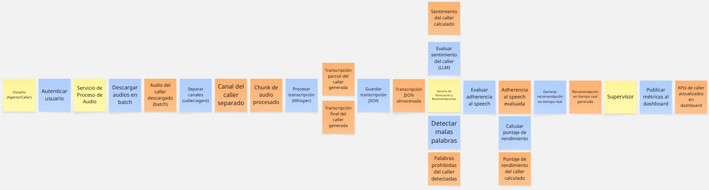
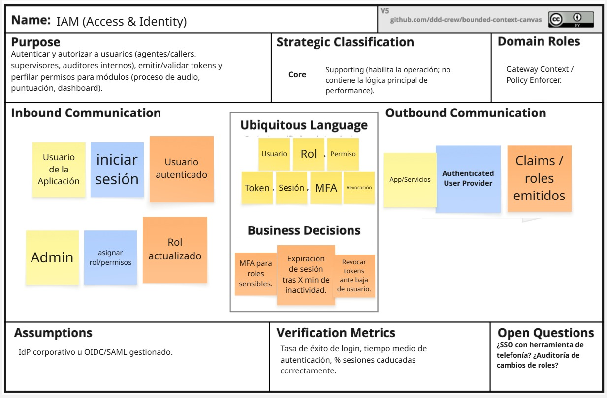

<h1 style="text-align: center;"> Informe del Trabajo Final </h1>
<h3 style="text-align: center;"> Universidad Peruana de Ciencias Aplicadas </h3>

<h5 style="text-align: center"> Área: Ingeniería de Software </h5>

<h5 style="text-align: center"> Arquitecturas de Software Emergentes </h5>
<h5 style="text-align: center"> NRC: 14802 </h5>

<h5 style="text-align: center"> Docente: Royer Edelwer Rojas Malásquez </h5>

<h5 style="text-align: center"> Startup: Los Power Ranger </h5>

<h5 style="text-align: center"> Producto: aloGPT </h5>

## Team members:

  
|                Nombre                 |   Código   |
| :-----------------------------------: | :--------: |
| Diego Martin Bastidas Bastidas        | u20221a301 |
| Diego André Cantoral Paredes          | u20201f568 |
| David Alejandro Rivas Sarango         | u20191e831 |
| Elvia Marcela Rodriguez Villa         | u20231c784 |
| Sebastian Valentino Silva Tirado      | u20211g296 |

<h5 style="text-align: center"> Ciclo 2025-02 </h5>

# Registro de Versiones del Informe

El objetivo de esta sección es resumir las modificaciones relevantes que se realizan al informe durante el ciclo de vida del proyecto. Esta sección inicia en una página nueva y se incluye un cuadro con la siguiente estructura:

| Versión |   Fecha    |             Autor             | Descripción de modificación                                                                                                                                                                       |
| :-----: | :--------: | :---------------------------: | ------------------------------------------------------------------------------------------------------------------------------------------------------------------------------------------------- |
|   TB1   | 15/09/2025 | Silva Tirado, Sebastian Valentino | Realización de:   - Capítulo I: Introducción - Capítulo II: Requirements Elicitation & Analysis - Capítulo III: Requirements Specification - Capítulo IV: Strategic-Level Software Design |

# Project Report Collaboration Insights

URL del repositorio para el reporte del proyecto: https://github.com/TF-SoftwareEmergentes

**TB1**

  

  

Para el desarrollo del informe perteneciente a la entrega TF, se dividió la implementación de secciones de la siguiente forma para cada integrante del equipo:

| Integrante                        | Tareas Asignadas                                                                                                                                                              |
| --------------------------------- | ----------------------------------------------------------------------------------------------------------------------------------------------------------------------------- |
| Diego Martin Bastidas Bastidas    | Elaboración de la Unidad 1, 2 y 3 |
| Diego André Cantoral Paredes      | Elaboración Diseño dirigido por atributos |
| David Alejandro Rivas Sarango     | Elaboración de Software Architecture System |
| Elvia Marcela Rodriguez Villa     | Elaboración de Users Stories |
| Silva Tirado, Sebastián Valentino | Elaboración de Arquitectura y modelado avanzado |

**Github Collaboration Insights**

Github también presenta un timeline de las ramas principales y los procesos de merge a los que se han sometido. Todas las ramas se crearon tomando en cuenta el diseño de GitFlow para una buena organización cuando se usa un software de control de versiones.

Los integrantes son:

- Diego Martin Bastidas Bastidas (ghostnotfound404)
- Diego André Cantoral Paredes (diegocantoralp)
- David Alejandro Rivas Sarango (dars2002)
- Elvia Marcela Rodriguez Villa (ElviaRV)
- Silva Tirado, Sebastián Valentino (SebasSilvaT)

# Contenido

1. [**Capítulo I: Introducción.**](#1.)  
   1.1. [Startup Profile.](#1.1.)  
   1.1.1. [Descripción del startup.](#1.1.1.) 
   1.1.2.[Perfiles de los integrantes del equipo.](#1.1.2.) 
   1.2. [Solution Profile.](#1.2.) 
   1.2.1. [Antecedentes y Problemática.](#1.2.1.) 
   1.2.2. [Lean UX Process.](#1.2.2.) 
   1.2.2.1 [Lean UX Problem Statements.](#1.2.2.1.) 
   1.2.2.2. [Lean UX Assumptions.](#1.2.2.2.) 
   1.2.2.3 [Lean UX Hypothesis Statements.](#1.2.2.3.) 
   1.2.2.4 [Lean UX Canvas.](#1.2.2.4.) 
   1.3. [Segmentos objetivo.](#1.3.) 
2. [**Capítulo II: Requirements Elicitation & Analysis.**](#2.) 
   2.1. [Competidores.](#2.1.) 
   2.1.1. [Análisis competitivo.](#2.1.1.) 
   2.1.2. [Estrategias y tácticas frente a competidores.](#2.1.2.) 
   2.2. [Entrevistas.](#2.2.) 
   2.2.1. [Diseño de entrevistas.](#2.2.1.) 
   2.2.2. [Registro de entrevistas.](#2.2.2.) 
   2.2.3. [Análisis de entrevistas.](#2.2.3.) 
   2.3. [Needfinding.](#2.3.) 
   2.3.1. [User Personas.](#2.3.1.) 
   2.3.2. [User Task Matrix.](#2.3.2.) 
   2.3.3. [Empathy Mapping.](#2.3.3.) 
   2.3.4. [As-is Scenario Mapping.](#2.3.4.) 
   2.4. [Ubiquitous Language](#2.4.) 
3. [**Capítulo III: Requirements Specification.**](#3.) 
   3.1. [To-Be Scenario Mapping.](#3.1.) 
   3.2. [User Stories.](#3.2.) 
   3.3. [Impact Mapping.](#3.3.) 
   3.4. [Product Backlog.](#3.4.) 
4. [**Capítulo IV: Solution Software Design.**](#4.) 
  4.1. [Strategic-Level Attribute-Driven Design.](#4.1.) 
  4.1.1. [Design Purpose.](#4.1.1.) 
  4.1.2. [Attribute-Driven Design Inputs.](#4.1.2.) 
  4.1.2.1. [Primary Functionality (Primary User Stories).](#4.1.2.1.) 
  4.1.2.2. [Quality Attribute Scenarios.](#4.1.2.2.) 
  4.1.2.3. [Constraints.](#4.1.2.3.) 
  4.1.3. [Architectural Drivers Backlog.](#4.1.3.) 
  4.1.4. [Architectural Design Decisions.](#4.1.4.) 
  4.1.5. [Quality Attribute Scenario Refinements.](#4.1.5.) 
  4.2. [Strategic-Level Domain-Driven Design.](#4.2.) 
  4.2.1. [EventStorming.](#4.2.1.) 
  4.2.2. [Candidate Context Discovery.](#4.2.2.) 
  4.2.3. [Domain Message Flows Modeling.](#4.2.3.) 
  4.2.4. [Bounded Context Canvases.](#4.2.4.) 
  4.2.5. [Context Mapping.](#4.2.5.) 
  4.3. [Software Architecture.](#4.3.) 
  4.3.1. [Software Architecture System Landscape Diagram.](#4.3.1.) 
  4.3.2. [Software Architecture Context Level Diagrams.](#4.3.2.) 
  4.3.3. [Software Architecture Container Level Diagrams.](#4.3.3.) 
  4.3.4. [Software Architecture Deployment Diagrams.](#4.3.4.) 

5. [Conclusiones](#5.) 
6. [Bibliografía](#6.) 
7. [Anexo](#7.) 

# STUDENT OUTCOME

El curso contribuye al cumplimiento del Student Outcome ABET:

**ABET – EAC - Student Outcome 3**

**Criterio:** Capacidad de comunicarse efectivamente con un rango de audiencias.

En el siguiente cuadro se describe las acciones realizadas y enunciados de
conclusiones por parte del grupo, que permiten sustentar el haber alcanzado el logro del ABET – EAC - Student Outcome 3.

<table>
  <thead>
    <tr>
      <th>Criterio específico</th>
      <th>Acciones realizadas</th>
      <th>Conclusiones</th>
    </tr>
  </thead>
  <tbody>
    <tr>
      <td style="font-weight:bold">Comunica oralmente sus ideas y/o resultados con objetividad a público de diferentes especialidades y niveles jerarquicos, en el marco del desarrollo de un proyecto en ingeniería.</td>
      <td>
      </td>
      <td>
        <!--conclusion -->
      </td>
    </tr>
    <tr>
      <td style="font-weight:bold">Comunica en forma escrita ideas y/o resultados con objetividad a público de diferentes especialidades y niveles jerarquicos, en el marco del desarrollo de un proyecto en ingeniería.</td>
      <td>
      </td>
      <td>
        <!-- conclusion -->
      </td>
    </tr>
  </tbody>
</table>

<h2>1. Capítulo I: Introducción</h2>

<h3>1.1. Startup Profile</h3>

Esta sección incluye la descripción del Startup y los perfiles de los integrantes del equipo.

<h4>1.1.1. Descripción del startup</h4>

aloGPT es una solución de inteligencia artificial para el sector de cobranzas. Su función principal es asistir a los agentes y supervisores en el proceso de llamadas a usuarios con deudas pendientes. La plataforma analiza la voz del deudor durante la llamada, identificando emociones, nivel de convicción y la probabilidad real de cumplir con la promesa de pago.

Análisis de promesa de pago: el sistema genera un score emocional del audio y lo interpreta con un modelo de lenguaje (LLM) para determinar la veracidad de la intención del cliente.

Gestión oportuna: en la fecha de vencimiento, aloGPT apoya en la identificación de los deudores con mayor probabilidad de pago, optimizando la eficiencia de las llamadas de cobranza.

<h4>1.1.2. Perfiles de los integrantes del equipo</h4>

|                       Photo                        | Description |
|:--------------------------------------------------:|:------------|
|  | **Nombre y Apellido:** Diego Martin Bastidas Bastidas    **Carrera:** Ingeniería de Software (8vo ciclo)   **Acerca de:** Decidí estudiar esta carrera porque desde pequeño me llamaba la atención el funcionamiento de las computadoras y los procesos que conllevan. Me apasiona practicar deportes de contacto, salir a pasear y, sobre todo, ser Groomer canino, ya que disfruto trabajar con mascotas. |
|  | **Nombre y Apellido:** Nombre_1   **Carrera:** Ingeniería de Software   **Acerca de:** Mi nombre es Diego André Cantoral Paredes y soy estudiante de la carrera de Ingeniería de Software. Desde siempre me interesaron los temas tecnológicos y sobre todo las computadoras, por lo que desarrollé una afición a los videojuegos y luego a la programación. Me considero una persona responsable, creativa y siempre dispuesto a ayudar a mis compañeros. |
|  | **Nombre y Apellido:** Nombre_2   **Carrera:** Carrera_2   **Acerca de:** Descripción_2 |
|  | **Nombre y Apellido:** Nombre_3   **Carrera:** Carrera_3   **Acerca de:** Descripción_3 |
|  | **Nombre y Apellido:** Nombre_4   **Carrera:** Carrera_4   **Acerca de:** Descripción_4 |

<h3>1.2. Solution Profile</h3>

<h4>1.2.1. Antecedentes y Problemática</h4>

- What (¿Qué?)

  El sector de cobranzas depende en gran medida de llamadas telefónicas para recuperar deudas. Sin embargo, gran parte de estas interacciones no generan resultados efectivos, ya que los deudores suelen dar respuestas poco confiables sobre su intención de pago.

- Who (¿Quién?)

  Los principales afectados son los supervisores de cobranza y los agentes callers, quienes invierten tiempo y esfuerzo en contactar deudores sin tener herramientas objetivas para evaluar si las promesas de pago serán cumplidas.

- Where (¿Dónde?)

  Esto ocurre principalmente en call centers de cobranza y en áreas de gestión de pagos de bancos, financieras, cooperativas y empresas de servicios.

- When (¿Cuándo?)

  El problema se intensifica en las fechas de vencimiento de deudas, cuando los equipos realizan más llamadas y necesitan priorizar a los clientes con mayor probabilidad de pago.

- Why (¿Por qué?)

  Las promesas de pago incumplidas generan ineficiencia operativa, pérdida de tiempo de los agentes, y retrasos en la recuperación de dinero para las empresas. Además, la falta de análisis emocional en la comunicación provoca que los supervisores tomen decisiones con información incompleta.

- How (¿Cómo?)

  Actualmente, la evaluación de la promesa de pago depende de la percepción subjetiva del agente, sin métricas objetivas que midan la veracidad o la disposición real del deudor. Esto limita la capacidad de los supervisores para tomar decisiones basadas en datos.

- How much (¿Cuánto?)

  El impacto económico es alto: en muchos call centers de cobranzas, más del 50% de las promesas de pago no se cumplen, lo que se traduce en pérdidas millonarias y en un uso ineficiente de recursos humanos y tecnológicos.

<h4>1.2.2. Lean UX Process</h4>

<h5>1.2.2.1. Lean UX Problem Statements</h5>

Nuestro producto fue diseñado para apoyar a supervisores y agentes de cobranza mediante una plataforma que analiza la voz de los deudores de forma eficiente, confiable y fácil de usar. Hemos observado que en muchos call centers aún se enfrentan dificultades para identificar de manera objetiva qué promesas de pago son reales, lo que genera pérdida de tiempo, baja productividad y retrasos en la recuperación de la deuda.

<h5>1.2.2.2. Lean UX Assumptions</h5>

#### Features

- Análisis de voz y emociones: Los supervisores valoran poder identificar el nivel de convicción de los deudores a través de un score confiable que mide emociones e intenciones.

- Detección de promesas de pago: Los agentes necesitan un sistema que evalúe si las promesas realizadas durante la llamada son reales o poco probables.

- Alertas y reportes en tiempo real: Los usuarios valoran recibir insights inmediatos sobre la llamada, lo que les permite priorizar casos de mayor probabilidad de pago.

- Modelo freemium con opción premium: Los call centers estarían dispuestos a pagar por funciones avanzadas de predicción, reportes detallados y dashboards integrados.

#### Business Outcomes

- Aumentar la efectividad de recuperación de deuda mediante análisis predictivo de promesas de pago.

- Mejorar la productividad de los agentes y la toma de decisiones de supervisores.

- Generar ingresos sostenibles mediante licencias, comisiones por uso y planes premium.

- Posicionar a aloGPT como una solución innovadora y confiable en la industria de cobranzas.

#### Users

- Supervisores de cobranza, que necesitan medir y mejorar el desempeño de sus equipos.

- Agentes callers, que requieren apoyo en tiempo real para saber con qué deudores insistir o no.

- Call centers y áreas de cobranza de bancos, financieras, cooperativas y empresas de servicios.

#### User Outcomes & Benefits

- Identificar rápidamente deudores con mayor probabilidad de cumplir con su promesa de pago.

- Tomar decisiones basadas en datos objetivos en lugar de percepciones subjetivas.

- Reducir frustración y tiempo perdido en llamadas improductivas.

- Aumentar la tasa de éxito en la recuperación de deudas con una herramienta de fácil uso.

#### User Assumptions

- Los supervisores desean métricas claras y fáciles de interpretar para evaluar a sus equipos.

- Los agentes confían más en una herramienta que valide sus percepciones durante la llamada.

- Prefieren plataformas intuitivas que no interrumpan su flujo de trabajo.

- Los call centers están dispuestos a pagar un plan premium si obtienen análisis más profundos y predictivos.

#### Business Assumptions

- La demanda por soluciones de cobranza más efectivas seguirá creciendo en bancos y empresas de servicios.

- Los usuarios adoptarán la plataforma si esta ofrece rapidez, confiabilidad y facilidad de uso.

- Los call centers verán valor en registrar a sus equipos para aumentar el rendimiento y las recuperaciones.

<h5>1.2.2.3. Lean UX Hypothesis Statements</h5>

**Hipótesis 1**

Creemos que al ofrecer un sistema de análisis de voz que identifique emociones y el nivel de convicción en las promesas de pago, para supervisores de cobranza y agentes callers, mejoraremos la efectividad en la priorización de llamadas y aumentaremos la tasa de recuperación de deuda.
Sabremos que esta hipótesis es cierta
Cuando veamos que al menos el 60% de los supervisores reportan una mejora en la clasificación de deudores y que la tasa de cumplimiento de promesas de pago aumenta en un 20%.

**Hipótesis 2**

Creemos que al proveer reportes en tiempo real con un score de promesa de pago, los agentes de cobranza podrán tomar decisiones más rápidas y precisas durante la llamada, reduciendo el tiempo invertido en deudores con baja probabilidad de pago.
Sabremos que esta hipótesis es cierta
Cuando observemos que los agentes reducen en un 30% el tiempo promedio por llamada improductiva y aumentan en un 15% la conversión de promesas efectivas.

**Hipótesis 3**

Creemos que al implementar un sistema de alertas y dashboards fáciles de usar para supervisores, se incrementará la productividad del equipo y la satisfacción en la gestión de cobranza.
Sabremos que esta hipótesis es cierta
Cuando al menos el 70% de los supervisores reporten que la herramienta les facilita la toma de decisiones y se observe un aumento del 25% en la eficiencia operativa del call center.

**Hipótesis 4**

Creemos que al ofrecer un modelo free con funciones básicas gratuitas y análisis predictivos avanzados en un plan premium, los call centers adoptarán la plataforma y generaremos ingresos sostenibles.
Sabremos que esta hipótesis es cierta
Cuando al menos el 20% de los usuarios gratuitos migren al plan premium en los primeros 6 meses, y los ingresos por suscripciones superen las proyecciones iniciales.

<h5>1.2.2.4. Lean UX Canvas</h5>

**Enlace:** <a href="https://acortar.link/ualshH"> https://acortar.link/ualshH</a> 

<h3>1.3. Segmentos objetivo</h3>

**Segmento Objetivo 1: Supervisores de cobranza**

Son responsables de monitorear y dirigir equipos de agentes en call centers o áreas de cobranza. Su principal necesidad es contar con métricas objetivas y dashboards claros que les permitan evaluar en tiempo real la calidad de las promesas de pago, priorizar deudores y mejorar la productividad del equipo.

**Segmento Objetivo 2: Agentes callers**

Son los operadores que realizan las llamadas directamente a los deudores. Enfrentan la dificultad de distinguir entre promesas reales y falsas, lo que genera frustración y pérdida de tiempo. Con aloGPT reciben apoyo en tiempo real mediante un score de intención de pago, lo que les ayuda a decidir con qué clientes insistir y cómo enfocar la conversación.

<h2>2. Capítulo II: Requirements Elicitation & Analysis</h2>

<h3>2.1. Competidores</h3>

| Competidor          | Descripción                                                                 | Características                                                                 | Logo |
|---------------------|-----------------------------------------------------------------------------|---------------------------------------------------------------------------------|------|
| Latitude AI         | Plataforma que utiliza inteligencia artificial para analizar el comportamiento de deudores y predecir la probabilidad de pago, optimizando las estrategias de cobranza. | Canal de distribución principal: SaaS en la nube, integración con CRMs y plataformas de cobranza. |  |
| TrueAccord (EE. UU.)| Empresa especializada en cobranza digital automatizada que usa machine learning para personalizar mensajes y aumentar la tasa de recuperación de deudas. | Canal de distribución principal: Plataforma web, API de integración y comunicación omnicanal (email, SMS, chat). |  |
| CollectAI (Alemania)| Solución de gestión de cobranzas que combina IA con estrategias de comunicación digital para mejorar el flujo de caja y reducir costos operativos. | Canal de distribución principal: SaaS, integración API y comunicación omnicanal (correo, SMS, WhatsApp). |  |

<h4>2.1.1. Análisis competitivo</h4>

<table>
    <tr>
        <th colspan="2" align="center">¿Por qué llevar a cabo este análisis?</th>
        <th colspan="4" align="center">Lo realizamos para comprender mejor a la competencia en cobranza digital con IA y así ajustar la estrategia de negocio para competir con mayor efectividad.</th>
    </tr>
    <tr>
        <td colspan="2"></td>
        <td align="center">aloGPT</td>
        <td align="center">Latitude AI</td>
        <td align="center">TrueAccord</td>
        <td align="center">CollectAI</td>
    </tr>
    <tr>
        <td rowspan="2" align="center">Perfil</td>
        <td align="center"><b>Overview</b></td>
        <td align="center">Plataforma de cobranza asistida por IA enfocada en supervisores y agentes de call center. Integra generación automática de guiones, análisis en tiempo real y reportes personalizados.</td>
        <td align="center">Solución basada en IA que analiza el comportamiento de deudores y predice la probabilidad de pago, optimizando las estrategias de cobranza.</td>
        <td align="center">Empresa estadounidense que ofrece cobranza digital automatizada mediante machine learning, personalizando mensajes y procesos para cada deudor.</td>
        <td align="center">Startup alemana que combina IA y comunicación digital multicanal para mejorar el flujo de caja y reducir costos operativos.</td>
    </tr>
    <tr>
        <td align="center"><b>Ventaja competitiva ¿Qué valor ofrece a los clientes?</b></td>
        <td align="center">Optimiza la productividad de agentes y supervisores al generar guiones personalizados y análisis inmediato del desempeño.</td>
        <td align="center">Predicción avanzada de pagos y segmentación de clientes de alto valor.</td>
        <td align="center">Mensajes hiperpersonalizados y tasa alta de recuperación sin interacción humana.</td>
        <td align="center">Eficiencia en la comunicación digital y reducción significativa de los costos de cobranza.</td>
    </tr>
    <tr>
        <td rowspan="2" align="center">Perfil de Marketing</td>
        <td align="center"><b>Mercado objetivo</b></td>
        <td align="center">Empresas de cobranza y call centers que buscan mejorar la productividad de supervisores y agentes callers.</td>
        <td align="center">Bancos y grandes instituciones financieras que manejan volúmenes altos de cartera vencida.</td>
        <td align="center">Empresas financieras y fintechs en EE. UU. que buscan digitalizar su cobranza.</td>
        <td align="center">Compañías europeas de energía, telecomunicaciones y servicios financieros con altos volúmenes de clientes.</td>
    </tr>
    <tr>
        <td align="center"><b>Estrategias de marketing</b></td>
        <td align="center">Alianzas con call centers, demostraciones directas y casos de uso medibles.</td>
        <td align="center">Marketing B2B con enfoque en big data y consultoría.</td>
        <td align="center">Campañas digitales y contenido educativo sobre cobranza ética y efectiva.</td>
        <td align="center">Énfasis en eficiencia operativa y automatización en mercados europeos.</td>
    </tr>
    <tr>
        <td rowspan="3" align="center">Perfil de producto</td>
        <td align="center"><b>Productos o servicios</b></td>
        <td align="center">Generación automática de guiones, dashboards de supervisión, métricas de productividad y reportes en tiempo real.</td>
        <td align="center">Plataforma predictiva para segmentación de clientes y optimización de cobranza.</td>
        <td align="center">Automatización de cobranzas digitales con machine learning y comunicación multicanal.</td>
        <td align="center">Gestión de cobranzas digital con IA, recordatorios multicanal y pagos inteligentes.</td>
    </tr>
    <tr>
        <td align="center"><b>Precios y costos</b></td>
        <td align="center">Modelo SaaS con planes de suscripción escalables para equipos de cobranza.</td>
        <td align="center">Licenciamiento SaaS con costos elevados dirigidos a grandes corporaciones.</td>
        <td align="center">Modelo de comisiones + SaaS para fintechs y empresas medianas/grandes.</td>
        <td align="center">Licenciamiento SaaS y comisiones por recuperación de cartera.</td>
    </tr>
    <tr>
        <td align="center"><b>Canales de distribución (web y/o móvil)</b></td>
        <td align="center">Aplicación web con dashboards, API de integración y módulos de entrenamiento.</td>
        <td align="center">Plataforma SaaS en la nube e integraciones personalizadas.</td>
        <td align="center">Plataforma web, API e integración con CRMs.</td>
        <td align="center">SaaS en la nube y comunicación omnicanal (SMS, email, WhatsApp).</td>
    </tr>
    <tr>
        <td rowspan="4" align="center"><b>Análisis SWOT</b></td>
        <td align="center"><b>Fortalezas</b></td>
        <td align="center">Optimiza la eficiencia de agentes, insights inmediatos y facilidad de integración en call centers.</td>
        <td align="center">Alta capacidad predictiva en grandes volúmenes de datos.</td>
        <td align="center">Personalización avanzada y posicionamiento fuerte en EE. UU.</td>
        <td align="center">Automatización multicanal con fuerte presencia en Europa.</td>
    </tr>
    <tr>
        <td align="center"><b>Debilidades</b></td>
        <td align="center">Startup emergente con necesidad de construir reputación en el mercado.</td>
        <td align="center">Costos elevados limitan acceso a empresas medianas.</td>
        <td align="center">Enfocado principalmente en el mercado estadounidense.</td>
        <td align="center">Dependencia en conectividad digital y regulación europea estricta.</td>
    </tr>
    <tr>
        <td align="center"><b>Oportunidades</b></td>
        <td align="center">Escalar a Latinoamérica donde la industria de call centers es grande y creciente.</td>
        <td align="center">Expandirse a mercados emergentes fuera de EE. UU.</td>
        <td align="center">Ingresar a nuevos sectores como seguros y salud.</td>
        <td align="center">Crecer en mercados fuera de Europa con soluciones adaptadas.</td>
    </tr>
    <tr>
        <td align="center"><b>Amenazas</b></td>
        <td align="center">Competidores consolidados con mayor capital y presencia internacional.</td>
        <td align="center">Competencia en IA aplicada a cobranza de grandes techs.</td>
        <td align="center">Nuevas regulaciones de privacidad y datos sensibles en EE. UU.</td>
        <td align="center">Riesgo de que surjan plataformas más económicas y simples.</td>
    </tr>
</table>

<h4>2.1.2. Estrategias y tácticas frente a competidores</h4>

**Propuesta de valor diferenciada**  

Crear una plataforma que conecte de forma rápida y confiable a supervisores de cobranza y agentes callers con herramientas de inteligencia artificial, destacándose por la facilidad de uso, la reducción de tiempos en la gestión y la mejora en los indicadores de desempeño.  

---

**Estrategia digital multicanal**  
- Campañas en redes sociales profesionales (LinkedIn).  
- Webinars especializados en cobranza y call centers.  
- Publicidad segmentada en empresas de servicios financieros, telecomunicaciones y retail con alta necesidad de gestión de cartera.  

---

**Generación de confianza**  
- Incorporar testimonios y casos de éxito reales de call centers.  
- Mostrar mejoras en KPIs como:  
  - Promesas de pago cumplidas.  
  - Eficiencia por llamada.  
  - Reducción de costos operativos.  
- Difusión de resultados en la app y en campañas publicitarias.  

---

**Beneficios iniciales**  
- Promociones de lanzamiento (acceso gratuito a módulos premium durante los primeros meses).  
- Gamificación interna para agentes y supervisores con beneficios como:  
  - Dashboards más avanzados.  
  - Reportes personalizados.  
  - Soporte técnico prioritario.  

---

**Valor para supervisores y agentes**  
- Generación de insights inmediatos (guiones sugeridos en tiempo real y métricas automáticas de productividad).  
- Mejora del desempeño y reducción de la carga operativa.  
- Motivación del equipo mediante recompensas por rendimiento.  

<h3>2.2. Entrevistas</h3>

<h4>2.2.1. Diseño de entrevistas</h4>

**Preguntas para el Segmento Objetivo 1: Supervisores de cobranza**

1. ¿Cuáles son los principales retos que enfrentas al supervisar a los agentes de cobranza?

1. ¿Qué métricas utilizas actualmente para medir el desempeño de tu equipo?

1. ¿Cómo decides si un deudor realmente cumplirá con la promesa de pago?

1. ¿Qué tan confiables consideras las promesas de pago que registran los agentes?

1. ¿Qué herramientas o sistemas utilizas actualmente para gestionar las llamadas de cobranza?

1. ¿Qué problemas ves en los reportes o en la manera en que recibes la información?

1. ¿Qué mejorarías en el proceso de seguimiento a las promesas de pago?

1. ¿Te resultaría útil una plataforma que analice las emociones en la voz del deudor y prediga la probabilidad de pago? ¿Por qué?

1. ¿Cómo influiría en tu trabajo poder tener dashboards automáticos de predicción de pagos?

1. ¿Qué características te darían confianza para implementar una herramienta como aloGPT en tu equipo?

**Preguntas para el  Segmento Objetivo 2: Agentes callers**

1. ¿Qué es lo más difícil al momento de convencer a un deudor para que cumpla su promesa de pago?

1. ¿Cuánto tiempo promedio dedicas a cada llamada y cómo lo mides?

1. ¿Qué tan seguido percibes que los deudores cumplen realmente con sus promesas de pago?

1. ¿Qué técnicas o frases usas para persuadir al deudor?

1. ¿Recibes apoyo o guías en tiempo real mientras llamas, o todo depende de tu experiencia?

1. ¿Qué tan útiles consideras los guiones que te dan actualmente?

1. ¿Qué te gustaría mejorar en el proceso de llamadas para que sea más efectivo?

1. ¿Qué pensarías de una herramienta que te sugiera en tiempo real qué decir según el tono de voz del cliente?

1. ¿Qué beneficios personales esperas obtener de una plataforma como aloGPT (menos estrés, más cierres, incentivos, etc.)?

1. ¿Qué haría que realmente quieras usar este tipo de herramienta en tu día a día?

<h4>2.2.2. Registro de entrevistas</h4>

<h4>2.2.3. Análisis de entrevistas</h4>

<h3>2.3. Needfinding</h3>

<h4>2.3.1. User Personas</h4>

<h4>2.3.2. User Task Matrix</h4>

| Tarea | Supervisores de Cobranza (Frecuencia / Importancia) | Agentes Callers (Frecuencia / Importancia) |
|-------|-----------------------------------------------------|--------------------------------------------|
| Revisar desempeño del equipo | Frecuente / Alta | - |
| Analizar promesas de pago | Frecuente / Alta | Frecuente / Alta |
| Recibir reportes automáticos | Frecuente / Alta | - |
| Monitorear llamadas en tiempo real | Media / Alta | - |
| Ajustar estrategias de cobranza | Media / Alta | - |
| Registrar promesas de pago en el sistema | - | Frecuente / Alta |
| Seguir guiones de cobranza | - | Frecuente / Media |
| Convencer al deudor para que pague | - | Frecuente / Alta |
| Validar emociones y tono de voz con IA | Media / Alta | Frecuente / Alta |
| Cumplir objetivos de cobranza (KPIs) | Frecuente / Alta | Frecuente / Alta |
| Recibir retroalimentación gamificada (niveles, puntos, incentivos) | Media / Media | Frecuente / Media |

<h4>2.3.3. Empathy Mapping</h4>

<h4>2.3.4. As-is Scenario Mapping</h4>

<h3>2.4. Ubiquitous Language</h3>

| Término en Inglés (Español) | Definición |
|-----------------------------|------------|
| **Account (Cuenta)** | Identidad digital de un usuario en aloGPT, ya sea supervisor o agente caller, con acceso al sistema y permisos asociados. |
| **User (Usuario)** | Persona registrada en la plataforma, que puede ser un **Supervisor** o un **Agente Caller**. |
| **Supervisor (Supervisor de Cobranza)** | Usuario que gestiona, supervisa y analiza el desempeño de los agentes callers y la efectividad de las llamadas de cobranza. |
| **Caller Agent (Agente Caller)** | Usuario encargado de realizar llamadas a los deudores, registrar interacciones y utilizar el análisis de voz para mejorar la gestión de cobranza. |
| **Debtor (Deudor)** | Persona que mantiene una deuda pendiente y es contactada por un agente a través de la plataforma. |
| **Call (Llamada)** | Interacción telefónica entre un agente caller y un deudor, que puede ser grabada y analizada por aloGPT. |
| **Voice Analysis (Análisis de Voz)** | Proceso automatizado de aloGPT que interpreta el tono, emociones y patrones de la voz del deudor para generar un puntaje o probabilidad de pago. |
| **Promise to Pay (Promesa de Pago)** | Compromiso verbal detectado durante una llamada en la que el deudor indica su disposición a realizar un pago. |
| **Promise Score (Score de Promesa)** | Puntuación calculada por aloGPT que estima la probabilidad de que el deudor cumpla con su promesa de pago. |
| **LLM Analysis (Análisis LLM)** | Interpretación del lenguaje y contenido de la llamada mediante un modelo de lenguaje, para identificar la intención y credibilidad del deudor. |
| **Notification (Notificación)** | Aviso que recibe un agente o supervisor sobre pagos pendientes, llamadas programadas o resultados de análisis de voz. |
| **Dashboard (Panel de Control)** | Vista centralizada para supervisores donde se muestran métricas clave como desempeño de agentes, score de promesas y cumplimiento de pagos. |
| **Report (Reporte de Gestión)** | Documento generado automáticamente con estadísticas de llamadas, tasas de promesas y efectividad de los agentes. |
| **Gamification (Gamificación)** | Sistema de incentivos para agentes basado en métricas de desempeño (ej. cumplimiento de metas, efectividad en promesas). |
| **Level (Nivel)** | Categoría alcanzada por un agente en el sistema de gamificación (ej. Bronce, Plata, Oro) que refleja su efectividad en cobranza. |
| **Reward (Recompensa)** | Beneficio otorgado a los agentes callers por su desempeño (bonificaciones, reconocimientos o acceso a más herramientas). |

<h2>3. Capítulo III: Requirements Specification</h2>

<h3>3.1. To-Be Scenario Mapping</h3>

<h3>3.2. User Stories</h3>

| Epic ID | Título | Descripción |
|---------|--------|-------------|
| EP001 | Gestión de Usuarios y Autenticación | Como usuario (supervisor o agente de cobranza), quiero gestionar mi acceso y perfil para mantener la seguridad y personalización del sistema. |

| Story ID | Título | Descripción | Criterios de aceptación con Escenarios |
|----------|--------|-------------|----------------------------------------|
| US001 | Registro de usuario | Como nuevo usuario del equipo de cobranza, quiero crear una cuenta para acceder a la plataforma de análisis de sentimientos. | E01: Registro exitoso Dado que un nuevo usuario necesita registrarse Cuando completa el formulario de registro con datos válidos Y confirma su registro Entonces recibe un correo de verificación y su cuenta queda pendiente de activación.  E02: Registro con datos inválidos Dado que un nuevo usuario intenta registrarse Cuando ingresa datos incompletos o inválidos Entonces el sistema muestra mensajes de error específicos. |
| US002 | Inicio de sesión | Como usuario registrado, quiero iniciar sesión para acceder al dashboard de análisis. | E01: Login exitoso Dado que un usuario tiene credenciales válidas Cuando ingresa usuario y contraseña correctos Entonces accede al dashboard principal.  E02: Credenciales incorrectas Dado que un usuario ingresa credenciales inválidas Cuando intenta iniciar sesión Entonces el sistema muestra error de autenticación. |
| US003 | Recuperación de contraseña | Como usuario, quiero recuperar mi contraseña en caso de olvido para mantener el acceso al sistema. | E01: Recuperación exitosa Dado que un usuario olvidó su contraseña Cuando solicita recuperación vía email Entonces recibe instrucciones para resetear su contraseña. |

| Epic ID | Título | Descripción |
|---------|--------|-------------|
| EP002 | Procesamiento y Análisis de Audios | Como sistema, debo procesar audios de llamadas, generar transcripciones y analizar sentimientos para proporcionar insights valiosos al equipo de cobranza. |

| Story ID | Título | Descripción | Criterios de aceptación con Escenarios |
|----------|--------|-------------|----------------------------------------|
| US004 | Carga de audios de llamadas | Como agente, quiero subir audios de llamadas para que sean procesados y analizados. | E01: Carga exitosa Dado que un agente selecciona un archivo de audio Cuando lo sube al sistema Entonces recibe confirmación y el audio entra a la cola de procesamiento.  E02: Formato inválido Dado que un agente sube un archivo no compatible Cuando intenta procesarlo Entonces el sistema rechaza el archivo y notifica el error. |
| US005 | Transcripción automática | Como sistema, debo transcribir automáticamente los audios para facilitar el análisis de contenido. | E01: Transcripción exitosa Dado que un audio es procesado Cuando el motor de transcripción funciona correctamente Entonces se genera texto con alta precisión y bajo margen de error. |
| US006 | Análisis de sentimiento | Como sistema, debo analizar el tono emocional del cliente usando LLM para clasificar el estado anímico. | E01: Análisis completo Dado que una transcripción está disponible Cuando el LLM procesa el contenido Entonces clasifica el sentimiento (positivo, neutral, negativo, estrés, disposición pago). |

| Epic ID | Título | Descripción |
|---------|--------|-------------|
| EP003 | Dashboard y Visualización de Insights | Como supervisor o agente, quiero visualizar los resultados del análisis através de un dashboard interactivo para tomar decisiones informadas. |

| Story ID | Título | Descripción | Criterios de aceptación con Escenarios |
|----------|--------|-------------|----------------------------------------|
| US007 | Dashboard principal | Como usuario, quiero acceder a un dashboard con métricas generales del desempeño del equipo. | E01: Visualización de KPIs Dado que un usuario accede al dashboard Cuando el sistema carga la información Entonces muestra métricas clave: llamadas procesadas, distribución de sentimientos, efectividad. |
| US008 | Filtros de búsqueda | Como supervisor, quiero filtrar llamadas por tipo de sentimiento para analizar patrones específicos. | E01: Filtrado por sentimiento Dado que hay múltiples llamadas analizadas Cuando selecciono filtrar por "disposición de pago" Entonces el sistema muestra solo las llamadas con esa clasificación. |
| US009 | Detalle de llamada | Como agente, quiero ver el detalle completo de una llamada específica incluyendo transcripción y análisis. | E01: Visualización completa Dado que selecciono una llamada del listado Cuando accedo a su detalle Entonces veo audio, transcripción, análisis de sentimiento y recomendaciones. |

| Epic ID | Título | Descripción |
|---------|--------|-------------|
| EP004 | Recomendaciones y Alertas en Tiempo Real | Como sistema, debo proporcionar recomendaciones prácticas basadas en el análisis para mejorar la efectividad en la cobranza. |

| Story ID | Título | Descripción | Criterios de aceptación con Escenarios |
|----------|--------|-------------|----------------------------------------|
| US010 | Recomendaciones personalizadas | Como agente, quiero recibir sugerencias específicas basadas en el análisis de cada llamada. | E01: Recomendaciones contextuales Dado que una llamada muestra cliente estresado Cuando el sistema analiza el patrón Entonces sugiere técnicas de desescalamiento y próximos pasos. |
| US011 | Alertas de oportunidades | Como supervisor, quiero recibir alertas cuando se detecte alta disposición de pago. | E01: Alerta inmediata Dado que una llamada muestra disposición de pago alta Cuando el análisis se completa Entonces el sistema notifica al supervisor para acción inmediata. |

| Epic ID | Título | Descripción |
|---------|--------|-------------|
| EP005 | Reportes y Analytics | Como supervisor, quiero generar reportes detallados del desempeño del equipo y efectividad de las estrategias de cobranza. |

| Story ID | Título | Descripción | Criterios de aceptación con Escenarios |
|----------|--------|-------------|----------------------------------------|
| US012 | Reportes periódicos | Como supervisor, quiero generar reportes semanales/mensuales de métricas clave. | E01: Generación de reportes Dado que solicito un reporte del mes actual Cuando el sistema procesa la data Entonces genera PDF/Excel con todas las métricas relevantes. |
| US013 | Tendencias temporales | Como manager, quiero visualizar tendencias de sentimientos a lo largo del tiempo. | E01: Análisis temporal Dado que accedo a la sección de analytics Cuando selecciono rango de fechas Entonces veo gráficos de evolución de sentimientos y efectividad. |

| Story ID | Título | Descripción | Criterios de aceptación con Escenarios |
|----------|--------|-------------|----------------------------------------|
| TS001 | Endpoint para procesamiento de audio | Como developer, quiero crear un endpoint para subir y procesar audios de llamadas. | E01: Procesamiento exitoso Dado el endpoint "/api/audio/process" Cuando se envía POST con audio válido Entonces responde 202 Accepted y devuelve ID de proceso. |
| TS002 | Endpoint para análisis de sentimiento | Como developer, quiero crear un endpoint para análisis de texto con LLM. | E01: Análisis exitoso Dado el endpoint "/api/analyze/sentiment" Cuando se envía texto de transcripción Entonces devuelve clasificación de sentimiento y confianza. |
| TS003 | Endpoint para dashboard data | Como developer, quiero crear endpoints para alimentar el dashboard. | E01: Data consistente Dado el endpoint "/api/dashboard/metrics" Cuando se solicita data del dashboard Entonces devuelve métricas en tiempo real. |

<h3>3.3. Impact Mapping</h3>

| Actor              | Impacto                        | Comportamiento Deseado                               | Funcionalidades (Deliverables)                                   |
|--------------------|--------------------------------|------------------------------------------------------|------------------------------------------------------------------|
| Agentes de cobranza| Mejorar estrategias de negociación | Adaptar su enfoque según el estado emocional del cliente | - Dashboard con análisis de sentimientos   - Recomendaciones personalizadas   - Alertas de oportunidades |
| Supervisores       | Optimizar gestión del equipo   | Identificar patrones y oportunidades de mejora        | - Reportes de desempeño   - Tendencias temporales   - Métricas de efectividad |

<h3>3.4. Product Backlog</h3>

| ID     | Título                              | Estimación | Estimación en Horas |
|--------|-------------------------------------|------------|---------------------|
| US001  | Registro de usuario                 | S          | 3                   |
| US002  | Inicio de sesión                    | S          | 2                   |
| US003  | Recuperación de contraseña          | S          | 3                   |
| US004  | Carga de audios de llamadas         | M          | 5                   |
| US005  | Transcripción automática            | L          | 13                  |
| US006  | Análisis de sentimiento             | L          | 21                  |
| US007  | Dashboard principal                 | M          | 8                   |
| US008  | Filtros de búsqueda                 | M          | 5                   |
| US009  | Detalle de llamada                  | M          | 8                   |
| US010  | Recomendaciones personalizadas      | M          | 8                   |
| US011  | Alertas de oportunidades            | S          | 3                   |
| US012  | Reportes periódicos                 | M          | 8                   |
| US013  | Tendencias temporales               | M          | 8                   |
| US014  | Seguridad de datos                  | M          | 8                   |
| TS001  | Endpoint para procesamiento de audio| M          | 8                   |
| TS002  | Endpoint para análisis de sentimiento| M         | 8                   |
| TS003  | Endpoint para dashboard data        | M          | 5                   |

| Tamaño | Rango de Horas | Descripción |
|--------|----------------|-------------|
| S      | 1-3            | Tareas simples, rápidas de implementar |
| M      | 5-8            | Tareas moderadas, requieren más desarrollo o integración |
| L      | 13+            | Tareas complejas, con múltiples escenarios o integraciones externas |

<h2>4. Capítulo IV: Solution Software Design</h2>

<h3>4.1. Strategic-Level Attribute-Driven Design</h3>

<h4>4.1.1. Design Purpose</h4>

El propósito del diseño es mejorar la eficiencia en la gestión de cobranza mediante Inteligencia Artificial.  
La plataforma busca:  
- Procesar audios de llamadas y transcribirlos automáticamente con un LLM.  
- Analizar emociones con una red neuronal de sentimiento.  
- Predecir disposición de pago y apoyar la toma de decisiones.  
- Brindar métricas en un dashboard interactivo para agentes y supervisores.  

<h4>4.1.2. Attribute-Driven Design Inputs</h4>

<h5>4.1.2.1. Primary Functionality (Primary User Stories)</h5>

| ID     | Título                              | Descripción |
|--------|-------------------------------------|-------------|
| US004  | Carga de audios de llamadas         | Como agente, quiero subir audios de llamadas para que sean procesados y analizados. |
| US005  | Transcripción automática            | Como sistema, debo transcribir automáticamente los audios para facilitar el análisis de contenido. |
| US006  | Análisis de sentimiento             | Como sistema, debo analizar el tono emocional del cliente usando LLM para clasificar el estado anímico. |
| US007  | Dashboard principal                 | Como usuario, quiero acceder a un dashboard con métricas generales del desempeño del equipo. |
| US008  | Filtros de búsqueda                 | Como supervisor, quiero filtrar llamadas por tipo de sentimiento para analizar patrones específicos. |
| US009  | Detalle de llamada                  | Como agente, quiero ver el detalle completo de una llamada específica incluyendo transcripción y análisis. |
| US010  | Recomendaciones personalizadas      | Como agente, quiero recibir sugerencias específicas basadas en el análisis de cada llamada. |

<h5>4.1.2.2. Quality Attribute Scenarios</h5>

| Atributo de Calidad | Escenario | Estímulo | Respuesta | Medida |
|---------------------|-----------|----------|-----------|--------|
| **Rendimiento** | Procesamiento de audio en tiempo casi real | Subida de archivo de audio (5-10 min) | Transcripción y análisis completos en menos de 3 minutos | 95% de procesamientos bajo 3 min |
| **Disponibilidad** | Acceso continuo al dashboard | Solicitud de acceso durante horario laboral | Sistema disponible 24/7 con máximo 1h de mantenimiento mensual | 99.5% uptime |
| **Seguridad** | Protección de datos sensibles | Intento de acceso no autorizado a grabaciones | Autenticación robusta y encriptación end-to-end | 0 brechas de datos |
| **Usabilidad** | Interfaz intuitiva para agentes | Primer uso del dashboard | Curva de aprendizaje menor a 30 minutos | 90% de usuarios proficientes en 1 día |
| **Precisión** | Análisis de sentimientos | Procesamiento de transcripción | Clasificación correcta del estado emocional | >85% de precisión en clasificación |

<h5>4.1.2.3. Constraints</h5>

| Technical Story ID | Título                         | Descripción | Criterios de Aceptación | Relacionado con (Epic ID) |
|--------------------|---------------------------------|-------------|--------------------------|---------------------------|
| TS001              | Endpoint para procesamiento de audio | Subida de audios en formatos válidos .wav/.mp3 | Procesamiento exitoso con 202 Accepted | EP002 |
| TS002              | Endpoint para análisis de sentimiento | Procesar transcripciones y devolver clasificación | Respuesta con sentimiento + confianza | EP002 |
| TS003              | Endpoint para dashboard data   | Entregar métricas en tiempo real al dashboard | GET devuelve KPIs consistentes | EP003 |
| C001               | Seguridad en autenticación     | Uso de OAuth2 y cifrado robusto en endpoints | Solo accesos autenticados válidos | EP001 |
| C002               | Latencia máxima en análisis    | Procesamiento en < 3 min en 95% de casos | Validación en pruebas de carga | EP002 |
| C003               | Disponibilidad mínima          | Dashboard disponible 24/7 (≥99.5% uptime) | Máx. 1h de downtime mensual | EP003 |
| C004               | Privacidad de datos sensibles  | Grabaciones cifradas y anonimizadas | Sin filtración de datos personales | EP002 |
| C005               | Escalabilidad en lotes         | Procesar ≥10,000 audios sin degradación | Stress test exitoso < 1 hora | EP005 |

<h4>4.1.3. Architectural Drivers Backlog</h4>

| Driver ID | Título de Driver       | Descripción | Importancia para Stakeholders (High, Medium, Low) | Impacto en Architecture Technical Complexity (High, Medium, Low) |
|-----------|------------------------|-------------|-----------------------------|--------------------------------|
| AD01      | Rendimiento            | Procesamiento de audios en tiempo real | High | High |
| AD02      | Disponibilidad         | Garantizar acceso continuo al dashboard | High | Medium |
| AD03      | Seguridad              | Protección de datos sensibles | High | Medium |
| AD04      | Usabilidad             | Dashboard intuitivo | High | Medium |
| AD05      | Precisión del análisis | Clasificación emocional ≥85% | High | High |
| AD06      | Escalabilidad          | Procesamiento masivo de llamadas | Medium | High |

<h4>4.1.4. Architectural Design Decisions</h4>

| Driver ID | Título de Driver | Pattern 1 |        | Pattern 2 |        |
|-----------|------------------|-----------|--------|-----------|--------|
|           |                  | Pro       | Con    | Pro       | Con    |
| AD01      | Rendimiento      | Procesamiento en streaming (baja latencia) | Mayor consumo de recursos | Procesamiento batch (optimizado análisis masivo) | No sirve en tiempo real |
| AD02      | Disponibilidad   | Nube multi-región (redundancia) | Costo elevado | Una sola región (bajo costo) | Riesgo mayor de downtime |
| AD03      | Seguridad        | Cifrado AES-256 + OAuth2 (robusto) | Más complejo | Cifrado básico + token (simple) | Menos seguro |
| AD04      | Usabilidad       | Framework de UI modular (consistencia) | Curva de aprendizaje | Diseño ad-hoc (flexible) | Inconsistencias UX |

<h4>4.1.5. Quality Attribute Scenario Refinements</h4>

#### Ejemplo Refinamiento 1 – Rendimiento

| Campo                        | Detalle |
|------------------------------|---------|
| Scenario(s)                  | Procesamiento de audio en tiempo casi real |
| **Business Goals**           | Brindar retroalimentación rápida al agente |
| **Relevant Quality Attributes** | Rendimiento, Escalabilidad |
| Stimulus                     | Subida de audio de 5–10 min |

**Scenario Components**

| Componente        | Detalle |
|-------------------|---------|
| Stimulus Source   | Agente |
| Environment       | Plataforma web |
| Artifact (if Known) | Módulo de transcripción + red neuronal |
| Response          | Transcripción y análisis completados en menos de 3 min |
| Response Measure  | ≥95% de los casos cumplen con la latencia establecida |
| Questions:|  ¿Qué hacer si la latencia excede el límite en condiciones de stress? |  
| **Issues:**  |  Ajustar recursos de cómputo en picos de carga.  |

#### Ejemplo Refinamiento 2 – Seguridad

| Campo                        | Detalle |
|------------------------------|---------|
| Scenario(s)                  | Protección de datos sensibles |
| **Business Goals**           | Evitar accesos no autorizados y brechas |
| **Relevant Quality Attributes** | Seguridad, Disponibilidad |
| Stimulus                     | Intento de acceso no autorizado a grabación |

**Scenario Components**

| Componente        | Detalle |
|-------------------|---------|
| Stimulus Source   | Atacante externo |
| Environment       | Plataforma web |
| Artifact (if Known) | API de backend / repositorio de audios |
| Response          | Bloquear acceso, registrar en logs, notificar al admin |
| Response Measure  | 100% de accesos ilegales bloqueados en <5 seg |
| Questions  | ¿Se requiere auditoría externa anual? |
| Issues| Sobrecarga de logs en ataques masivos.  |

<h3>4.2. Strategic-Level Domain-Driven Design</h3>

<h4>4.2.1. EventStorming</h4>

A través de la plataforma Miro hemos realizado el proceso de EventStorming, lo que nos permitió identificar los eventos, usuarios o agentes, comandos que desencadenan dichos eventos, así como los aggregates y bounded contexts propios de nuestro dominio.

Para facilitar la comprensión, la información se seccionará y presentará mediante distintos “post-its”, siguiendo la convención:

* Post It Anaranjado: Evento que representa un hecho ocurrido en el dominio.
* Post It Azul: Comando que desata el evento de su derecha.
* Post It Amarillo: Usuario, sistema o agente que genera el comando de su derecha.
* Delimitaciones amarillas: Agrupan eventos y comandos relacionados a un aggregate.
* Delimitaciones de color negro: Agrupan uno o más aggregates relacionados a un bounded context.
* Flechas punteadas: Señalan la comunicación de comandos que generan eventos en distintos aggregates o bounded contexts.

</img>

#### Proceso

Primer paso: se identificaron los eventos principales del dominio y se trazaron en una línea de tiempo imaginaria de izquierda a derecha. Entre los más relevantes se encuentran: Llamada iniciada, Consentimiento de grabación registrado, Transcripción parcial generada, Transcripción final generada, Análisis de sentimiento calculado, Disposición de pago inferida (score), Caso de cobranza actualizado, Señales de riesgo/compliance detectadas y Notificación enviada al dashboard.
Algunos eventos se dispusieron en la misma columna, dado que su ocurrencia no necesariamente sigue un orden consecutivo.

</img>

Segundo paso: se identificaron los comandos que disparan dichos eventos, representados con post-its azules. Ejemplos: Iniciar llamada, Registrar consentimiento, Procesar transcripción, Calcular sentimiento, Calcular disposición de pago, Actualizar caso de cobranza o Evaluar reglas de compliance.

</img>

Tercer paso: se definieron los agentes o usuarios que ejecutan cada comando, los cuales se representaron con post-its amarillos. Aquí destacan: Agente de cobranza, Deudor/Cliente, Motor de telefonía (SIP/CCaaS), Servicio de Transcripción (LLM/ASR), Motor de Sentimiento/NN, Servicio de Scoring, Módulo de Compliance y Dashboard/Analytics.

</img>

Último paso: se agruparon los eventos relacionados dentro de sus respectivos aggregates, delimitados con marcos amarillos, y posteriormente se organizaron en bounded contexts, delimitados con marcos negros. Entre ellos se encuentran: Telephony Ingestion, Transcription, Sentiment & Emotion, Propensity Scoring, Collections Operations, Compliance & Audit y Analytics & Dashboard.

Finalmente, se trazaron flechas punteadas para representar la interacción entre contextos. Por ejemplo: desde Transcripción final generada hacia Calcular sentimiento, desde Sentimiento calculado hacia Calcular disposición de pago, o desde Score de disposición de pago hacia Actualizar caso de cobranza y Enviar notificación al dashboard.

<h4>4.2.2. Candidate Context Discovery</h4>

La técnica Start-With-Value es un enfoque dentro del diseño centrado en el usuario y Domain-Driven Design (DDD) que propone iniciar el modelado del dominio a partir de los valores que el sistema debe entregar al usuario final o al negocio.

En este sentido, utilizamos dicha técnica para determinar los eventos clave en nuestros bounded contexts, alineados con el valor esperado por los distintos usuarios del sistema.

| **Bounded Context**        | **Valor esperado por el usuario**                                                                 | **Eventos clave**                                                                 |
|-----------------------------|---------------------------------------------------------------------------------------------------|-----------------------------------------------------------------------------------|
| **Telephony Ingestion**     | Establecer la comunicación con el cliente, registrar consentimiento y capturar el audio en tiempo real. | *Llamada iniciada*, *Consentimiento de grabación registrado*, *Audio capturado*.  |
| **Transcription**           | Obtener transcripciones parciales y finales de la conversación, incluyendo separación por hablantes. | *Transcripción parcial generada*, *Transcripción final generada*.                 |
| **Sentiment & Emotion**     | Analizar el tono emocional de la llamada y detectar emociones críticas (enojo, empatía, frustración). | *Análisis de sentimiento calculado*, *Emociones detectadas*.                      |
| **Propensity Scoring**      | Conocer la probabilidad de disposición de pago del cliente durante o después de la llamada.         | *Disposición de pago inferida (score)*.                                           |
| **Collections Operations**  | Gestionar los casos de cobranza y registrar promesas de pago realizadas por los clientes.            | *Promesa de pago registrada*, *Caso de cobranza actualizado*.                      |
| **Compliance & Audit**      | Asegurar el cumplimiento normativo, registrar evidencias y alertar sobre prácticas indebidas.        | *Señales de riesgo/compliance detectadas*, *Artefactos de auditoría consolidados*. |
| **Analytics & Dashboard**   | Visualizar métricas de desempeño de agentes, reportes de disposición de pago y cumplimiento.         | *Notificación enviada al dashboard*, *KPIs actualizados*.                          |

<h4>4.2.3. Domain Message Flows Modeling</h4>

Escenario 1: Atención completa de una llamada de cobranza

Objetivo: Un agente quiere gestionar una interacción de cobranza completa, desde que se inicia la llamada hasta el registro del caso, analizando emociones y calculando la disposición de pago.

</img>

Escenario 2: Control de cumplimiento y alertas en vivo

Objetivo: El sistema debe monitorear la conversación para garantizar el cumplimiento normativo y alertar sobre prácticas indebidas durante la cobranza.

</img>

Escenario 3: Gestión y trazabilidad de métricas financieras y operativas

Objetivo: Relacionar los resultados de las interacciones con métricas financieras y de desempeño de agentes.

</img>

<h4>4.2.4. Bounded Context Canvases</h4>

El Bounded Context Canvas es una herramienta gráfica aplicada en los talleres de Domain-Driven Design (DDD) que permite representar y documentar de manera explícita los límites y las interacciones entre distintos contextos delimitados dentro de un sistema complejo.

Su objetivo principal es ayudar a los equipos a construir una visión compartida sobre el nombre y propósito de cada contexto, las entidades y agregados que este contiene, así como las políticas de negocio que lo rigen.

## Bounded Context Canvas — IAM (Access & Identity)
</img>

## Bounded Context Canvas — Telephony Ingestion
</img>

## Bounded Context Canvas — Transcription
</img>

## Bounded Context Canvas — Sentiment & Emotion
</img>

## Bounded Context Canvas — Propensity Scoring (Payment Intent)
</img>

## Bounded Context Canvas — Collections Operations
</img>

## Bounded Context Canvas — Compliance & Audit
</img>

## Bounded Context Canvas — Analytics & Dashboard
</img>

<h4>4.2.5. Context Mapping</h4>

Este Context Map describe cómo interactúan los Bounded Contexts del sistema. Aplicamos patrones de DDD como Upstream/Downstream, Published Language, Open-Host Service, Conformist y Anti-Corruption Layer (ACL).

</img>

## Bounded Contexts y relaciones

1. IAM / AuthN-AuthZ

* Upstream de: Telephony, Transcription, Sentiment, Propensity Scoring, Collections, Compliance, Analytics.
* Patrón: Conformist (los consumidores aceptan claims/roles tal como los expone IAM).
* Motivo: identidad y permisos consistentes en todo el ecosistema.

2. Telephony Ingestion

* Upstream de Transcription mediante Open-Host Service (expone stream de audio/metadata).
* Downstream de IAM (autorización/claims para sesiones).
* Responsabilidad: sesión de llamada, consentimiento, chunks de audio.

3. Transcription

* Upstream de Sentiment & Emotion por Published Language (transcript con timestamps/diarización).
* Downstream de Telephony e IAM.
* Responsabilidad: transcripción parcial/final, calidad (WER), idioma.

4. Sentiment & Emotion

* Upstream de Propensity Scoring (señales/ métricas conversacionales) vía Published Language; el consumidor actúa Conformist.
* Downstream de Transcription e IAM.
* Responsabilidad: sentimiento segmentado/global, emociones, métricas (talk/listen, interrupciones).

5. Propensity Scoring (Payment Intent)

* Upstream hacia Collections a través de un ACL (traduce score probabilístico a comandos seguros de negocio).
* Upstream también de Analytics (entrega KPIs/scores).
* Downstream de Sentiment, Transcription (features) e IAM.
* Motivo del ACL: evitar contaminar el modelo operativo de casos con probabilidades/terminología de ML.

6. Collections Operations

* Downstream de Propensity (vía ACL) y Compliance (alertas).
* Upstream de Analytics (cambios de caso/promesas).
* Downstream de IAM.
* Responsabilidad: ciclo de vida de casos, promesas, follow-ups.

7. Compliance & Audit

* Downstream de Transcription y Sentiment (insumos para reglas).
* Upstream de Collections (incidentes/alertas) y Analytics (estadísticas de cumplimiento).
* Downstream de IAM para trazabilidad.
* Responsabilidad: detección de infracciones, evidencias, retención.

8. Analytics & Dashboard

* Downstream de Collections, Propensity y Compliance (widgets/KPIs en vivo y batch).
* Downstream de IAM (control de acceso).
* Responsabilidad: proyecciones CQRS, scorecards, reportes.

9. ML Platform / Feature Store

* Upstream de Sentiment y Propensity (modelos y features online/offline).
* No expone directamente a negocio; service interno de ML/Ops.

## Anti-Corruption Layers (ACL)

* **Entre Propensity Scoring y Collections**: convierte score, top factors y confianza en comandos/ eventos del dominio operativo (p.ej., Sugerir guion, Priorizar caso, Registrar promesa), aislando la incertidumbre del modelo.

## Patrones de integración

* **Conformist**: todos los consumidores de IAM aceptan su modelo de identidad/roles.
* **Open-Host Service**: Telephony expone un endpoint/stream estable para Transcription.
* **Published Language**: Transcription → Sentiment y Sentiment → Propensity usan contratos bien definidos de mensajes (segments, timestamps, señales).
* **ACL**: Propensity → Collections para proteger el modelo de casos.

## Flujos U/D (resumen)

* IAM como proveedor universal (Upstream) de identidad.
* Telephony → Transcription → Sentiment → Propensity como cadena principal de valor (todos Upstream del siguiente).
* Propensity → (ACL) → Collections y Collections → Analytics para operación y visibilidad.
* Compliance consume de Transcription/Sentiment y provee a Collections/Analytics.

<h3>4.3. Software Architecture</h3>

<h4>4.3.1. Software Architecture System Landscape Diagram</h4>

<h4>4.3.2. Software Architecture Context Level Diagrams</h4>

<h4>4.3.3. Software Architecture Container Level Diagrams</h4>

<h4>4.3.4. Software Architecture Deployment Diagrams</h4>

<h2>5. Conclusiones</h2>

<h2>6. Bibliografía</h2>

<h2>7. Anexo</h2>

| Descripción | Enlace |
|---------------------------------------|-----------------------------------------------------------------------------------------------------------------------------------------------------------------------------------------------------|
| Organización de Github | [https://github.com/TF-SoftwareEmergentes](https://github.com/TF-SoftwareEmergentes) |
| Link de Exposición |[Video]()|
| Miro (Strategic-Level DDD) |[Miro](https://miro.com/welcomeonboard/NTdVVituT0xHUHkzRGE0anlScmprYjhKSzZtQWpPNFY4eVBOUXJpU284bVVGekJyY05yT0gwWlFCK3QxajRrUG0yRTNXTnB1SU9zZEVNc1BFN2U0YnJpenV0QTBlNTNnYmwrbW1MMkxTaHdDbVNLM3Fwd1g2VHVkVDR4V0pMTW5zVXVvMm53MW9OWFg5bkJoVXZxdFhRPT0hdjE=?share_link_id=331643886038) |
